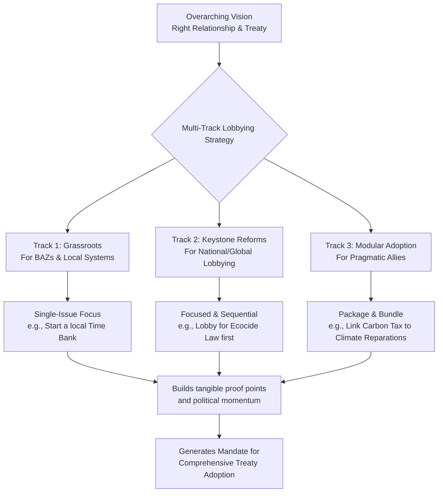

Björn:
Should I lobby separately for each of the initiatives, or all for example three at once?

DeepSeek:
This is a crucial strategic question. The answer isn't one-size-fits-all; it depends on the context and the goal. You should employ a **tiered, multi-track approach**.

Think of it not as separate initiatives, but as a **political ecosystem** where different strategies are used for different actors and opportunities.

Here’s a visual overview of this multi-track strategy:

---

### **Track 1: For Grassroots Mobilization (Building BAZs) → SINGLE ISSUE FOCUS**

**Strategy: "Start Small, Win Concrete, and Expand."**

When you're talking to a community group, a local NGO, or potential first adopters, you should **focus on one initiative at a time.**

*   **Why:** People at the grassroots level have limited bandwidth. They need a clear, winnable goal with an immediate payoff.
*   **How:**
    1.  **Identify the Local Pain Point:** Is it lack of childcare? Food insecurity? Loneliness among the elderly?
    2.  **Match to a Single Framework Tool:** Propose a **Time Bank** (from the Financial Systems Framework) to address care gaps. Or a **community garden & buying club** that uses a simple local currency (proto-Hearts). This is the "BAZ Starter Pack" in action.
    3.  **Avoid Overwhelming:** Don't lead with the Love Ledger, LMCI, AUBI, and Treaty all at once. You'll lose them. Say, "Let's solve our childcare problem together," not "Let's implement a plural financial infrastructure to foster Right Relationship."

**Bottom Line:** At this level, you are not "lobbying for initiatives." You are **solving immediate problems using the framework's tools.** Each successful micro-project becomes a powerful proof-of-concept that makes the larger vision more credible.

---

### **Track 2: For National/Global Lobbying (Treaty Reform) → FOCUSED & SEQUENTIAL**

**Strategy: "Lead with the Keystone, Build the Coalition."**

When you're engaging with politicians, diplomats, and large NGOs, you should **lead with your most compelling, high-leverage "Keystone Reform," but be ready with the connected modules.**

*   **Why:** Policymakers think in terms of solvable problems, political capital, and legacy. A giant, complex treaty is a non-starter. A specific, powerful reform to address a headline crisis is compelling.
*   **How:**
    1.  **Lead with the Best Hook:** In the wake of a climate disaster, the "Keystone Reform" is the **Ecocide Law**. After a pandemic, it's the **Pandemic & Biosafety Protocol**. During a debt crisis, it's **Debt Justice**. This is your single point of entry.
    2.  **Frame it as a Module:** Present the Ecocide Law not as "Pillar 3 of the Treaty," but as "the crucial legislation we need to hold polluters accountable and protect our shared environment." However, your briefing document should show how it connects to and enables other parts of the system (e.g., it's funded by P4 carbon taxes, enforced by P3 Forensic Corps).
    3.  **Be Sequential, Not Simultaneous:** It's unrealistic to demand a government endorse UNSC reform, a carbon tax, and a UN Parliamentary Assembly all at once. But it's very realistic to build a coalition for one, and then, once trust is established, introduce the next logical piece. "Now that we have an ecocide law, we need the independent funding from a carbon tax to enforce it properly."

**Bottom Line:** You are lobbying for a **single keystone reform at a time**, but you are doing so with a clear, behind-the-scenes map of how this single piece fits into the larger, coherent framework.

---

### **Track 3: For "Modular Adoption" by Pragmatic Allies → PACKAGE & BUNDLE**

**Strategy: "Create Thematic Policy Packages."**

Some actors (like the "Coalition of the Willing" nations, progressive cities, or certain UN agencies) are ready for more than one piece. For them, you can **create smart, thematic bundles.**

*   **Why:** This shows the system's intelligence and addresses their need for comprehensive, cross-cutting solutions.
*   **How:**
    *   **The "Climate Justice" Package:** Bundles the **Carbon Tax (P4)** + **Ecocide Law (P3)** + **Debt Justice (P4)**. This is a logically connected set that tackles the problem from multiple angles.
    *   **The "Democratic Renewal" Package:** Bundles the **UN Parliamentary Assembly (P2)** + **Global Citizens' Initiative (P2)** + **Civic Curriculum (P5)**. This directly addresses the "democratic deficit."
    *   **The "Economic Resilience" Package:** This is where you can carefully introduce **Hearts/Leaves** not as a utopian currency, but as a **"resilient local exchange and care-validation system"** that can be piloted in partnership with a forward-thinking city or regional government.

### **Summary: Your Lobbying Answer**

> **"We pursue a multi-track strategy. On the ground, we focus on single, winnable issues to build tangible proof. In national and global halls of power, we lead with a single, high-leverage keystone reform that solves an immediate crisis, while having the rest of the coherent framework ready to build out the solution. For our most advanced partners, we offer integrated thematic packages."**

This approach avoids the dilution of lobbying for everything at once while also preventing the creation of isolated, ineffective silos. It respects the bandwidth of your different audiences while consistently advancing the entire, integrated system, one strategic step at a time.
