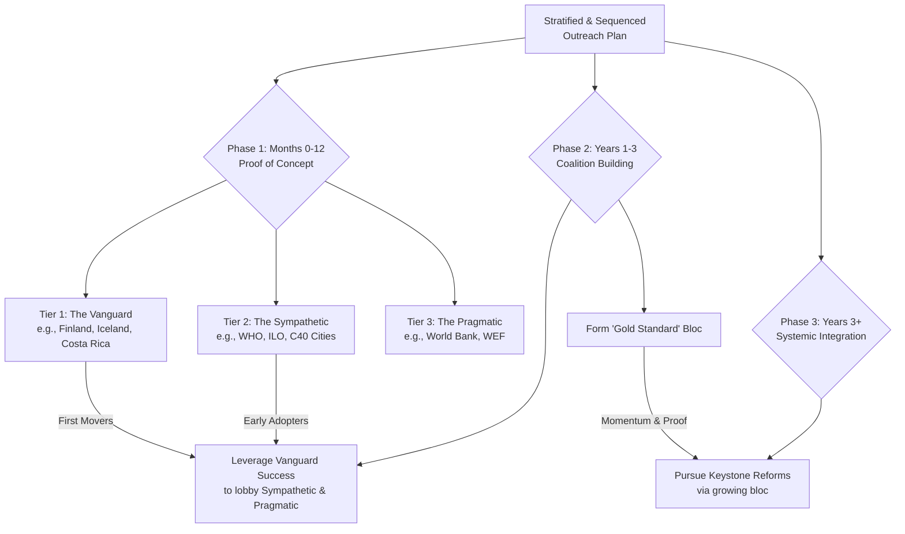

Of course. For the top-down strategy, targeting governments and major organizations, you need a plan that is both **highly strategic** and **highly adaptable**. This isn't about a loose "let's see what happens" approach, nor is it a rigid, grand five-year plan that will break upon contact with reality.

I recommend a **"Stratified & Sequenced Outreach Plan"**—a dynamic, living strategy that prioritizes targets and times its approach based on a clear theory of change.

Here is a visual overview of this structured approach:

---

### The Stratified & Sequenced Outreach Plan

#### **Phase 1: The Proof of Concept (Months 0-12)**
**Goal:** Secure 3-5 "lighthouse" adopters to create demonstrable success.

**Tier 1: The Vanguard (The "Yes, And..." Countries)**
*   **Who:** Nations with a proven track record of progressive, experimental policy. **Finland, Iceland, New Zealand, Costa Rica.**
*   **When:** Outreach in the first 3 months.
*   **The Ask:** NOT "Adopt the whole treaty." Instead:
    *   To **Finland/Iceland:** "Pilot a **Hearts-style care currency** in one municipality, integrated with your strong social services. You're already leaders in wellbeing; let's make it measurable."
    *   To **Costa Rica:** "Formalize your leadership by being the first nation to adopt the **Ecocide Law** into your national legal code and champion it globally."
    *   To **New Zealand:** "Co-design a **LMCI-style budget** with your Māori partners, formally valuing wellbeing and cultural heritage alongside GDP."
*   **Why they might say yes:** It aligns with their national brand, offers first-mover advantage, and is a manageable, high-impact pilot.

**Tier 2: The Sympathetic (The "Mission-Aligned" Orgs)**
*   **Who:** **World Health Organization (WHO), International Labour Organization (ILO), C40 Cities, OECD's Wellbeing Initiative.**
*   **When:** Months 3-9.
*   **The Ask:**
    *   **WHO/ILO:** "Endorse the **'Care Work as Foundational Infrastructure'** principle and help us develop the validation metrics for the AUBI's Layer 2 bonuses."
    *   **C40 Cities:** "Adopt the **BAZ Starter Pack** as a model for urban resilience and community-led climate action in your member cities."
*   **Why they might say yes:** It gives them a concrete, innovative framework to advance their existing mandates.

**Tier 3: The Pragmatic (The "Show Me the Money" Orgs)**
*   **Who:** **World Bank, IMF, World Economic Forum (WEF).**
*   **When:** Months 9-12, *but only with a Tier 1 success story in hand.*
*   **The Ask:** "Let us present a case study from Finland/Costa Rica on how this new economic model **reduces long-term social service costs, increases resilience, and improves key metrics.** We are not asking for endorsement, but for your analysis and dialogue."
*   **Why they might engage:** Curiosity, risk management, and the need to understand emerging alternatives.

---

#### **Phase 2: The Coalition of the Willing (Years 1-3)**
**Goal:** Build a critical mass of support to make the framework politically undeniable.

*   **The Strategy:** Use the success stories from Phase 1 as your primary lobbying tool.
    *   **Case Study:** "The Finnish pilot saw a 15% increase in community trust and a 10% reduction in elderly care costs. Here's how your country can do the same."
    *   **The "Gold Standard" Bloc:** Help the Vanguard countries (Finland, Costa Rica, etc.) form a formal alliance—a "Treaty for Our Only Home Gold Standard" group—to coordinate pressure in international forums.

*   **Expanded Outreach:**
    *   **To the EU:** Target the **European Commission's Green Deal** team and progressive MEPs. The ask: "Incorporate the **Leaves/ecological currency** model into your carbon border adjustment mechanism and just transition funds."
    *   **To Middle Powers:** **Canada, Germany, South Korea, Chile.** The ask: "Join the Gold Standard bloc in championing one Keystone Reform, like the **UN Parliamentary Assembly** or **UNSC veto override for climate**."

---

#### **Phase 3: The Systemic Integration (Years 3+)**
**Goal:** Secure adoption of Keystone Reforms at the global level.

*   **The Strategy:** The "Gold Standard" bloc, now expanded and backed by data from dozens of pilots, uses its collective diplomatic weight.
*   **The Asks become bolder and more systemic:**
    *   "We, the 40-nation Gold Standard bloc, formally table the **Ecocide Law** amendment at the ICC Assembly of States Parties."
    *   "We call for a **UNGA Resolution** to establish a pilot of the Global Citizens' Initiative."
    *   "We are now channeling 5% of our national climate funds through the **Hearts/Leaves** system for local adaptation projects."

### The "How" of Outreach

1.  **The Right Messenger:** For Finland, send a Nordic academic and a well-regarded Finnish diplomat. For Costa Rica, send an environmental lawyer and a representative from an Indigenous governance council. **Cultural and institutional alignment is key.**
2.  **The Right Package:** Never show up with the 100-page framework. Show up with a **2-page "Opportunity Brief"** tailored to that specific entity's priorities, referencing the specific "Ask."
3.  **The Right Timing:** Leverage **"Focusing Events"**—a new climate disaster, a pandemic treaty negotiation, a UN summit—to pitch the relevant part of your framework as *the* solution.

In short: **Start with the most likely allies with the most tailored, modest asks. Use their success to recruit the next tier. Build a coalition that eventually becomes too large for the old system to ignore.** This is a plan, but it's a plan designed to learn and adapt from reality, not dictate it.
