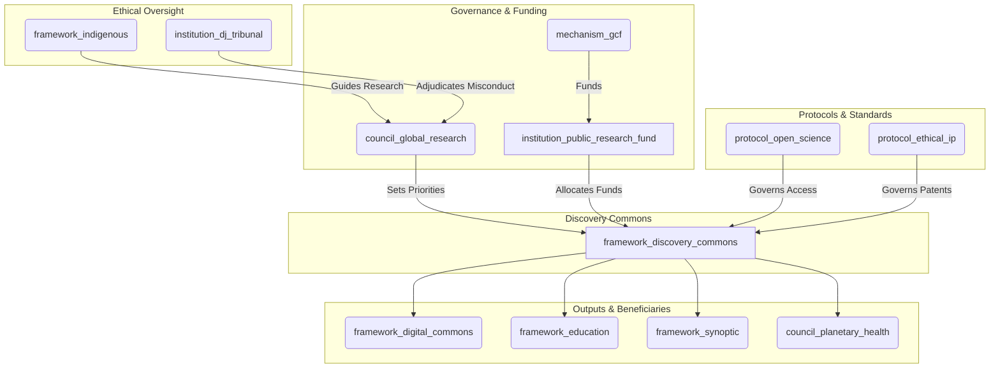

# The Discovery Commons (Version 0.1)

### A GGF Framework for Scientific & Research Integrity

*This is a foundational draft (Version 0.1) for a Tier 2 GGF framework. It is designed to govern the production of scientific knowledge as a global public good, ensuring it is ethical, open, and directed toward planetary well-being.*

-----

### **1. Introduction: The Engine of Verifiable Knowledge**

#### **The Challenge**

The polycrisis is also an epistemic crisis. The systems that produce scientific knowledge are often fragmented, siloed within nations, captured by private interests, and inaccessible behind paywalls. This slows innovation, hinders global collaboration on existential threats, and erodes public trust in science itself. Without a global framework to guide research priorities and steward knowledge as a commons, we risk solving the wrong problems, duplicating efforts, and allowing life-saving insights to be privatized for profit rather than shared for the public good.

#### **The Opportunity**

The Discovery Commons reimagines scientific research as a transparent, collaborative, and globally coordinated enterprise dedicated to human and planetary flourishing. It provides the architecture to direct public funding toward our most pressing challenges, break down data silos, and establish a new paradigm where knowledge is a shared inheritance, not a private commodity. It serves as the GGF's primary engine for producing the verifiable, open-access knowledge that underpins effective governance, education, and media integrity.

#### **The Framework**

As a **Tier 2 Foundational Application Framework**, The Discovery Commons governs the entire lifecycle of publicly funded research—from priority-setting and funding to methodology, publication, and intellectual property. It works in direct partnership with **The Capacity Engine** (which disseminates its findings), the **Synoptic Protocol** (which relies on its rigor), and the **Digital Commons** (which hosts its outputs), creating a complete, end-to-end knowledge ecosystem for the GGF.

-----

### **2. Core Principles**

  - **Knowledge as a Public Good**: All publicly funded research outputs—data, papers, code—are a global commons, freely accessible to all.
  - **Epistemic Rigor & Integrity**: Upholding the highest standards of scientific methodology, peer review, and reproducibility to ensure the knowledge produced is reliable and trustworthy.
  - **Mission-Oriented Research**: Prioritizing and funding research that directly addresses the challenges identified by the GGF, particularly the `council_planetary_health`.
  - **Epistemological Pluralism**: Actively recognizing and integrating diverse ways of knowing, including Indigenous scientific methodologies, with non-negotiable protocols for consent and data sovereignty guided by the `framework_indigenous`.
  - **Ethical Conduct & Precaution**: All research must adhere to strict ethical guidelines, including the precautionary principle for high-stakes domains like AI and synthetic biology.
  - **Global Collaboration & Equity**: Fostering a globally distributed and collaborative research ecosystem that dismantles historical inequities and empowers the Global South.

-----

### **3. Structural Components & GGF Integration**

The Discovery Commons establishes the core institutions for governing global research.

**Visual: The Discovery Commons Integration**

#### **Core Entities:**

  - **Framework (`framework_discovery_commons`):** This parent framework.
  - **Governing Council (`council_global_research`):** A specialized sub-council of the Meta-Governance framework.
      - **Mandate:** To set global research priorities in dialogue with other GGF councils (especially `council_planetary_health`). It oversees the allocation of research funds and the enforcement of open science and ethical IP protocols.
      - **Composition:** A balance of leading scientists from diverse fields, representatives from Global South research institutions, Indigenous knowledge keepers, and delegates from citizen assemblies.
  - **Financial Institution (`institution_public_research_fund`):** The operational funding body.
      - **Mandate:** To receive a dedicated allocation from the `mechanism_gcf` (Global Commons Fund) and distribute it as grants for research projects aligned with the priorities set by the `council_global_research`.
  - **Core Protocol (`protocol_open_science`):** The standard for all funded research.
      - **Mandate:** Requires all research data, methodologies, and publications from funded projects to be immediately published open-access in the `framework_digital_commons`. It also mandates standards for data formatting and reproducibility.
  - **Legal Protocol (`protocol_ethical_ip`):** The protocol for managing intellectual property.
      - **Mandate:** All patents and IP derived from research funded by the `institution_public_research_fund` are automatically placed into **Stewardship Trusts** under the `framework_hearthstone`. This prevents privatization and ensures the knowledge can be used for the public good, while allowing for licensing models that fund further research.

-----

### **4. Key Functions & Mandates**

1.  **Setting Global Research Priorities:** The `council_global_research` runs an annual "Global Research Agenda" process. It solicits challenges and priorities from other GGF bodies (e.g., the `council_planetary_health` requests research on tipping points; the `Sundown Protocol` requests research on new remediation technologies) and from the public via citizen assemblies.
2.  **Allocating Public Funding Equitably:** The `institution_public_research_fund` uses the Global Research Agenda to issue calls for proposals. Its allocation process is transparent and weighted to support researchers and institutions in the Global South, breaking down historical inequities in global science funding.
3.  **Enforcing Open Science:** Compliance with `protocol_open_science` is a non-negotiable condition of all funding. The `platform_transition_observatory` (adapted for this purpose) will track compliance in real-time. Non-compliant institutions risk being blacklisted from future funding rounds.
4.  **Stewarding Intellectual Property as a Commons:** The `protocol_ethical_ip` ensures that breakthroughs from public funding benefit all of humanity. The `institution_commons_transition_office` (from `framework_hearthstone`) will assist in managing the patent trusts, developing equitable licensing agreements that can generate revenue to be funneled back into the `institution_public_research_fund`.
5.  **Adjudicating Research Misconduct:** The `council_global_research` investigates allegations of scientific misconduct (plagiarism, data fabrication). Severe cases are escalated to the `institution_dj_tribunal` for adjudication and potential sanctions.

-----

### **5. Implementation Pathway**

  - **Phase 1: Foundation & Priority Setting (Years 1-3)**
      - Establish the `council_global_research` and the `institution_public_research_fund`.
      - Run the first Global Research Agenda, focusing on a few critical areas (e.g., climate solutions, pandemic preparedness).
      - Draft and ratify the `protocol_open_science` and `protocol_ethical_ip`.
  - **Phase 2: Scaling & Integration (Years 3-8)**
      - Scale up funding to cover a wider range of scientific disciplines.
      - Integrate fully with **The Capacity Engine**, creating curricula based on the latest open research.
      - Establish formal partnerships with national research agencies to align funding priorities and open science standards.
  - **Phase 3: Global Scientific Commons (Years 8+)**
      - The Discovery Commons becomes the default global standard for publicly funded research.
      - The `framework_digital_commons` hosts a mature, interconnected library of all human scientific knowledge, accessible to anyone, anywhere.

-----

### **6. Conclusion: Science for the People and the Planet**

The Discovery Commons transforms science from a competitive, often proprietary endeavor into a collaborative, mission-driven engine for planetary regeneration. By ensuring that the production of knowledge is transparent, ethical, and oriented toward the public good, it provides the GGF with the solid foundation of verifiable truth needed to navigate the complexities of the 21st century and build a wiser future.
