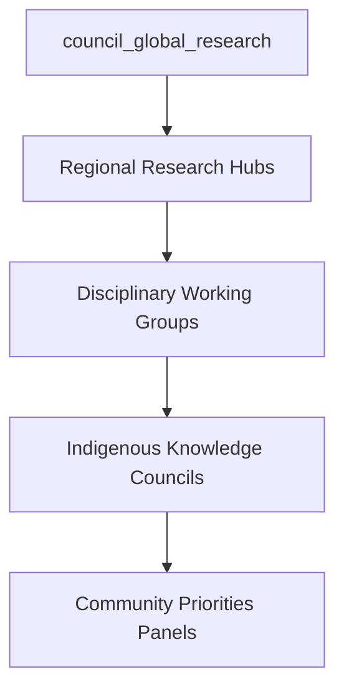

The Discovery Commons framework shows strong foundational thinking! Here are my suggestions for improvement:

## **Strengthening the Framework**

### **1. Enhanced Integration with Existing Initiatives**

Building on current open science momentum like UNESCO's Open Science Partnership and the European Open Science Cloud, consider:

- **Bridge Existing Networks**: Rather than creating entirely new structures, leverage existing initiatives like SCOSS (Global Sustainability Coalition for Open Science Services) which already coordinates funding for open science infrastructure across 340+ institutions
- **Standards Alignment**: Integrate with FAIR data principles (Findability, Accessibility, Interoperability, Reusability) already implemented by EOSC

### **2. More Specific Implementation Mechanisms**

**Enhanced Governance Structure:**

- **Rotating Regional Leadership**: Prevent dominance by any single region
- **Disciplinary Balance**: Ensure representation across STEM, social sciences, and humanities
- **Community Integration**: Direct pathways for civil society input on research priorities

### **3. Addressing Power Dynamics & Equity**

**Global South Empowerment:**
- **Capacity Building Fund**: Dedicated portion of budget for research infrastructure in under-resourced regions
- **Reverse Fellowship Programs**: Northern researchers embedded in Global South institutions
- **Indigenous Research Sovereignty**: Stronger protocols ensuring Indigenous communities control research affecting them

### **4. More Robust Enforcement Mechanisms**

**Compliance Architecture:**
- **Graduated Sanctions**: Clear escalation from warnings to funding suspension
- **Peer Review Integration**: Community-driven oversight similar to how the Open Science Framework enables researcher self-governance
- **Whistleblower Protections**: Safe channels for reporting violations

### **5. Technology & Platform Specifications**

**Digital Infrastructure:**
- **Interoperability Standards**: APIs connecting with existing platforms (OSF, Zenodo, institutional repositories)
- **AI Integration**: Tools for research synthesis, fraud detection, and collaboration matching
- **Multi-language Support**: Breaking down language barriers in global research

### **6. Economic Sustainability Model**

**Diverse Funding Streams:**
- **Research Tax**: Small levy on patent licensing revenues
- **Corporate Contribution**: Tech companies benefiting from public research contribute back
- **National Quotas**: Countries contribute based on GDP and research output

### **7. Specific Success Metrics**

**Measurable Outcomes:**
- **Open Access Rate**: Percentage of funded research immediately available
- **Global Collaboration Index**: Cross-regional research partnerships
- **Innovation Velocity**: Time from discovery to application
- **Equity Indicators**: Research leadership demographics and geographic distribution

### **8. Crisis Response Capabilities**

**Emergency Research Coordination:**
- **Rapid Response Protocol**: Fast-track funding for urgent challenges (pandemics, climate events)
- **Data Sharing Mandates**: Immediate open access during global emergencies
- **Resource Reallocation**: Ability to redirect funding quickly when priorities shift

## **Framework Enhancement: Key Additions**

1. **`institution_regional_research_hubs`**: Decentralized implementation bodies
2. **`process_indigenous_research_protocols`**: Ensuring FPIC compliance
3. **`mechanism_research_equity_fund`**: Dedicated Global South capacity building
4. **`protocol_crisis_research_response`**: Emergency coordination procedures

This framework has excellent potential to transform global research governance. The key is balancing ambition with pragmatic implementation that builds on existing momentum while addressing historical inequities.
