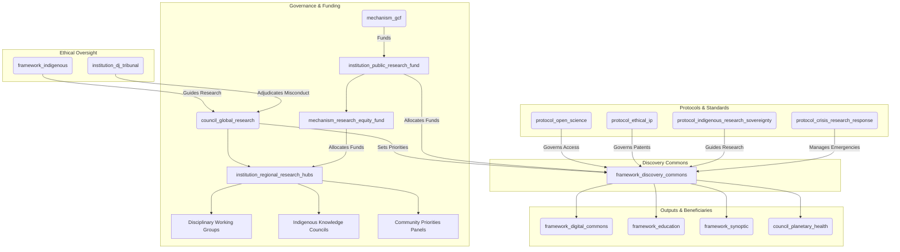

# The Discovery Commons (Version 0.2)

### A GGF Framework for Scientific & Research Integrity

*This is an updated draft (Version 0.2) for a Tier 2 GGF framework, governing the production of scientific knowledge as a global public good, ensuring it is ethical, open, and directed toward planetary well-being. This version incorporates feedback to enhance governance, equity, enforcement, and integration with existing initiatives.*

---

### **1. Introduction: The Engine of Verifiable Knowledge**

#### **The Challenge**

The polycrisis is also an epistemic crisis. Fragmented, siloed, and often privatized scientific systems slow innovation, hinder global collaboration on existential threats, and erode public trust in science. Without a global framework to guide research priorities and steward knowledge as a commons, we risk solving the wrong problems, duplicating efforts, and allowing life-saving insights to be privatized.

#### **The Opportunity**

The Discovery Commons reimagines scientific research as a transparent, collaborative, and globally coordinated enterprise for human and planetary flourishing. It directs public funding toward pressing challenges, breaks down data silos, and establishes knowledge as a shared inheritance. It serves as the GGF's engine for verifiable, open-access knowledge underpinning governance, education, and media integrity.

#### **Alignment with the Global Open Science Movement**

The Discovery Commons builds on existing open science momentum, partnering with initiatives like UNESCO's Open Science Partnership and the European Open Science Cloud (EOSC). It aligns with FAIR data principles (Findability, Accessibility, Interoperability, Reusability) and leverages networks like SCOSS (Global Sustainability Coalition for Open Science Services) to coordinate funding and infrastructure across 340+ institutions, ensuring it amplifies rather than duplicates global efforts.

#### **The Framework**

As a **Tier 2 Foundational Application Framework**, The Discovery Commons governs the lifecycle of publicly funded research—from priority-setting and funding to methodology, publication, and intellectual property. It partners with **The Capacity Engine** (disseminating findings), the **Synoptic Protocol** (relying on rigor), and the **Digital Commons** (hosting outputs), creating a complete GGF knowledge ecosystem.

---

### **2. Core Principles**

- **Knowledge as a Public Good**: All publicly funded research outputs—data, papers, code—are a global commons, freely accessible to all.
- **Epistemic Rigor & Integrity**: Upholding the highest standards of methodology, peer review, and reproducibility for trustworthy knowledge.
- **Mission-Oriented Research**: Prioritizing research addressing GGF-identified challenges, particularly via the `council_planetary_health`.
- **Epistemological Pluralism**: Integrating diverse ways of knowing, including Indigenous methodologies, with strict protocols for consent and data sovereignty guided by the `framework_indigenous`.
- **Ethical Conduct & Precaution**: Adhering to ethical guidelines and the precautionary principle in high-stakes domains like AI and synthetic biology.
- **Global Collaboration & Equity**: Fostering a distributed, collaborative research ecosystem that dismantles historical inequities and empowers the Global South.

---

### **3. Structural Components & GGF Integration**

The Discovery Commons establishes core institutions for governing global research, with enhanced decentralization and equity mechanisms.

**Visual: The Discovery Commons Integration**

#### **Core Entities**

- **Framework (`framework_discovery_commons`):** The parent framework.
- **Governing Council (`council_global_research`):** A sub-council of the Meta-Governance framework.
  - **Mandate**: Sets global research priorities in dialogue with GGF councils (e.g., `council_planetary_health`). Oversees fund allocation, open science, and ethical IP enforcement. Convenes **Disciplinary Working Groups** (STEM, social sciences, humanities) and **Community Priorities Panels** for balanced agendas.
  - **Composition**: Leading scientists, Global South representatives, Indigenous knowledge keepers, and citizen assembly delegates. Leadership rotates across **Regional Research Hubs** to prevent regional dominance.
- **Regional Research Hubs (`institution_regional_research_hubs`):** Decentralized bodies adapting global priorities to local contexts, managing regional funding, and fostering local ecosystems.
- **Financial Institution (`institution_public_research_fund`):** The operational funding body.
  - **Mandate**: Receives allocations from the `mechanism_gcf` (Global Commons Fund) and distributes grants aligned with the Global Research Agenda. Includes the **Research Equity Fund** (`mechanism_research_equity_fund`), allocating 20% of funds for Global South infrastructure and **Reverse Fellowship Programs** embedding Northern researchers in Southern institutions.
- **Core Protocol (`protocol_open_science`):** Mandates immediate open-access publication of research data, methodologies, and papers in the `framework_digital_commons`, compliant with FAIR data principles.
- **Legal Protocol (`protocol_ethical_ip`):** Places patents and IP from funded research into **Stewardship Trusts** under the `framework_hearthstone`, preventing privatization and enabling equitable licensing.
- **Indigenous Protocol (`protocol_indigenous_research_sovereignty`):** Mandates co-design and co-ownership of research affecting Indigenous communities, with veto power by local BAZ or traditional governance bodies, overseen by **Indigenous Knowledge Councils** within Regional Hubs.
- **Crisis Protocol (`protocol_crisis_research_response`):** Activates fast-track funding and mandatory open-access data sharing during global emergencies, triggered by the `process_crisis_command`.

#### **Digital Infrastructure & Interoperability**

The Discovery Commons platform, hosted on the `framework_digital_commons`, provides:
- **Interoperability Standards**: APIs connecting with platforms like OSF, Zenodo, and institutional repositories.
- **AI Integration**: Tools for research synthesis, fraud detection, and collaboration matching.
- **Multi-language Support**: Breaking down language barriers in global research.

---

### **4. Key Functions & Mandates**

1. **Setting Global Research Priorities**: The `council_global_research` runs an annual Global Research Agenda, soliciting challenges from GGF bodies (e.g., `council_planetary_health` on tipping points, `Sundown Protocol` on remediation) and the public via citizen assemblies and Community Priorities Panels.
2. **Allocating Public Funding Equitably**: The `institution_public_research_fund` issues transparent calls for proposals, weighted to support Global South researchers. The `mechanism_research_equity_fund` ensures 20% of funds build Southern infrastructure and fellowships.
3. **Enforcing Open Science**: Compliance with `protocol_open_science` is mandatory. The `platform_transition_observatory` tracks compliance in real-time, with non-compliant institutions risking funding blacklists.
4. **Stewarding Intellectual Property as a Commons**: The `protocol_ethical_ip` ensures public-funded breakthroughs benefit all. The `institution_commons_transition_office` manages patent trusts and equitable licensing, reinvesting revenue into the `institution_public_research_fund`.
5. **Adjudicating Research Misconduct**: The `council_global_research` investigates misconduct (e.g., plagiarism, data fabrication), escalating severe cases to the `institution_dj_tribunal`.

#### **Funding Sustainability**

The `mechanism_gcf` provides initial funding, supplemented by:
- **Research Tax**: A levy on patent licensing revenues from public data-driven discoveries.
- **Corporate Contribution**: Tech companies leveraging the commons contribute financially.
- **National Quotas**: Countries contribute based on GDP and research output.

---

### **5. Compliance, Crisis Response & Metrics**

#### **Compliance & Enforcement**

- **Graduated Sanctions**: Non-compliance with open science or ethical protocols triggers warnings, funding suspension, or blacklisting.
- **Whistleblower Protections**: Safe reporting channels linked to the `framework_justice`.
- **Peer Review Integration**: Community-driven oversight modeled on the Open Science Framework.

#### **Crisis Response**

The `protocol_crisis_research_response` enables:
- **Rapid Response Protocol**: Fast-track funding for urgent challenges (e.g., pandemics, climate events).
- **Data Sharing Mandates**: Immediate open access during emergencies.
- **Resource Reallocation**: Redirecting funds based on shifting priorities.

#### **Success Metrics**

- **Open Access Rate**: Percentage of funded research immediately available.
- **Global Collaboration Index**: Measures North-South and South-South partnerships.
- **Innovation Velocity**: Time from discovery to application.
- **Equity Indicators**: Tracks demographic and geographic diversity in research leadership.

---

### **6. Implementation Pathway**

- **Phase 1: Foundation & Priority Setting (Years 1-3)**
  - Establish the `council_global_research`, `institution_public_research_fund`, and `institution_regional_research_hubs`.
  - Run the first Global Research Agenda, focusing on climate solutions and pandemic preparedness.
  - Ratify `protocol_open_science`, `protocol_ethical_ip`, `protocol_indigenous_research_sovereignty`, and `protocol_crisis_research_response`.
- **Phase 2: Scaling & Integration (Years 3-8)**
  - Expand funding across disciplines, with 20% via the `mechanism_research_equity_fund`.
  - Integrate with **The Capacity Engine** for curricula and national research agencies for aligned priorities.
  - Launch the Discovery Commons platform with APIs and AI tools.
- **Phase 3: Global Scientific Commons (Years 8+)**
  - Establish the Discovery Commons as the global standard for publicly funded research.
  - Create a mature, interconnected library of human scientific knowledge on the `framework_digital_commons`.

---

### **7. Conclusion: Science for the People and the Planet**

The Discovery Commons transforms science into a collaborative, mission-driven engine for planetary regeneration. By ensuring transparent, ethical, and equitable knowledge production, it provides the GGF with verifiable truth to navigate the 21st century and build a wiser future.