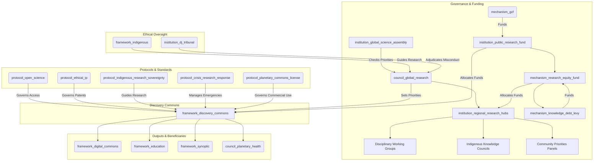

# The Discovery Commons (Version 0.3)

### A GGF Framework for Scientific & Research Integrity

*This is an updated draft (Version 0.3) for a Tier 2 GGF framework, governing the production of scientific knowledge as a global public good. It ensures knowledge is ethical, open, and directed toward planetary well-being, with radical equity, decolonized structures, and crisis responsiveness. This version incorporates bold, transformative feedback while maintaining feasibility.*

---

### **1. Introduction: The Engine of Verifiable Knowledge**

#### **The Challenge**

The polycrisis is an epistemic crisis. Fragmented, siloed, and often privatized scientific systems slow innovation, hinder collaboration on existential threats, and erode public trust. Historical inequities, including the extraction of Global South knowledge, exacerbate these issues. Without a transformative global framework, we risk misaligned priorities, duplicated efforts, and privatized insights.

#### **The Opportunity**

The Discovery Commons reimagines scientific research as a transparent, collaborative, and decolonized enterprise for human and planetary flourishing. It directs public funding toward critical challenges, dismantles data and power silos, and ensures knowledge is a shared, equitable inheritance. It serves as the GGF’s engine for verifiable, open-access knowledge underpinning governance, education, and media integrity.

#### **Alignment with the Global Open Science Movement**

The Discovery Commons partners with initiatives like UNESCO’s Open Science Partnership and the European Open Science Cloud (EOSC), aligning with FAIR data principles (Findability, Accessibility, Interoperability, Reusability). It leverages networks like SCOSS to coordinate funding and infrastructure across 340+ institutions, amplifying global efforts without duplication.

#### **The Framework**

As a **Tier 2 Foundational Application Framework**, The Discovery Commons governs the lifecycle of publicly funded research—from priority-setting and funding to methodology, publication, and intellectual property. It integrates with **The Capacity Engine** (disseminating findings), the **Synoptic Protocol** (relying on rigor), and the **Digital Commons** (hosting outputs), creating a complete GGF knowledge ecosystem.

---

### **2. Core Principles**

- **Knowledge as a Public Good**: All publicly funded research outputs—data, papers, code—are a global commons, freely accessible in multiple languages.
- **Epistemic Rigor & Integrity**: Upholding the highest standards of methodology, open peer review, and reproducibility for trustworthy knowledge.
- **Mission-Oriented Research**: Prioritizing research addressing GGF-identified challenges, particularly via the `council_planetary_health`, with citizen input.
- **Epistemological Pluralism**: Integrating diverse ways of knowing, including Indigenous methodologies, with dynamic consent and data sovereignty guided by the `framework_indigenous`.
- **Ethical Conduct & Precaution**: Adhering to strict ethical guidelines and the precautionary principle in high-stakes domains like AI and synthetic biology.
- **Radical Equity & Decolonization**: Dismantling historical power imbalances by centering Global South leadership and reparative funding.

---

### **3. Structural Components & GGF Integration**

The Discovery Commons establishes core institutions with decentralized, equitable governance and radical accountability.

**Visual: The Discovery Commons Integration**

#### **Core Entities**

- **Framework (`framework_discovery_commons`):** The parent framework.
- **Governing Council (`council_global_research`):** A sub-council of the Meta-Governance framework.
  - **Mandate**: Sets global research priorities in dialogue with GGF councils (e.g., `council_planetary_health`), convenes **Disciplinary Working Groups** (STEM, social sciences, humanities), and **Community Priorities Panels**. Oversees fund allocation, open science, and ethical IP enforcement.
  - **Composition**: Balanced representation of scientists, Global South researchers (50% leadership roles), Indigenous knowledge keepers, and citizen assembly delegates. Leadership and secretariats rotate between Global North and South institutions (e.g., Kenya, India, Brazil).
- **Global Science Assembly (`institution_global_science_assembly`):** A directly elected body (1 million votes = 1 seat) of scientists and citizens.
  - **Mandate**: Initiates binding public inquiries into `council_global_research` priorities and, with a 2/3 majority, forces supermajority reconsideration votes on decisions neglecting existential risks.
- **Regional Research Hubs (`institution_regional_research_hubs`):** Decentralized bodies adapting global priorities to local contexts, managing regional funding, and fostering local ecosystems. They have **Subsidiarity Veto** power to override global priorities conflicting with urgent local needs (e.g., water scarcity over AI ethics).
- **Financial Institution (`institution_public_research_fund`):** The operational funding body.
  - **Mandate**: Distributes grants from the `mechanism_gcf` aligned with the Global Research Agenda. Includes the **Research Equity Fund** (`mechanism_research_equity_fund`), allocating 20% of funds for Global South infrastructure and **Reverse Fellowship Programs**, funded partly by the **Knowledge Debt Levy** (`mechanism_knowledge_debt_levy`) on historically dominant research nations.
- **Impact Credits (`mechanism_impact_credits`):** Non-monetary tokens awarded for cross-regional collaboration, mentoring Global South researchers, or high-quality peer review, redeemable for conference funding or sabbaticals.
- **Core Protocol (`protocol_open_science`):** Mandates immediate open-access publication of research outputs in the `framework_digital_commons`, compliant with FAIR principles. Includes:
  - **Pre-Registration Mandate**: Hypotheses and methodologies must be pre-registered before funding.
  - **Open Peer Review**: Blockchain-backed system linking reviewers’ contributions to publications.
  - **Language Justice**: Abstracts and summaries published in English and at least one Global South language (e.g., Swahili, Hindi, Portuguese), with AI translation support.
- **Legal Protocol (`protocol_ethical_ip`):** Places IP from funded research into **Stewardship Trusts** under the `framework_hearthstone`. Bans patents in critical domains (climate tech, pandemics, AI safety).
- **Planetary Commons License (`protocol_planetary_commons_license`):** Allows free use and derivation of research but requires commercial users to pay a tiered percentage (e.g., 5% of profits) to the `institution_public_research_fund`. AI models trained on Commons data must be open-sourced.
- **Indigenous Protocol (`protocol_indigenous_research_sovereignty`):** Mandates co-design and co-ownership of research affecting Indigenous communities, with **Dynamic Consent** via APIs for real-time consent modification, overseen by **Indigenous Knowledge Councils**.
- **Crisis Protocol (`protocol_crisis_research_response`):** Activates fast-track funding, mandatory open-access data sharing, and **Crisis Labs** (`institution_crisis_labs`)—temporary, decentralized collaboratives for rapid solution development during emergencies.
- **Crisis Labs (`institution_crisis_labs`):** Open-source war rooms uniting scientists, engineers, and communities, with fast-tracked funding and IP waivers.

#### **Digital Infrastructure & Interoperability**

The Discovery Commons platform, hosted on the `framework_digital_commons`, provides:
- **Interoperability Standards**: APIs connecting with OSF, Zenodo, and institutional repositories.
- **AI Integration**: Tools for research synthesis, fraud detection, collaboration matching, and translation.
- **Dynamic Consent APIs**: Enabling Indigenous communities to manage data access in real-time.

---

### **4. Key Functions & Mandates**

1. **Setting Global Research Priorities**: The `council_global_research` runs an annual Global Research Agenda, soliciting challenges from GGF bodies, citizen assemblies, and Community Priorities Panels. Regional Hubs can veto priorities conflicting with local needs.
2. **Allocating Public Funding Equitably**: The `institution_public_research_fund` issues transparent calls, weighted for Global South researchers. The `mechanism_research_equity_fund` (20% of funds) supports Southern infrastructure, fellowships, and **Global South Moonshot Challenges** (10% of funds for high-risk, high-reward prizes judged by grassroots panels).
3. **Enforcing Open Science**: Compliance with `protocol_open_science` is mandatory, tracked by the `platform_transition_observatory`. Non-compliant institutions face sanctions.
4. **Stewarding Intellectual Property as a Commons**: The `protocol_ethical_ip` and `protocol_planetary_commons_license` ensure breakthroughs benefit all, with revenue reinvested into the `institution_public_research_fund`.
5. **Adjudicating Research Misconduct**: The `council_global_research` investigates misconduct, escalating severe cases to the `institution_dj_tribunal`.

#### **Funding Sustainability**

The `mechanism_gcf` provides initial funding, supplemented by:
- **Knowledge Debt Levy**: Reparative contributions from historically dominant research nations.
- **Research Tax**: Levy on patent licensing revenues from public data-driven discoveries.
- **Corporate Contribution**: Tech companies leveraging the commons contribute financially.
- **National Quotas**: Countries contribute based on GDP and research output.

---

### **5. Compliance, Crisis Response & Metrics**

#### **Compliance & Enforcement**

- **Graduated Sanctions**: Warnings, funding suspension, or blacklisting for non-compliance.
- **Algorithmic Auditing**: AI monitors for knowledge hoarding, triggering sanctions.
- **Whistleblower Bounties**: 5% of recouped misused funds awarded to whistleblowers via encrypted channels.
- **Peer Review Integration**: Community-driven oversight via open, blockchain-backed reviews.

#### **Crisis Response**

The `protocol_crisis_research_response` enables:
- **Rapid Response Protocol**: Fast-track funding for urgent challenges.
- **Viral Priority-Setting**: Citizen assemblies allocate 10-20% of emergency funds via real-time voting.
- **Data Sharing Mandates**: Immediate open access during emergencies.
- **Crisis Labs**: Decentralized collaboratives for rapid, open-source solutions.
- **Resource Reallocation**: Redirecting funds based on shifting priorities.

#### **Success Metrics**

- **Open Access Rate**: Percentage of funded research immediately available.
- **Global Collaboration Index**: Measures North-South and South-South partnerships.
- **Innovation Velocity**: Time from discovery to application.
- **Equity Indicators**: Tracks demographic and geographic diversity in research leadership.

---

### **6. Implementation Pathway**

- **Phase 0: Pilot (Year 1)**
  - Test the framework by open-sourcing all GGF-funded research.
  - Establish the `council_global_research`, `institution_public_research_fund`, `institution_regional_research_hubs`, and `institution_global_science_assembly`.
- **Phase 1: Foundation & Priority Setting (Years 1-3)**
  - Run the first Global Research Agenda, focusing on climate and pandemics.
  - Ratify all protocols (`protocol_open_science`, `protocol_ethical_ip`, `protocol_indigenous_research_sovereignty`, `protocol_crisis_research_response`, `protocol_planetary_commons_license`).
  - Launch Moonshot Challenges and Impact Credits.
- **Phase 2: Scaling & Integration (Years 3-8)**
  - Expand funding, with 20% via the `mechanism_research_equity_fund`.
  - Integrate with **The Capacity Engine** for curricula and national research agencies.
  - Launch the Commons platform with APIs, AI tools, and Dynamic Consent.
- **Phase 3: Global Scientific Commons (Years 8+)**
  - Establish the Discovery Commons as the global standard for publicly funded research.
  - Create a mature, interconnected library of human scientific knowledge.

---

### **7. Conclusion: Science for the People and the Planet**

The Discovery Commons transforms science into a decolonized, collaborative, and crisis-responsive engine for planetary regeneration. By centering equity, enforcing radical transparency, and empowering communities, it provides the GGF with verifiable truth to navigate the 21st century and build a wiser, fairer future.