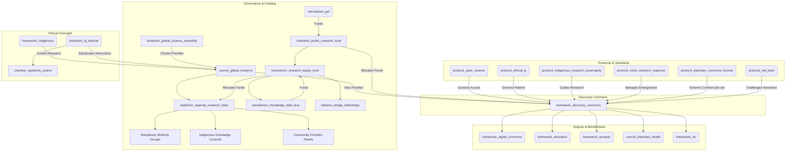

# The Discovery Commons (Version 0.4)

### A GGF Framework for Scientific & Research Integrity

*This is an updated draft (Version 0.4) for a Tier 2 GGF framework, governing the production of scientific knowledge as a global public good. It ensures knowledge is ethical, open, and directed toward planetary well-being, with radical equity, decolonized structures, crisis responsiveness, and adaptive governance. The Discovery Commons acts as the living library and research lab for a planetary civilization, evolving through global community feedback.*

---

### **1. Introduction: The Engine of Verifiable Knowledge**

#### **The Challenge**

The polycrisis is an epistemic crisis. During the COVID-19 pandemic, vaccine apartheid saw life-saving knowledge hoarded by wealthy nations and corporations, delaying global recovery and costing millions of lives. Fragmented, privatized scientific systems slow innovation, hinder collaboration on existential threats, and erode public trust. Historical inequities, including the extraction of Global South and Indigenous knowledge, exacerbate these issues, risking misaligned priorities and privatized insights.

#### **The Opportunity**

The Discovery Commons reimagines scientific research as a transparent, collaborative, and decolonized enterprise for human and planetary flourishing. It directs public funding toward critical challenges, dismantles power and data silos, and ensures knowledge is a shared, equitable inheritance. As the GGF’s engine for verifiable, open-access knowledge, it underpins governance, education, and media integrity, fostering a wiser future.

#### **Alignment with the Global Open Science Movement**

The Discovery Commons partners with initiatives like UNESCO’s Open Science Partnership and the European Open Science Cloud (EOSC), aligning with FAIR data principles (Findability, Accessibility, Interoperability, Reusability). It leverages networks like SCOSS to coordinate funding and infrastructure across 340+ institutions, amplifying global efforts.

#### **The Framework**

As a **Tier 2 Foundational Application Framework**, The Discovery Commons governs the lifecycle of publicly funded research—from priority-setting and funding to methodology, publication, and intellectual property. It integrates with **The Capacity Engine** (disseminating findings), the **Synoptic Protocol** (relying on rigor), the **Digital Commons** (hosting outputs), and the **Disaster Risk Reduction Framework** (`framework_drr`) for crisis responsiveness.

---

### **2. Core Principles**

- **Knowledge as a Public Good**: All publicly funded research outputs—data, papers, code—are a global commons, accessible in multiple languages.
- **Epistemic Rigor & Integrity**: Upholding the highest standards of methodology, open peer review, and reproducibility for trustworthy knowledge.
- **Mission-Oriented Research**: Prioritizing research addressing GGF-identified challenges, with citizen and community input.
- **Epistemological Pluralism**: Integrating diverse ways of knowing, including Indigenous methodologies, with dynamic consent and data sovereignty.
- **Ethical Conduct & Precaution**: Adhering to ethical guidelines and the precautionary principle in high-stakes domains like AI and synthetic biology.
- **Equity, Justice & Decolonization**: Centering Global South leadership and reparative funding to dismantle historical power imbalances.
- **Iterative Governance**: Evolving the framework through feedback from global epistemic communities, ensuring adaptability.

---

### **3. Structural Components & GGF Integration**

The Discovery Commons establishes core institutions with decentralized, equitable, and adaptive governance.

**Simplified Narrative Overview**:
- The `council_global_research` sets global priorities, guided by diverse experts and citizens.
- `institution_regional_research_hubs` adapt priorities locally, with veto power for urgent needs.
- `institution_public_research_fund` allocates equitable funding, with 20% for Global South capacity.
- `institution_global_science_assembly` ensures democratic oversight.
- Protocols ensure open access, ethical IP, Indigenous sovereignty, and crisis response.
- The `framework_digital_commons` hosts a multilingual, interoperable platform.

**Visual: The Discovery Commons Integration**

#### **Core Entities**

- **Framework (`framework_discovery_commons`):** The parent framework.
- **Governing Council (`council_global_research`):** A sub-council of the Meta-Governance framework.
  - **Mandate**: Sets global research priorities, convenes **Disciplinary Working Groups** and **Community Priorities Panels**, oversees funding and compliance. Establishes **AI Bias Audits** for scientific modeling, mandating diverse training data.
  - **Composition**: Scientists, Global South researchers (50% leadership), Indigenous knowledge keepers, citizen delegates. Leadership rotates between North and South institutions (e.g., Kenya, India, Brazil).
- **Global Science Assembly (`institution_global_science_assembly`):** A directly elected body (1 million votes = 1 seat).
  - **Mandate**: Initiates binding public inquiries and forces supermajority reconsideration votes on neglected existential risks.
  - **Elections**: Managed via a secure, decentralized identity system, with eligibility for verified researchers (e.g., ORCID) and GGF citizen assembly participants.
- **Regional Research Hubs (`institution_regional_research_hubs`):** Decentralized bodies adapting priorities, managing funding, with **Subsidiarity Veto** power for local needs.
- **Financial Institution (`institution_public_research_fund`):** Distributes grants from the `mechanism_gcf`.
  - **Mandate**: Includes the **Research Equity Fund** (`mechanism_research_equity_fund`), allocating 20% for Global South infrastructure, **Bridge Fellowships** (`initiative_bridge_fellowships`) for North-South mutual mentorship, and **Moonshot Challenges**, funded partly by the **Knowledge Debt Levy** (`mechanism_knowledge_debt_levy`).
- **Impact Credits (`mechanism_impact_credits`):** Tokens for collaboration, mentoring, or peer review, verified via blockchain to prevent farming, redeemable for conference funding or sabbaticals.
- **Core Protocol (`protocol_open_science`):** Mandates open-access publication, FAIR compliance, **Pre-Registration**, **Open Peer Review** (blockchain-backed), and **Language Justice** (outputs in English and a Global South language).
- **Legal Protocol (`protocol_ethical_ip`):** Bans patents in critical domains (climate, pandemics, AI safety), placing IP in **Stewardship Trusts**.
- **Planetary Commons License (`protocol_planetary_commons_license`):** Free use with commercial users paying 5% profits to the fund. AI models trained on Commons data are open-sourced.
- **Indigenous Protocol (`protocol_indigenous_research_sovereignty`):** Co-design and **Dynamic Consent** via APIs, overseen by **Indigenous Knowledge Councils**.
- **Crisis Protocol (`protocol_crisis_research_response`):** Fast-track funding, open-access data, and **Crisis Labs**, triggered by `framework_drr` early warnings.
- **Red Team Protocol (`protocol_red_team`):** Funds independent researchers and journalists to challenge scientific narratives and test misinformation resilience.
- **Crisis Labs (`institution_crisis_labs`):** Decentralized collaboratives for rapid, open-source solutions.

#### **Digital Infrastructure & Interoperability**

The `framework_digital_commons` platform provides:
- **Interoperability Standards**: APIs for OSF, Zenodo, and repositories.
- **AI Integration**: Tools for synthesis, fraud detection, translation, and bias audits.
- **Dynamic Consent APIs**: Real-time Indigenous data access control.

---

### **4. Key Functions & Mandates**

1. **Setting Global Research Priorities**: Annual Global Research Agenda via GGF bodies, citizen assemblies, and Community Priorities Panels. Regional Hubs can veto conflicting priorities.
2. **Allocating Public Funding Equitably**: Transparent calls weighted for Global South, with 20% via `mechanism_research_equity_fund` for infrastructure, fellowships, and Moonshot Challenges.
3. **Enforcing Open Science**: Mandatory compliance, tracked by `platform_transition_observatory`. Non-compliance faces sanctions.
4. **Stewarding Intellectual Property as a Commons**: `protocol_ethical_ip` and `protocol_planetary_commons_license` ensure public benefit, with revenue reinvested.
5. **Adjudicating Research Misconduct**: Handled by `council_global_research`, escalated to `institution_dj_tribunal`’s **Epistemic Justice Chamber**.

#### **Funding Sustainability**

- **Knowledge Debt Levy**: Reparative contributions from historically dominant nations.
- **Research Tax**: Levy on patent licensing revenues.
- **Corporate Contribution**: Tech companies leveraging the commons contribute.
- **National Quotas**: Contributions based on GDP and research output.

---

### **5. Compliance, Crisis Response & Metrics**

#### **Compliance & Enforcement**

- **Graduated Sanctions**: Warnings, suspension, or blacklisting.
- **Algorithmic Auditing**: Open-source AI monitors knowledge hoarding, with stakeholder access and appeal mechanisms.
- **Whistleblower Bounties**: 5% of recouped funds awarded via encrypted channels.
- **Peer Review Integration**: Open, blockchain-backed oversight.

#### **Crisis Response**

- **Rapid Response Protocol**: Fast-track funding for urgent challenges.
- **Viral Priority-Setting**: Citizen assemblies allocate 10-20% of emergency funds.
- **Data Sharing Mandates**: Immediate open access during emergencies.
- **Crisis Labs**: Rapid, open-source solution development.
- **Resource Reallocation**: Redirecting funds for shifting priorities.

#### **Success Metrics**

- **Open Access Rate**: Percentage of research immediately available.
- **Global Collaboration Index**: North-South and South-South partnerships.
- **Innovation Velocity**: Time from discovery to application.
- **Impact Latency**: Time from publication to policy/practice integration.
- **Equity Indicators**: Demographic and geographic diversity in leadership.

---

### **6. Implementation Pathway**

- **Phase -1: Seeding Period (Year 0, 6-12 months)**
  - Identify anchor institutions, test platform interoperability, and build trust with Indigenous and Global South partners.
- **Phase 0: Pilot (Year 1)**
  - Open-source all GGF-funded research.
  - Establish core institutions (`council_global_research`, `institution_public_research_fund`, `institution_regional_research_hubs`, `institution_global_science_assembly`).
- **Phase 1: Foundation & Priority Setting (Years 1-3)**
  - Run the first Global Research Agenda (climate, pandemics).
  - Ratify all protocols and launch Moonshot Challenges, Impact Credits, and the annual **Discovery Commons Assembly**.
- **Phase 2: Scaling & Integration (Years 3-8)**
  - Expand funding, integrate with **The Capacity Engine** and national agencies.
  - Launch the Commons platform with APIs and AI tools.
- **Phase 3: Global Scientific Commons (Years 8+)**
  - Establish the global standard for publicly funded research.
  - Create a mature, interconnected knowledge library.

#### **Layered Implementation Roadmaps**

- **Developing Nations**: Focus on infrastructure and capacity building.
- **Historically Extractive Nations**: Emphasize knowledge restitution via `mechanism_knowledge_debt_levy`.
- **Indigenous Territories**: Prioritize sovereignty and protocol integration.

---

### **7. Failure, Adaptation & Resilience**

The Discovery Commons is a living system, designed to evolve through failure and feedback.

- **Knowledge Commons Ombudsperson (`institution_knowledge_commons_ombudsperson`)**: Mediates global/local frictions, tracks failure points (e.g., IP misuse, politicized funding), and recommends adaptive upgrades to the `council_global_research`.
- **Adaptive Mechanisms**: Annual reviews at the Discovery Commons Assembly incorporate community feedback. Sunset clauses ensure outdated protocols are retired.
- **Resilience Testing**: The `protocol_red_team` proactively identifies vulnerabilities to misinformation or capture.

---

### **8. Conclusion: Science for the People and the Planet**

The Discovery Commons transforms science into a decolonized, collaborative, and crisis-responsive engine for planetary regeneration. By centering equity, transparency, and adaptability, it provides the GGF with verifiable truth to navigate the 21st century. We invite scientists, educators, and citizens to become stewards of this living commons, building a wiser, fairer future together.

> “Knowledge is the seed of liberation, but only when it is shared freely and rooted in justice.” — Vandana Shiva