The Discovery Commons framework (Version 0.4) is a robust, visionary, and well-structured blueprint for transforming global scientific research into a decolonized, equitable, and crisis-responsive commons. It balances radical ambition with practical implementation, integrating feedback from multiple perspectives to address governance, equity, and adaptability. Below, I offer **suggestions for improvement** to further refine and strengthen the framework, focusing on areas such as stakeholder engagement, risk mitigation, scalability, and public resonance. These suggestions aim to enhance feasibility, resilience, and global adoption while preserving the framework’s core principles.

---

## **Overall Assessment**
- **Strengths**: 
&nbsp;&nbsp;- Strong equity focus with mechanisms like the `mechanism_knowledge_debt_levy` and `protocol_indigenous_research_sovereignty`.
&nbsp;&nbsp;- Adaptive governance through iterative principles, the `institution_knowledge_commons_ombudsperson`, and `protocol_red_team`.
&nbsp;&nbsp;- Crisis responsiveness via `protocol_crisis_research_response` and `institution_crisis_labs`.
&nbsp;&nbsp;- Comprehensive integration with GGF frameworks and existing open science initiatives.
- **Areas for Improvement**:
&nbsp;&nbsp;- Enhance public and institutional buy-in through accessible communication and incentives.
&nbsp;&nbsp;- Strengthen risk mitigation for political resistance and technological dependencies.
&nbsp;&nbsp;- Clarify scalability mechanisms for resource-constrained environments.
&nbsp;&nbsp;- Deepen monitoring and evaluation to ensure long-term impact.

---

## **Suggestions for Improvement**

### **1. Enhance Public and Stakeholder Engagement**
To ensure global adoption, the framework needs to resonate with diverse audiences, including policymakers, researchers, citizens, and marginalized communities.

- **Citizen-Facing Communication Tool**:
&nbsp;&nbsp;- **Suggestion**: Develop a **Citizen Commons Portal** as a simplified, multilingual interface on the `framework_digital_commons`. This portal would provide accessible summaries of research outputs, interactive visualizations of global research priorities, and tools for citizens to propose research questions or vote in `institution_global_science_assembly` elections.
&nbsp;&nbsp;- **Rationale**: Increases public trust and participation, especially in regions with low scientific literacy or skepticism toward global governance.
&nbsp;&nbsp;- **Implementation**: Add to Section 3 under "Digital Infrastructure & Interoperability" as a mandated feature of the platform, with a pilot in Phase -1 (Seeding Period).

- **Incentive Structures for Institutions**:
&nbsp;&nbsp;- **Suggestion**: Introduce an **Institutional Recognition Program** where universities, research institutes, and national agencies that fully comply with `protocol_open_science` receive a "Discovery Commons Certified" badge, unlocking priority access to funding or collaboration opportunities.
&nbsp;&nbsp;- **Rationale**: Encourages institutional buy-in, especially in resource-constrained or competitive environments, by aligning compliance with tangible benefits.
&nbsp;&nbsp;- **Implementation**: Add to Section 5 under "Compliance & Enforcement" as a positive reinforcement mechanism, managed by the `council_global_research`.

- **Grassroots Ambassador Network**:
&nbsp;&nbsp;- **Suggestion**: Create a **Global Commons Ambassadors Program**, recruiting scientists, educators, and community leaders (especially from the Global South and Indigenous groups) to promote the framework locally during the Seeding Period and beyond.
&nbsp;&nbsp;- **Rationale**: Builds trust and counters perceptions of top-down governance by leveraging local voices.
&nbsp;&nbsp;- **Implementation**: Add to Section 6 under Phase -1, with ambassadors trained during the annual Discovery Commons Assembly.

---

### **2. Strengthen Risk Mitigation**
The framework’s ambitious scope introduces risks such as political resistance, technological vulnerabilities, and unintended consequences.

- **Political Resistance Contingency Plan**:
&nbsp;&nbsp;- **Suggestion**: Develop a **Political Engagement Protocol** (`protocol_political_engagement`) to proactively address resistance from nation-states or corporate actors who may oppose open science mandates or the `mechanism_knowledge_debt_levy`.
&nbsp;&nbsp;&nbsp;&nbsp;- Include strategies like diplomatic summits, public campaigns, and phased opt-in models for hesitant nations.
&nbsp;&nbsp;&nbsp;&nbsp;- Offer exemptions for small, low-income nations during early phases to reduce pushback.
&nbsp;&nbsp;- **Rationale**: Mitigates risks of geopolitical sabotage or funding withdrawal, especially from historically dominant research nations.
&nbsp;&nbsp;- **Implementation**: Add to Section 7 ("Failure, Adaptation & Resilience") as a proactive risk management tool, overseen by the `institution_knowledge_commons_ombudsperson`.

- **Technological Dependency Safeguards**:
&nbsp;&nbsp;- **Suggestion**: Mandate a **Low-Tech Fallback Protocol** for the `framework_digital_commons` platform, ensuring core functions (e.g., data access, priority-setting) can operate offline or via decentralized, low-bandwidth systems in regions with unreliable internet or during crises.
&nbsp;&nbsp;- **Rationale**: Reduces vulnerability to cyberattacks, infrastructure failures, or digital exclusion in underserved areas.
&nbsp;&nbsp;- **Implementation**: Add to Section 3 under "Digital Infrastructure & Interoperability," with testing during Phase 0 (Pilot).

- **Unintended Consequences Audit**:
&nbsp;&nbsp;- **Suggestion**: Expand the `protocol_red_team` to include an **Unintended Consequences Audit** every two years, assessing risks like over-reliance on AI tools, gentrification of Global South research hubs, or elite capture of funding.
&nbsp;&nbsp;- **Rationale**: Proactively identifies and mitigates systemic blind spots, enhancing long-term resilience.
&nbsp;&nbsp;- **Implementation**: Add to Section 7, with audit reports reviewed at the Discovery Commons Assembly.

---

### **3. Improve Scalability for Resource-Constrained Environments**
The framework assumes significant resources for implementation, which may challenge adoption in low-income regions or during global economic downturns.

- **Modular Implementation Framework**:
&nbsp;&nbsp;- **Suggestion**: Introduce a **Modular Adoption Toolkit**, allowing regions or institutions to implement the framework in stages based on capacity (e.g., starting with `protocol_open_science` compliance before adopting `protocol_planetary_commons_license`).
&nbsp;&nbsp;- **Rationale**: Enhances scalability by accommodating diverse economic and infrastructural realities, accelerating global uptake.
&nbsp;&nbsp;- **Implementation**: Add to Section 6 under "Layered Implementation Roadmaps," with toolkits developed in Phase -1 and distributed via Regional Hubs.

- **Micro-Funding Mechanism**:
&nbsp;&nbsp;- **Suggestion**: Create a **Micro-Grants Program** within the `mechanism_research_equity_fund`, offering small, rapid grants ($1,000-$10,000) to community-based researchers or small institutions in the Global South for open science projects.
&nbsp;&nbsp;- **Rationale**: Empowers grassroots innovation and builds capacity in under-resourced areas without requiring large-scale infrastructure.
&nbsp;&nbsp;- **Implementation**: Add to Section 4 under the `mechanism_research_equity_fund`, with a pilot in Phase 0.

- **Capacity-Sharing Network**:
&nbsp;&nbsp;- **Suggestion**: Establish a **Global Capacity-Sharing Network** where high-resource institutions (e.g., universities in the Global North) provide pro bono technical support (e.g., data management, AI tool training) to low-resource partners.
&nbsp;&nbsp;- **Rationale**: Reduces implementation barriers and fosters North-South collaboration, aligning with equity goals.
&nbsp;&nbsp;- **Implementation**: Add to Section 3 under `initiative_bridge_fellowships`, with coordination by Regional Hubs.

---

### **4. Deepen Monitoring and Evaluation**
To ensure long-term impact, the framework needs robust mechanisms to track progress and adjust course.

- **Real-Time Impact Dashboard**:
&nbsp;&nbsp;- **Suggestion**: Develop a **Public Impact Dashboard** on the `framework_digital_commons`, displaying real-time metrics (e.g., Open Access Rate, Global Collaboration Index, Impact Latency) and regional breakdowns.
&nbsp;&nbsp;- **Rationale**: Enhances transparency, accountability, and public engagement by making progress visible and actionable.
&nbsp;&nbsp;- **Implementation**: Add to Section 5 under "Success Metrics," with a prototype in Phase 1.

- **Longitudinal Equity Tracking**:
&nbsp;&nbsp;- **Suggestion**: Expand **Equity Indicators** to include longitudinal data on career progression for Global South and Indigenous researchers (e.g., promotions, leadership roles, citation rates).
&nbsp;&nbsp;- **Rationale**: Ensures equity mechanisms translate into systemic change, not just short-term representation.
&nbsp;&nbsp;- **Implementation**: Add to Section 5 under "Success Metrics," with data collection starting in Phase 2.

- **External Evaluation Partnership**:
&nbsp;&nbsp;- **Suggestion**: Partner with independent organizations (e.g., UNESCO, SCOSS) to conduct **triennial external evaluations** of the framework’s impact, focusing on equity, innovation, and crisis response.
&nbsp;&nbsp;- **Rationale**: Bolsters credibility and identifies blind spots through neutral perspectives.
&nbsp;&nbsp;- **Implementation**: Add to Section 7, with evaluations informing adaptive upgrades.

---

### **5. Refine Narrative and Emotional Resonance**
To inspire global adoption, the framework’s narrative can be further sharpened to connect emotionally with diverse audiences.

- **Human-Centered Success Stories**:
&nbsp;&nbsp;- **Suggestion**: Add a **Success Stories Repository** to the Citizen Commons Portal, showcasing real-world impacts (e.g., a Global South researcher solving a local water crisis using Commons-funded tools, or an Indigenous community reclaiming data sovereignty).
&nbsp;&nbsp;- **Rationale**: Humanizes the framework, making it relatable and inspiring for non-expert audiences.
&nbsp;&nbsp;- **Implementation**: Add to Section 3 under "Digital Infrastructure," with stories curated starting in Phase 1.

- **Cultural Contextualization**:
&nbsp;&nbsp;- **Suggestion**: Mandate that Regional Hubs tailor the framework’s narrative to local cultural values and histories (e.g., framing the Commons as a “shared ancestral knowledge system” in Indigenous contexts).
&nbsp;&nbsp;- **Rationale**: Increases local resonance and counters perceptions of Western-centric governance.
&nbsp;&nbsp;- **Implementation**: Add to Section 3 under `institution_regional_research_hubs`, with guidelines developed in Phase -1.

- **Inspirational Campaign**:
&nbsp;&nbsp;- **Suggestion**: Launch a **"Knowledge for All" Campaign** during Phase 0, using multimedia (videos, podcasts, art) to highlight the Commons’ vision, featuring voices from marginalized communities.
&nbsp;&nbsp;- **Rationale**: Builds global momentum and emotional investment in the framework’s success.
&nbsp;&nbsp;- **Implementation**: Add to Section 6 under Phase 0, coordinated by the Global Commons Ambassadors Program.

---

## **Implementation Notes**
- **Prioritization**: Start with the Citizen Commons Portal, Political Engagement Protocol, and Modular Adoption Toolkit in Phase -1, as they address critical barriers to adoption (public trust, political resistance, scalability).
- **Resource Allocation**: Allocate 5% of the `mechanism_research_equity_fund` to the Micro-Grants Program and Global Commons Ambassadors Program to maximize grassroots impact.
- **Governance Integration**: Assign the `institution_knowledge_commons_ombudsperson` to oversee the Political Engagement Protocol and Unintended Consequences Audit to ensure cohesive risk management.

---

## **Updated Mermaid Diagram (Reflecting Key Additions)**

```mermaid
graph TD
    subgraph Discovery Commons
        A[framework_discovery_commons]
    end

    subgraph Governance & Funding
        B(council_global_research) --Sets Priorities--> A
        B --> C[institution_regional_research_hubs]
        C --> D[Disciplinary Working Groups]
        C --> E[Indigenous Knowledge Councils]
        C --> F[Community Priorities Panels]
        G(mechanism_gcf) --Funds--> H[institution_public_research_fund]
        H --> I[mechanism_research_equity_fund]
        I --> J[mechanism_knowledge_debt_levy]
        I --> K[initiative_bridge_fellowships]
        I --> L[program_micro_grants]
        J --Funds--> I
        I --Allocates Funds--> C
        H --Allocates Funds--> A
        M[institution_global_science_assembly] --Checks Priorities--> B
        N[institution_knowledge_commons_ombudsperson] --Mediates & Adapts--> B
    end

    subgraph Protocols & Standards
        O(protocol_open_science) --Governs Access--> A
        P(protocol_ethical_ip) --Governs Patents--> A
        Q(protocol_indigenous_research_sovereignty) --Guides Research--> A
        R(protocol_crisis_research_response) --Manages Emergencies--> A
        S(protocol_planetary_commons_license) --Governs Commercial Use--> A
        T(protocol_red_team) --Challenges Narratives--> A
        U(protocol_political_engagement) --Manages Resistance--> A
    end

    subgraph Outputs & Beneficiaries
        A --> V(framework_digital_commons)
        V --> W[Citizen Commons Portal]
        A --> X(framework_education)
        A --> Y(framework_synoptic)
        A --> Z(council_planetary_health)
        A --> AA(framework_drr)
    end

    subgraph Ethical Oversight
        AB(framework_indigenous) --Guides Research--> B
        AC(institution_dj_tribunal) --Adjudicates Misconduct--> B
        AC --> AD[chamber_epistemic_justice]
    end
```

---

## **Why These Suggestions?**
- **Engagement**: The Citizen Commons Portal and Global Commons Ambassadors Program democratize access and build trust, critical for global legitimacy.
- **Resilience**: The Political Engagement Protocol and Low-Tech Fallback Protocol safeguard against external and internal threats, ensuring continuity.
- **Scalability**: The Modular Adoption Toolkit and Micro-Grants Program enable adoption in diverse contexts, accelerating global reach.
- **Impact**: The Real-Time Impact Dashboard and longitudinal equity tracking provide actionable insights, ensuring the framework delivers on its promises.
- **Inspiration**: Human-centered stories and cultural contextualization make the Commons a shared global vision, not just a technical framework.

Would you like me to produce a revised Markdown file (Version 0.5) incorporating these suggestions, or would you prefer a different format (e.g., a checklist or summary)?
