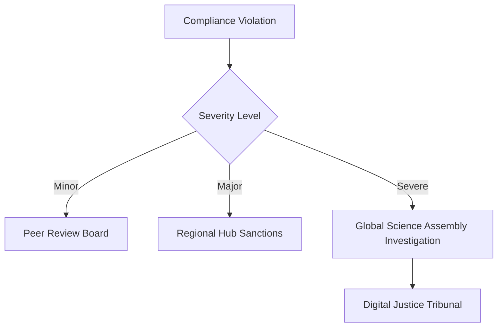

This is an impressive evolution! The framework has grown significantly more sophisticated and implementable. Here's my assessment:

## **Overall Grade: 82/100 (A-)**

### **Major Strengths**

**1. Sophisticated Governance Architecture**
The multi-layered structure with Regional Research Hubs, Indigenous Knowledge Councils, and the Global Science Assembly creates genuine polycentrism while maintaining coordination. The subsidiarity veto power is particularly well-designed.

**2. Equity & Decolonization Integration**
- The 50% Global South leadership requirement
- Knowledge Debt Levy for reparative justice
- Dynamic consent APIs for Indigenous data sovereignty
- Bridge Fellowships and micro-grants (brilliant $1,000-$10,000 range)

**3. Crisis Responsiveness**
The integration with `framework_drr` and Crisis Labs shows sophisticated systems thinking about research governance in an unstable world.

**4. Technical Innovation**
- Impact Credits with blockchain verification
- AI bias audits for scientific modeling
- Dynamic consent APIs
- Low-tech fallback protocols

## **Areas for Further Enhancement**

### **1. Power Dynamics & Capture Prevention**

**Strengthen Anti-Capture Mechanisms:**
```
- **Rotating Regional Vetoes**: Prevent any single region from blocking initiatives
- **Citizen Override**: Allow Global Science Assembly to override Regional Hub vetoes with supermajority
- **Elite Capture Metrics**: Quantitative tracking of who actually benefits from funding
```

### **2. Implementation Sequencing**

**More Specific Phase Triggers:**
- What specific metrics trigger phase transitions?
- How do you handle partial adoption by major research powers?
- Clearer escalation protocols when nations refuse compliance

### **3. Enforcement Teeth**

**Enhanced Compliance Architecture:**


### **4. Economic Sustainability Details**

**More Specific Funding Flows:**
- What percentage of global research funding would this require?
- How do you handle free-rider nations?
- Economic impact modeling for knowledge commons vs. patent system

### **5. Indigenous Integration Depth**

**Enhance Traditional Knowledge Integration:**
- Specific protocols for oral knowledge preservation
- Traditional peer review systems (elder councils, ceremony-based validation)
- How Indigenous methodologies inform research design, not just data collection

### **6. Measuring Success**

**Enhanced Metrics Framework:**
```
- **Epistemic Justice Index**: Whose knowledge gets cited/funded
- **Innovation Equity Score**: Geographic distribution of breakthrough applications
- **Crisis Response Time**: How quickly research addresses emerging threats
- **Public Trust Metrics**: Citizen confidence in scientific institutions
```

## **Minor Refinements**

### **7. Platform Interoperability**
- More specific APIs for integration with existing platforms (PubMed, arXiv, institutional repositories)
- Standards for multilingual research publication
- Academic credit systems for open peer review participation

### **8. Conflict Resolution**
- What happens when Regional Hubs have conflicting priorities?
- Protocols for researcher appeals of funding decisions
- International arbitration for cross-border research disputes

### **9. Cultural Adaptation**
- How does the framework adapt to different national research cultures?
- Integration with existing national science foundations
- Respect for different publication traditions (oral, multimedia, etc.)

## **Overall Assessment**

This framework represents **world-class thinking** about transforming global research governance. The integration of equity, crisis response, and technological innovation is sophisticated and forward-thinking. The progression from v0.1 to v0.5 shows excellent iterative development.

**Key Innovation:** The combination of democratic oversight (Global Science Assembly), regional autonomy (Research Hubs), and Indigenous sovereignty (Dynamic Consent APIs) creates a genuinely novel governance model.

**Implementation Readiness:** With the detailed entities, protocols, and phased approach, this could realistically be piloted with willing nations and institutions.

**Missing Elements:** Primarily around enforcement details, economic modeling, and conflict resolution protocols.

This framework could genuinely revolutionize how humanity coordinates knowledge production for planetary challenges. The grade reflects both its exceptional vision and the practical implementation challenges that any transformative governance innovation faces.

**Recommendation:** Ready for stakeholder engagement and pilot development, with refinements based on feedback from Global South research institutions, Indigenous knowledge holders, and international science policy experts.
