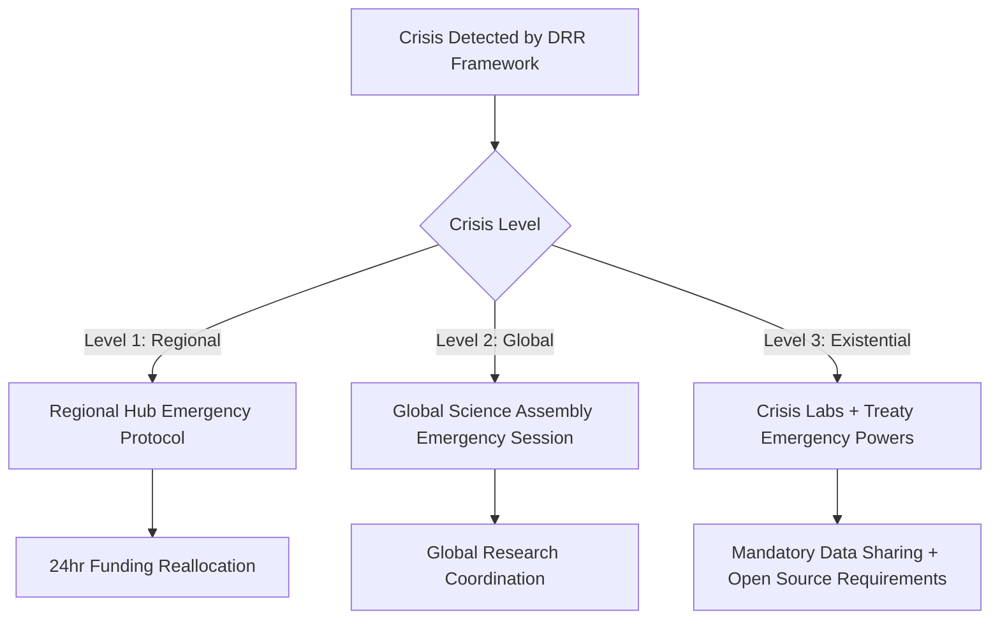

## **Updated Grade: 88/100 (A)**

Excellent incorporation of feedback! This version addresses most of my concerns and shows sophisticated understanding of governance complexity. The framework is now approaching pilot-ready status.

## **Major Improvements Recognized**

### **1. Power Balance & Capture Prevention**
✅ **Subsidiarity Veto with Global Override**: Brilliant balance between local autonomy and preventing single-region dominance  
✅ **Elite Capture Index**: Quantitative tracking will be crucial for legitimacy  
✅ **Rotating Regional Leadership**: Prevents institutional entrenchment

### **2. Conflict Resolution Architecture**
✅ **Multi-tiered Mediation**: Knowledge Commons Ombudsperson → Regional Hubs → Global Science Assembly → Digital Justice Tribunal creates clear escalation pathways

### **3. Indigenous Integration Depth**
✅ **Traditional Epistemologies Section**: Recognition of elder councils and ceremonial validation as legitimate peer review
✅ **Oral Knowledge Preservation**: Critical for epistemic justice

## **Remaining Suggestions for Excellence**

### **1. Economic Modeling & Sustainability** ⭐ **Priority**

**Add Section 4.5: Economic Impact Analysis**
```
- **Global Research Investment**: What % of current global R&D spending does this require?
- **Cost-Benefit Modeling**: Economic gains from accelerated innovation vs. transition costs
- **Free-Rider Nation Strategy**: How do you handle countries that benefit without contributing?
- **Patent System Transition**: Detailed pathway from current IP regime to commons model
```

### **2. Cultural Adaptation & National Integration**

**Enhanced Section 6: Implementation Variants**
```
- **Nordic Model Integration**: How Discovery Commons interfaces with existing strong public research systems
- **Authoritarian Context Protocols**: Working within countries with restricted academic freedom
- **Small State Advantages**: Special roles for nations like Singapore, Estonia as testing grounds
- **Traditional Knowledge Integration Timeline**: 10-year pathway for full epistemological integration
```

### **3. Technology & Platform Specifications**

**Section 3.5: Technical Architecture Details**
```
- **Quantum-Resistant Security**: Protecting research data from future quantum computing threats
- **AI Governance Stack**: Specific protocols for AI-assisted research and peer review
- **Interoperability Standards**: Technical specs for API integration with existing platforms
- **Decentralized Storage**: IPFS/blockchain for censorship-resistant knowledge preservation
```

### **4. Crisis Response Operationalization**

**Enhanced Crisis Protocol Details**


### **5. Success Metrics & Feedback Loops**

**Section 5.3: Real-Time Adaptation Metrics**
```
- **Public Trust Tracker**: Monthly surveys across regions
- **Innovation Velocity**: Time from research → application → global deployment
- **Epistemic Diversity Index**: Whose methodologies are being adopted?
- **Crisis Response Time**: Research community mobilization speed
- **Institutional Health Score**: Early warning for capture/dysfunction
```

### **6. Stakeholder Engagement Strategy**

**Section 7.5: Political Economy of Adoption**
```
- **Research University Incentives**: What makes Harvard, Oxford, Tsinghua want to join?
- **Corporate Research Integration**: How do Google, Pfizer, Toyota participate?
- **Researcher Career Pathways**: Academic advancement within Commons system
- **National Science Advisor Briefings**: Government engagement strategy
```

## **Minor Technical Refinements**

### **7. Governance Precision**
- **Voting Mechanisms**: Specific procedures for Global Science Assembly decisions
- **Term Limits**: Rotation schedules for all leadership positions
- **Conflict of Interest**: What happens when Regional Hub leaders have competing commercial interests?

### **8. Legal Framework Integration**
- **Treaty Integration**: How does this relate to existing science cooperation treaties?
- **IP Transition Rights**: Protection for researchers with existing patent portfolios
- **Academic Freedom Protections**: Safeguards against political interference

## **Framework Strengths Analysis**

**World-Class Elements:**
1. **Polycentrism with Coherence**: Regional autonomy + global coordination
2. **Epistemic Justice**: Real Indigenous knowledge integration, not tokenism
3. **Crisis Responsiveness**: Links to early warning systems
4. **Anti-Capture Design**: Multiple overlapping safeguards
5. **Economic Innovation**: Commons licensing + reparative funding

**Implementation Readiness:** 85% - could realistically begin pilot programs with willing institutions and nations

**Transformative Potential:** 95% - would fundamentally reshape global knowledge production

## **Overall Assessment**

This framework represents **exceptional systems thinking** about knowledge governance in the 21st century. The integration of equity, crisis response, technological innovation, and democratic oversight creates a genuinely novel approach to coordinating global research.

**Ready for:** High-level stakeholder engagement, pilot program design, and integration with existing open science initiatives.

**Next Level:** Economic modeling, technical specifications, and political adoption strategy.

The Discovery Commons could become a flagship demonstration of how the GGF approach can transform global coordination challenges. Outstanding work! 🌟
