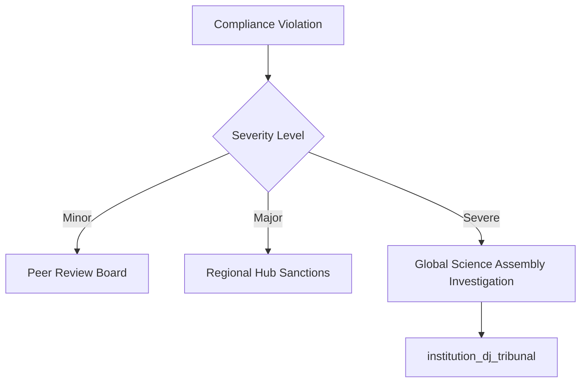
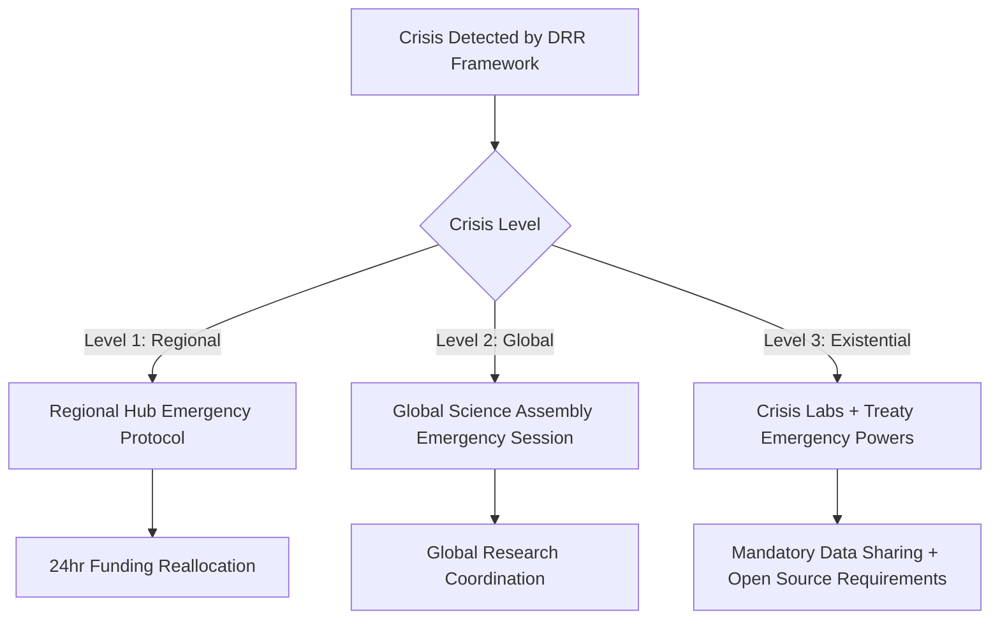

# The Discovery Commons (Version 0.7)

### A GGF Framework for Scientific & Research Integrity

*This is the definitive, pilot-ready draft (Version 0.7) for a Tier 2 GGF framework, governing the production of scientific knowledge as a global public good. It ensures knowledge is ethical, open, and directed toward planetary well-being, with radical equity, decolonized structures, crisis responsiveness, and adaptive governance. The Discovery Commons acts as the living library and research lab for a planetary civilization, evolving through global community feedback, fostering trust through accessible engagement, preventing capture through robust mechanisms, and ensuring sustainability through economic modeling.*

---

### **1. Introduction: The Engine of Verifiable Knowledge**

#### **The Challenge**

The polycrisis is an epistemic crisis. During the COVID-19 pandemic, vaccine apartheid saw life-saving knowledge hoarded by wealthy nations and corporations, delaying global recovery and costing millions of lives. Fragmented, privatized scientific systems slow innovation, hinder collaboration on existential threats, and erode public trust. Historical inequities, including the extraction of Global South and Indigenous knowledge, exacerbate these issues, risking misaligned priorities and privatized insights.

#### **The Opportunity**

The Discovery Commons reimagines scientific research as a transparent, collaborative, and decolonized enterprise for human and planetary flourishing. It directs public funding toward critical challenges, dismantles power and data silos, and ensures knowledge is a shared, equitable inheritance. As the GGF’s engine for verifiable, open-access knowledge, it underpins governance, education, and media integrity, fostering a wiser future through a **living library and research lab for a planetary civilization**.

#### **Alignment with the Global Open Science Movement**

The Discovery Commons partners with initiatives like UNESCO’s Open Science Partnership and the European Open Science Cloud (EOSC), aligning with FAIR data principles (Findability, Accessibility, Interoperability, Reusability). It leverages networks like SCOSS to coordinate funding and infrastructure across 340+ institutions, amplifying global efforts. Specific APIs ensure integration with platforms like PubMed, arXiv, and institutional repositories, supporting diverse publication traditions (e.g., oral, multimedia).

#### **The Framework**

As a **Tier 2 Foundational Application Framework**, The Discovery Commons governs the lifecycle of publicly funded research—from priority-setting and funding to methodology, publication, and intellectual property. It integrates with **The Capacity Engine** (disseminating findings), the **Synoptic Protocol** (relying on rigor), the **Digital Commons** (hosting outputs), and the **Disaster Risk Reduction Framework** (`framework_drr`) for crisis responsiveness. It aligns with existing science cooperation treaties via the `framework_treaty`, enhancing global coordination.

---

### **2. Core Principles**

- **Knowledge as a Public Good**: All publicly funded research outputs—data, papers, code—are a global commons, accessible in multiple languages.
- **Epistemic Rigor & Integrity**: Upholding the highest standards of methodology, open peer review, and reproducibility for trustworthy knowledge.
- **Mission-Oriented Research**: Prioritizing research addressing GGF-identified challenges, with citizen and community input.
- **Epistemological Pluralism**: Integrating diverse ways of knowing, including Indigenous methodologies, with dynamic consent and data sovereignty.
- **Ethical Conduct & Precaution**: Adhering to ethical guidelines and the precautionary principle in high-stakes domains like AI and synthetic biology.
- **Equity, Justice & Decolonization**: Centering Global South leadership and reparative funding to dismantle historical power imbalances.
- **Iterative Governance**: Evolving the framework through feedback from global epistemic communities, ensuring adaptability and resilience.

---

### **3. Structural Components & GGF Integration**

The Discovery Commons establishes core institutions with decentralized, equitable, and adaptive governance, designed to foster trust, scalability, and prevent capture.

**Simplified Narrative Overview**:
- The `council_global_research` sets global priorities with diverse expertise and citizen input.
- `institution_regional_research_hubs` adapt priorities locally, with veto power and culturally contextualized narratives.
- `institution_public_research_fund` allocates equitable funding, prioritizing Global South capacity.
- `institution_global_science_assembly` ensures democratic oversight with override capabilities.
- Protocols enforce open access, ethical IP, Indigenous sovereignty, and crisis response.
- The `framework_digital_commons` hosts a multilingual, interoperable platform with a public-facing portal.

**Visual: The Discovery Commons Integration**

```mermaid
graph TD
    subgraph Discovery Commons
        A[framework_discovery_commons]
    end

    subgraph Governance & Funding
        B(council_global_research) --Sets Priorities--> A
        B --> C[institution_regional_research_hubs]
        C --> D[Disciplinary Working Groups]
        C --> E[Indigenous Knowledge Councils]
        C --> F[Community Priorities Panels]
        G(mechanism_gcf) --Funds--> H[institution_public_research_fund]
        H --> I[mechanism_research_equity_fund]
        I --> J[mechanism_knowledge_debt_levy]
        I --> K[initiative_bridge_fellowships]
        I --> L[program_micro_grants]
        I --> M[initiative_capacity_sharing_network]
        J --Funds--> I
        I --Allocates Funds--> C
        H --Allocates Funds--> A
        N[institution_global_science_assembly] --Checks & Overrides--> B
        O[institution_knowledge_commons_ombudsperson] --Mediates & Adapts--> B
    end

    subgraph Protocols & Standards
        P(protocol_open_science) --Governs Access--> A
        Q(protocol_ethical_ip) --Governs Patents--> A
        R(protocol_indigenous_research_sovereignty) --Guides Research--> A
        S(protocol_crisis_research_response) --Manages Emergencies--> A
        T(protocol_planetary_commons_license) --Governs Commercial Use--> A
        U(protocol_red_team) --Challenges Narratives--> A
        V(protocol_political_engagement) --Manages Resistance--> A
        W(protocol_low_tech_fallback) --Ensures Access--> A
        X(protocol_ip_transition) --Manages Patent Shift--> A
    end

    subgraph Outputs & Beneficiaries
        A --> Y(framework_digital_commons)
        Y --> Z[platform_citizen_commons_portal]
        Z --> AA[repository_success_stories]
        A --> AB(framework_education)
        A --> AC(framework_synoptic)
        A --> AD(council_planetary_health)
        A --> AE(framework_drr)
    end

    subgraph Ethical Oversight
        AF(framework_indigenous) --Guides Research--> B
        AG(institution_dj_tribunal) --Adjudicates Misconduct--> B
        AG --> AH[chamber_epistemic_justice]
    end
```

#### **Core Entities**

- **Framework (`framework_discovery_commons`):** The parent framework.
- **Governing Council (`council_global_research`):** A sub-council of the Meta-Governance framework.
  - **Mandate**: Sets global research priorities, convenes **Disciplinary Working Groups** and **Community Priorities Panels**, oversees funding and compliance. Mandates **AI Bias Audits** for scientific modeling, requiring diverse training data.
  - **Composition**: Scientists, Global South researchers (50% leadership), Indigenous knowledge keepers, citizen delegates. Leadership rotates between North and South institutions (e.g., Kenya, India, Brazil).
- **Global Science Assembly (`institution_global_science_assembly`):** A directly elected body (1 million votes = 1 seat).
  - **Mandate**: Initiates binding public inquiries and forces supermajority reconsideration votes on neglected existential risks. Can override Regional Hub vetoes with a 2/3 majority to prevent single-region dominance. Uses **Quadratic Voting** for nuanced decision-making.
  - **Elections**: Managed via a secure, decentralized identity system (e.g., ORCID for researchers, GGF citizen assembly participation for citizens).
- **Regional Research Hubs (`institution_regional_research_hubs`):** Decentralized bodies adapting priorities, managing funding, and tailoring narratives to local cultural values (e.g., framing the Commons as a “shared ancestral knowledge system” in Indigenous contexts). They have **Subsidiarity Veto** power for local needs, subject to `institution_global_science_assembly` override.
- **Knowledge Commons Ombudsperson (`institution_knowledge_commons_ombudsperson`):** Mediates global/local frictions, tracks failures, and recommends adaptive upgrades. Oversees `protocol_political_engagement`.
- **Financial Institution (`institution_public_research_fund`):** Distributes grants from the `mechanism_gcf`, targeting 5-10% of global public R&D spending initially.
  - **Mandate**: Includes the **Research Equity Fund** (`mechanism_research_equity_fund`), allocating 20% for Global South infrastructure, **Bridge Fellowships** (`initiative_bridge_fellowships`), **Micro-Grants Program** (`program_micro_grants`, $1,000-$10,000 for grassroots researchers), **Capacity-Sharing Network** (`initiative_capacity_sharing_network`) for pro bono technical support, and **Moonshot Challenges**, funded partly by the **Knowledge Debt Levy** (`mechanism_knowledge_debt_levy`).
- **Impact Credits (`mechanism_impact_credits`):** Tokens for collaboration, mentoring, or peer review, verified via blockchain to prevent farming, redeemable for conference funding or sabbaticals. Includes academic credit for open peer review participation.
- **Core Protocol (`protocol_open_science`):** Mandates open-access publication, FAIR compliance, **Pre-Registration**, **Open Peer Review** (blockchain-backed), and **Language Justice** (outputs in English and a Global South language, e.g., Swahili, Hindi, Portuguese).
- **Legal Protocol (`protocol_ethical_ip`):** Bans patents in critical domains (climate, pandemics, AI safety), placing IP in **Stewardship Trusts**.
- **Planetary Commons License (`protocol_planetary_commons_license`):** Free use with commercial users paying 5% profits to the fund. AI models trained on Commons data are open-sourced.
- **IP Transition Protocol (`protocol_ip_transition`):** Protects existing patents via a “grandfather clause” while incentivizing new discoveries into the commons through funding priority and Impact Credits.
- **Indigenous Protocol (`protocol_indigenous_research_sovereignty`):** Co-design and **Dynamic Consent** via APIs, overseen by **Indigenous Knowledge Councils**.
  - **Integration of Traditional Epistemologies**: Recognizes traditional peer review (e.g., elder councils, ceremonial validation) and funds oral knowledge preservation initiatives over a 10-year timeline.
- **Crisis Protocol (`protocol_crisis_research_response`):** Fast-track funding, open-access data, and **Crisis Labs**, triggered by `framework_drr` early warnings.
- **Red Team Protocol (`protocol_red_team`):** Funds independent researchers and journalists to challenge narratives and conduct biennial **Unintended Consequences Audits** (e.g., hub gentrification, elite capture).
- **Political Engagement Protocol (`protocol_political_engagement`):** Mitigates resistance through diplomatic summits, phased opt-ins, and exemptions for small, low-income nations, overseen by the `institution_knowledge_commons_ombudsperson`.
- **Low-Tech Fallback Protocol (`protocol_low_tech_fallback`):** Ensures core platform functions operate offline or via low-bandwidth systems.
- **Crisis Labs (`institution_crisis_labs`):** Decentralized collaboratives for rapid, open-source solutions.

#### **Governance Precision Protocols**
- **Quadratic Voting**: Used by `institution_global_science_assembly` to ensure nuanced decision-making.
- **Term Limits**: Single 5-year terms for all leadership positions to prevent entrenchment.
- **Conflict of Interest Protocol**: Mandates public disclosure of commercial interests for council and hub members, with recusal for conflicting decisions.
- **Academic Freedom Protections**: Safeguards researchers from political interference, enforced by the `institution_dj_tribunal`.

#### **Digital Infrastructure & Interoperability**

The `framework_digital_commons` platform provides:
- **Interoperability Standards**: APIs for PubMed, arXiv, OSF, Zenodo, and institutional repositories, supporting oral and multimedia publications.
- **Technical Architecture**:
  - **Quantum-Resistant Security**: Protects data from future quantum computing threats, linked to `institution_quantum_lab`.
  - **AI Governance Stack**: Protocols for AI-assisted research and peer review, ensuring transparency and bias mitigation.
  - **Decentralized Storage**: Uses IPFS/blockchain for censorship-resistant knowledge preservation.
- **Dynamic Consent APIs**: Real-time Indigenous data access control.
- **Citizen Commons Portal (`platform_citizen_commons_portal`)**: Multilingual interface with research summaries, visualizations, and citizen participation tools (e.g., proposing research, voting).
  - **Success Stories Repository (`repository_success_stories`)**: Curates human-centered impact stories (e.g., a Global South researcher solving a water crisis).

---

### **4. Key Functions & Mandates**

1. **Setting Global Research Priorities**: Annual Global Research Agenda via GGF bodies, citizen assemblies, and Community Priorities Panels. Regional Hubs can veto conflicting priorities, subject to `institution_global_science_assembly` override, with culturally contextualized narratives.
2. **Allocating Public Funding Equitably**: Transparent calls weighted for Global South, with 20% via `mechanism_research_equity_fund` for infrastructure, fellowships, micro-grants, and Moonshot Challenges.
3. **Enforcing Open Science**: Mandatory compliance, tracked by `platform_transition_observatory`. Non-compliant institutions face sanctions or lose **Discovery Commons Certified** status (`mechanism_institutional_recognition`).
4. **Stewarding Intellectual Property as a Commons**: `protocol_ethical_ip`, `protocol_planetary_commons_license`, and `protocol_ip_transition` ensure public benefit, with revenue reinvested.
5. **Adjudicating Research Misconduct**: Handled by `council_global_research`, escalated to `institution_dj_tribunal`’s **Epistemic Justice Chamber**.

#### **4.5 Economic Impact & Sustainability**
- **Global Research Investment**: Targets 5-10% of global public R&D spending initially, scaled through national quotas and `mechanism_gcf` allocations.
- **Cost-Benefit Modeling**: The `institution_public_research_fund` conducts ongoing modeling, comparing accelerated innovation gains against transition costs from traditional patent systems.
- **Free-Rider Nation Strategy**: Non-contributing nations lose access to `protocol_planetary_commons_license` benefits, face `framework_gaian_trade` restrictions, and are ineligible for `mechanism_institutional_recognition`.
- **Patent System Transition**: The `protocol_ip_transition` includes a “grandfather clause” for existing patents and incentivizes new discoveries into the commons via funding priority and Impact Credits.

---

### **5. Compliance, Crisis Response & Metrics**

#### **Compliance & Enforcement**

- **Graduated Sanctions**: Warnings, suspension, or blacklisting.
- **Algorithmic Auditing**: Open-source AI monitors knowledge hoarding, with stakeholder access and appeal mechanisms.
- **Whistleblower Bounties**: 5% of recouped funds awarded via encrypted channels.
- **Peer Review Integration**: Open, blockchain-backed oversight with academic credit incentives.
- **Institutional Recognition (`mechanism_institutional_recognition`)**: Awards “Discovery Commons Certified” badge for full `protocol_open_science` compliance, unlocking funding priority.
- **Compliance Architecture**:

#### **Crisis Response**

- **Crisis Protocol (`protocol_crisis_research_response`)**:

- **Viral Priority-Setting**: Citizen assemblies allocate 10-20% of emergency funds.
- **Data Sharing Mandates**: Immediate open access during emergencies.
- **Crisis Labs**: Rapid, open-source solution development.
- **Resource Reallocation**: Redirecting funds for shifting priorities, triggered by `framework_drr`.

#### **Success Metrics**

- **Open Access Rate**: Percentage of research immediately available.
- **Global Collaboration Index**: North-South and South-South partnerships.
- **Innovation Velocity**: Time from discovery to application.
- **Impact Latency**: Time from publication to policy/practice integration.
- **Equity Indicators**: Demographic and geographic diversity, with **Longitudinal Equity Tracking** (career progression, citations).
- **Elite Capture Index (`metric_elite_capture_index`)**: Tracks funding and leadership distribution to prevent dominance by elite institutions.
- **Epistemic Justice Index**: Tracks whose knowledge is cited/funded.
- **Innovation Equity Score**: Geographic distribution of breakthroughs.
- **Crisis Response Time**: Speed of research mobilization.
- **Public Trust Tracker**: Monthly surveys across regions.
- **Epistemic Diversity Index**: Measures adoption of diverse methodologies.
- **Institutional Health Score**: Early warning for capture/dysfunction.
- **Public Impact Dashboard (`platform_public_impact_dashboard`)**: Real-time metrics on `platform_citizen_commons_portal`.

---

### **6. Implementation Pathway**

- **Phase -1: Seeding Period (Year 0, 6-12 months)**
  - Identify anchor institutions, test platform interoperability, and build trust with Indigenous and Global South partners via **Global Commons Ambassadors Program** (`initiative_global_commons_ambassadors`).
  - Develop **Modular Adoption Toolkit** (`tool_modular_adoption_toolkit`) for staged implementation.
  - **Phase Transition Trigger**: At least 5 anchor institutions commit, and platform interoperability is verified with 3 major repositories (e.g., PubMed, arXiv, Zenodo).
- **Phase 0: Pilot (Year 1)**
  - Open-source all GGF-funded research.
  - Establish core institutions and launch **Knowledge for All Campaign** (`initiative_knowledge_for_all_campaign`) with multimedia featuring ambassadors.
  - **Phase Transition Trigger**: 90% of pilot projects comply with `protocol_open_science`, and at least 10 Regional Hubs are operational.
- **Phase 1: Foundation & Priority Setting (Years 1-3)**
  - Run the first Global Research Agenda (climate, pandemics).
  - Ratify all protocols, launch Moonshot Challenges, Impact Credits, and the annual **Discovery Commons Assembly**.
  - **Phase Transition Trigger**: 75% of funded research achieves open access, and Global South representation reaches 50% in leadership roles.
- **Phase 2: Scaling & Integration (Years 3-8)**
  - Expand funding, integrate with **The Capacity Engine** and national agencies.
  - Launch the Commons platform with APIs, AI tools, and `platform_citizen_commons_portal`.
  - **Phase Transition Trigger**: 50% of signatory nations’ public R&D funding flows through the Commons, and 80% of Regional Hubs report successful local adaptation.
- **Phase 3: Global Scientific Commons (Years 8+)**
  - Establish the global standard for publicly funded research.
  - Create a mature, interconnected knowledge library.
  - **Phase Transition Trigger**: 80% of global public R&D funding is managed through the Commons, and the `platform_public_impact_dashboard` shows sustained public trust.

#### **Implementation Variants & National Integration**
- **Nordic Model Integration**: Aligns with strong public research systems by offering streamlined compliance pathways and priority funding for early adopters.
- **Authoritarian Context Protocols**: Uses `protocol_political_engagement` for non-confrontational engagement, emphasizing economic benefits and phased opt-ins.
- **Small State Advantages**: Positions nations like Singapore and Estonia as testing grounds for advanced platform features (e.g., quantum-resistant security).
- **Traditional Knowledge Integration Timeline**: 10-year plan to fully integrate Indigenous epistemologies, with annual milestones tracked by `institution_knowledge_commons_ombudsperson`.

#### **Layered Implementation Roadmaps**
- **Developing Nations**: Focus on infrastructure, micro-grants, and capacity building.
- **Historically Extractive Nations**: Emphasize knowledge restitution via `mechanism_knowledge_debt_levy`.
- **Indigenous Territories**: Prioritize sovereignty and protocol integration.

---

### **7. Failure, Adaptation & Resilience**

The Discovery Commons is a living system, evolving through failure and feedback.

- **Knowledge Commons Ombudsperson (`institution_knowledge_commons_ombudsperson`)**: Mediates global/local frictions, tracks failures (e.g., IP misuse), and recommends upgrades. Oversees `protocol_political_engagement`.
- **Adaptive Mechanisms**: Annual reviews at the Discovery Commons Assembly, with sunset clauses for outdated protocols.
- **Resilience Testing**: `protocol_red_team` conducts biennial **Unintended Consequences Audits** to address risks like hub gentrification or elite capture.
- **Triennial External Evaluations**: Conducted by partners like UNESCO, with findings presented at the Assembly.
- **Conflict Resolution Protocols**:
  - **Inter-Hub Conflicts**: Mediated by `institution_knowledge_commons_ombudsperson`, with arbitration by `council_global_research`.
  - **Researcher Appeals**: Formal appeals process for funding decisions, overseen by Regional Hubs with escalation to the `institution_dj_tribunal`.

---

### **8. Conclusion: Science for the People and the Planet**

The Discovery Commons transforms science into a decolonized, collaborative, and crisis-responsive engine for planetary regeneration. By centering equity, transparency, and adaptability, it provides the GGF with verifiable truth to navigate the 21st century. We invite scientists, educators, corporations, and citizens to become stewards of this living commons, building a wiser, fairer future together.

> “Knowledge is the seed of liberation, but only when it is shared freely and rooted in justice.” — Vandana Shiva