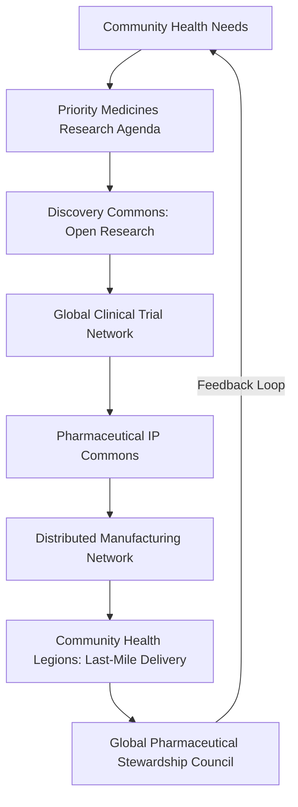

# The Pharmaceutical & Biotechnology Commons Framework v4.0

**Tier:** 2 (Foundational Application Layer)  
**Status:** Fourth Draft  
**Implementation Priority:** High  

---

### **1. Introduction: Healing as a Shared Inheritance**

#### **The Challenge**  
The global pharmaceutical system commodifies life-saving medicines, perpetuating inequities through patent monopolies, profit-driven research, and biopiracy of Indigenous knowledge. The COVID-19 crisis exposed this as "vaccine apartheid," where wealth dictated access, prolonging suffering. This framework dismantles extractive systems, addressing pharmaceutical colonialism and ensuring universal access to medicines as a human right.

#### **The Vision**  
In 2025, a mother in rural Malawi receives a heat-stable vaccine for her child, produced locally by a community-owned hub, funded by the Global Commons Fund, and derived from open-source research guided by Indigenous knowledge. Her community health worker, rewarded with Hearts for her service, ensures last-mile delivery. This is the Pharmaceutical & Biotechnology Commons: a world where medicines are a shared inheritance, accessible to all, rooted in justice and resilience.

#### **The Myth of Medicine**  
Healing is humanity’s sacred flame, akin to Prometheus stealing fire for the common good. This framework rekindles that flame, transforming medicine from a commodity into a commons, where knowledge flows freely, communities thrive, and no one is left behind.

#### **Systemic Position**  
This Tier 2 framework operationalizes global health equity within the Global Governance Frameworks (GGF).  
- **Core Dependencies:**  
  - **Treaty for Our Only Home (`framework_treaty`):** Legal authority.  
  - **Global Commons Fund (`mechanism_gcf`):** Funding.  
- **Key Synergies:**  
  - **Global Health & Pandemic Security (`council_ghsc`):** Acute crisis response.  
  - **The Aethelred Accord:** Ethical biotechnology oversight.  
  - **The Discovery Commons (`framework_discovery_commons`):** Open-science research.  
  - **The Hearthstone Protocol (`framework_hearthstone`):** IP transition.  
  - **Indigenous & Traditional Knowledge Governance (`framework_indigenous`):** Sovereignty and reparative justice.  
  - **Educational Systems (`framework_education`):** Health worker training.  
  - **Migration Framework (`framework_migration`):** Refugee/migrant access.  
  - **Technology Governance (`framework_technology_governance`):** AI in drug discovery.  
  - **Disability Justice (`framework_disability`):** Accessible formulations.  
  - **Mental Health Governance:** Mental health priorities.  
  - **Consciousness & Inner Development (`framework_consciousness_and_inner_development`):** Preventive wellness.  
- **Failure Modes & Substitutes:**  
  - If `mechanism_gcf` is delayed, the **Pharmaceutical Colonialism Reparations Fund** (1.5% pharma profit levy) funds Phase 0.  
  - **Standalone Viability:** **Pharmaceutical IP Commons (`institution_pip_commons`)** and **Distributed Manufacturing Network (`institution_dmn`)** can pilot with coalition nations/BAZs using `framework_hearthstone` tools pre-GGF ratification.

#### **Medicine Lifecycle Diagram**

---

### **2. Commons Charter**  
We, the stewards of humanity’s health, declare:  
- Healing is a universal right, not a privilege.  
- Knowledge belongs to all, not the few.  
- Indigenous wisdom is sovereign, its benefits shared justly.  
- Medicines serve need, not profit, priced for access.  
- Communities own their health, empowered by resilient systems.  
We commit to a world where every person thrives, united by the flame of shared healing.  

---

### **3. Core Principles**

1. **Health as a Universal Right:** Essential medicines are accessible to all.  
2. **Knowledge as a Public Good:** Commons-funded research, data, and IP are open-access.  
3. **Primacy of Indigenous Sovereignty:** Traditional knowledge research adheres to **FPIC 2.0** with binding veto power.  
4. **Needs-Driven Innovation:** Democratic priorities based on global health needs (e.g., DALYs).  
5. **Radical Affordability & Access:** Medicines priced at production cost.  
6. **Distributed & Resilient Manufacturing:** Community-owned, Global South-focused systems.  
7. **Safety, Efficacy & Ethical Rigor:** Transparent regulation ensures standards.  
8. **Reparative Justice:** Addresses pharmaceutical colonialism via reparations.  
9. **Intergenerational Equity:** Benefits stewarded for future generations.  
10. **Holistic Wellness:** Evolves toward preventive health.

---

### **4. Structural Components**

#### **4.1. Governance: Global Pharmaceutical Stewardship Council (GPSC)**  
- **Mandate:** Oversees research, IP, manufacturing, and access.  
- **Structure:**  
  - **Composition:**  
    - Global South health ministries (30%).  
    - Patient advocacy/community health (20%).  
    - Scientists/clinicians from **Discovery Commons** (20%).  
    - Indigenous representatives from **Earth Council** (20% minimum, permanent co-chair).  
    - Ethicists/legal experts (10%).  
    - Youth Health Justice Council representative (rotating co-chair).  
    - City/BAZ representatives (`framework_nested_sovereignty`).  
  - **Selection:** Nominated by stakeholder bodies, confirmed by **Planetary Health Council (`council_phc`)**; 3-year staggered terms.  
  - **Evolution:** Decennial review via **Meta-Governance Framework (`framework_meta_gov`)**.  
- **Key Tools:**  
  - Sets **Priority Medicines Research Agenda** via community forums/digital voting.  
  - Manages **Pharmaceutical IP Commons** and **Distributed Manufacturing Network**.  
  - Oversees **Indigenous Benefit Veto** (15% revenue to communities via **Love Ledger (`platform_love_ledger`)**).  
- **Enforcement:**  
  - Deadlocks mediated by `council_phc`; escalated to **Commons Equity Court** (public-facing name for **Digital Justice Tribunal (`institution_dj_tribunal`)** in this context).  
- **GGF Integration:** Interfaces with `council_ghsc`, `council_earth`, and `framework_global_health`.

#### **4.2. Research & Development: Discovery-to-Delivery Pipeline**  
- **Mandate:** Drives needs-based innovation.  
- **Structure:**  
  - **Priority Medicines Research Agenda:** Annual, community-driven, prioritizing neglected diseases/populations (pediatric, elderly, disability, mental health).  
  - **Global Clinical Trial Network:** Tests generic-compatible formulations, certified by **framework_disability**.  
  - **Crowdsourced Formulary:** GitHub-style platform in **Discovery Commons**; process:  
    1. Clinician submission.  
    2. AI-assisted literature/safety review.  
    3. Peer review by trial network committee.  
    4. `council_gpsc` funds fast-tracked trials (safety gates maintained).  
- **Key Tools:**  
  - Open-source platforms (e.g., **Open Source Malaria**); **triple Impact Credits (`mechanism_impact_credits`)** for open tools.  
  - **Fail Forward Database:** Logs R&D failures, linked to **Global Pathogen Surveillance Network** for safety alerts, reviewed annually by `council_gpsc`.  
- **Enforcement:** Funded by **Global Commons Fund (`mechanism_gcf`)** and **Pharmaceutical Colonialism Reparations Fund** (1.5% pharma levy, tiered incentives for **Regenerative Enterprises (`framework_regenerative_enterprise`)**).  
- **GGF Integration:** Feeds from `framework_discovery_commons`, aligns with `framework_technology_governance`.

#### **4.3. Intellectual Property: Pharmaceutical IP Commons**  
- **Mandate:** Stewards patents, data, and know-how as a **Stewardship Trust**.  
- **Structure:** Managed by **GPSC** and **institution_pip_commons**.  
- **Key Tools:**  
  - **Transition (via `framework_hearthstone`):**  
    - **Patent Buyouts:** **Transition Bonds** for keystone patents (e.g., insulin analogs).  
    - **Stewardship Inheritance:** **Impact Credits** for IP donations.  
    - **Corporate Conversion:** Firms join **Regenerative Enterprises**.  
  - **Planetary Commons License (`protocol_planetary_commons_license`):** Includes **Commons Growth Clause** (open-source improvements or face sanctions/GCF exclusion).  
  - **Viral Open Access Trigger:** `council_ghsc` releases patents in pandemics if targets fail (`process_crisis_command`).  
- **Enforcement:** **Commons Equity Court** adjudicates violations; **Regulatory Harmonization Committee** aligns trials with FDA/EMA.  
- **GGF Integration:** Links to `framework_gaian_trade`, `framework_institutional_regeneration`.

#### **4.4. Manufacturing & Distribution: Distributed Manufacturing Network**  
- **Mandate:** Produces medicines via community-owned facilities.  
- **Structure:**  
  - **Community Work Teams (`institution_cwt`)** or cooperatives (`framework_work_in_liberation`).  
  - Open-source technologies (e.g., mRNA printers) licensed for $1/year, 10% profit cap.  
  - **Global South First:** 70% LMIC hubs by Year 5; Northern hubs train two Southern hubs (`institution_ggf_catalyst`, AR tools).  
- **Key Tools:**  
  - **Global Quality Standards Board:** Unannounced audits.  
  - **Digital Product Passports:** **Love Ledger** ensures ethical sourcing (`framework_gaian_trade`).  
  - **Pandemic Fire Drill:** 5% capacity pivots in 30 days; failures open-source patents.  
  - **Emergency Stockpiling:** For conflict/disaster zones (`council_ghsc`, `council_gpsc`).  
  - **Last-Mile Delivery:** **Community Health Legions** (`framework_global_health`), rewarded with **Hearts (`mechanism_hearts`)**.  
- **Enforcement:** Sanctions via `framework_gaian_trade`.  
- **GGF Integration:** Aligns with `framework_migration`, `framework_education`.

#### **4.5. Indigenous Knowledge & Biopiracy Prevention**  
- **Mandate:** Protects traditional knowledge with reparative benefits.  
- **Structure:** Co-governed by **BAZs** or Indigenous authorities.  
- **Key Tools:**  
  - **Binding Veto Power:** Enforced via **Love Ledger** cryptographic signatures for research approval.  
  - **International Genetic Commons & Sovereignty Registry** (`council_earth`) tracks IP lineage.  
  - **Global Alert System:** `council_earth` monitors unauthorized use, triggers **Commons Equity Court** injunctions.  
  - 15% revenue to **Stewardship Trusts** for intergenerational benefits.  
- **Enforcement:** **Commons Equity Court** adjudicates violations.  
- **GGF Integration:** Links to `framework_indigenous`, `framework_justice`.

#### **4.6. Pharma Transition Pathway**  
- **Mandate:** Integrates whistleblowers and firms into commons.  
- **Structure:** Restorative justice track via **Commons Equity Court** (`framework_justice`).  
- **Key Tools:**  
  - Amnesty for whistleblowers exposing price-gouging.  
  - **Regenerative Enterprises** attract talent with purpose-driven work (`framework_work_in_liberation`), economic security (`framework_aubi`), and open-science access (`framework_discovery_commons`).  
- **Enforcement:** Sanctions for non-compliance (`framework_gaian_trade`).  
- **GGF Integration:** Aligns with `framework_hearthstone`, `framework_institutional_regeneration`.

---

### **5. Economic Model**

- **Funding:**  
  - Initial: **Pharmaceutical Colonialism Reparations Fund** (1.5% pharma levy, tiered incentives, enforced via `framework_gaian_trade`).  
  - Long-term: **Automation Tax**, **Carbon Tax**, GCF (`framework_treaty`).  
- **Pricing:** Production cost for affordability.  
- **AUBI & Hearts:** Medicines in **AUBI Layer 1**; health workers earn **Hearts** for delivery/education.  
- **Financial Systems:** **Transition Bonds** for buyouts/conversions (`framework_financial_systems`).

---

### **6. Implementation Pathway**

- **Phase 0 (Year 1):**  
  - Test **Indigenous Benefit Veto** with Kani Tribe.  
  - Establish **Reparations Fund** (`framework_treaty`).  
  - Build health ministry coalitions.  
- **Phase 1 (Years 1-3):**  
  - Charter **GPSC** with co-chairs (Indigenous, youth).  
  - Launch **Pharmaceutical IP Commons**.  
  - Buyout 5 keystone patents (high DALY impact).  
  - Issue **Priority Medicines Research Agenda**.  
- **Phase 2 (Years 4-7):**  
  - Build **Distributed Manufacturing Network** (70% LMIC hubs).  
  - Launch **Global Clinical Trial Network** with accessibility certification.  
  - Integrate **Genetic Commons Registry**.  
- **Phase 3 (Years 8+):**  
  - 90% global access to commons medicines.  
  - Full pandemic surge capacity.  
- **Success Metrics (via Planetary Dashboard):**  
  - **Equity:** % GCF to neglected diseases; # Indigenous benefit-sharing agreements.  
  - **Resilience:** Time-to-production for vaccines; # medicines with 3+ hubs.  
  - **Phase Targets:**  
    - Phase 1: 10 LMIC hubs, 5 patents.  
    - Phase 2: 50% essential medicines, 70% LMIC hubs.  
    - Phase 3: 90% access, surge capacity.

---

### **7. Stakeholder Engagement**

- **Healthcare Workers:** Reduced bureaucracy, training via `framework_education`.  
- **Patient Advocates:** **GPSC** seat for priority-setting.  
- **Academic Institutions:** **Impact Credits**, prestige for IP contributions.  
- **Communication:** Frame as “Shared Healing”; use **Commons Charter** for advocacy.

---

### **8. Conclusion**  
This framework transforms medicine into a shared, equitable resource, dismantling extractive systems with justice, resilience, and innovation. It builds a future where health is a universal right, guided by the flame of collective healing.  

**Quote for the Road:**  
*"A pill priced for profit is a bullet aimed at the poor."*

---

### **Appendix: Systems Map**

| **Component** | **Role** | **Dependency Type** | **Substitute/Failure Mode** |
|---------------|----------|---------------------|-----------------------------|
| `framework_treaty` | Legal authority | Essential | Coalition of willing nations |
| `mechanism_gcf` | Funding | Essential | Reparations Fund |
| `framework_hearthstone` | IP transition | Amplifier | Ad hoc buyouts |
| `framework_discovery_commons` | R&D engine | Amplifier | Existing open-source platforms |
| `framework_indigenous` | Ethical guidance | Amplifier | Interim FPIC protocols |