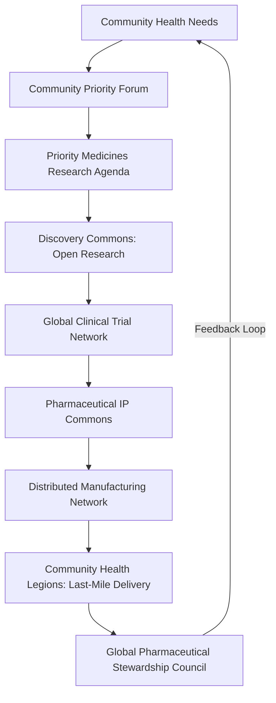
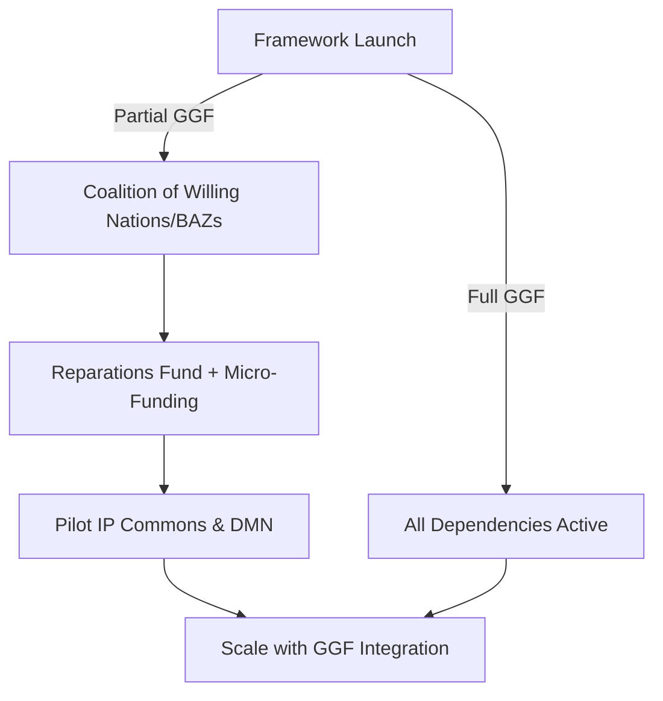

# The Pharmaceutical & Biotechnology Commons Framework v5.0

**Tier:** 2 (Foundational Application Layer)  
**Status:** Fifth Draft  
**Implementation Priority:** High  

---

### **1. Introduction: Healing as a Shared Inheritance**

#### **The Challenge**  
The global pharmaceutical system prioritizes profit over people, perpetuating inequities through patent monopolies, market-driven research, and biopiracy of Indigenous knowledge. The COVID-19 crisis exposed this as "vaccine apartheid," where wealth dictated access, costing lives and deepening mistrust. This framework dismantles extractive systems, addressing pharmaceutical colonialism to ensure medicines are a universal right.

#### **The Vision**  
In 2025, a mother in rural Malawi receives a heat-stable vaccine for her child, produced by a local, community-owned hub, funded by the Global Commons Fund, and guided by Indigenous knowledge shared under sovereign consent. Her community health worker, rewarded with Hearts, ensures seamless delivery. This is the Pharmaceutical & Biotechnology Commons: a world where healing is a shared inheritance, accessible to all, rooted in justice and resilience.

#### **The Myth of Medicine**  
Healing is humanity’s sacred flame, akin to Prometheus sharing fire for the common good. This framework rekindles that flame, transforming medicine from a commodity into a commons where knowledge flows freely, communities thrive, and no one is left behind.

#### **Systemic Position**  
This Tier 2 framework operationalizes health equity within the Global Governance Frameworks (GGF).  
- **Core Dependencies:**  
  - **Treaty for Our Only Home (`framework_treaty`):** Legal authority.  
  - **Global Commons Fund (`mechanism_gcf`):** Funding.  
- **Key Synergies:**  
  - **Global Health & Pandemic Security (`council_ghsc`):** Acute crisis response.  
  - **The Aethelred Accord:** Ethical biotechnology oversight.  
  - **The Discovery Commons (`framework_discovery_commons`):** Open-science research.  
  - **The Hearthstone Protocol (`framework_hearthstone`):** IP transition.  
  - **Indigenous & Traditional Knowledge Governance (`framework_indigenous`):** Sovereignty and reparative justice.  
  - **Educational Systems (`framework_education`):** Health worker training.  
  - **Migration Framework (`framework_migration`):** Refugee/migrant access.  
  - **Technology Governance (`framework_technology_governance`):** AI in drug discovery.  
  - **Disability Justice (`framework_disability`):** Accessible formulations.  
  - **Mental Health Governance:** Mental health priorities.  
  - **Consciousness & Inner Development (`framework_consciousness_and_inner_development`):** Preventive wellness.  
- **Failure Modes & Substitutes:**  
  - **Delayed `mechanism_gcf`:** Bootstrap with **Pharmaceutical Colonialism Reparations Fund** and coalition-based micro-funding (e.g., LMIC budgets, crowdfunding).  
  - **Delayed `framework_treaty`:** Form a "coalition of the willing" among nations/BAZs, using `framework_gaian_trade` to enforce commons rules.  
  - **Standalone Viability:** **Pharmaceutical IP Commons (`institution_pip_commons`)** and **Distributed Manufacturing Network (`institution_dmn`)** can pilot with coalition partners using `framework_hearthstone` tools.

#### **Medicine Lifecycle Diagram**

---

### **2. Commons Charter**  
We, the stewards of humanity’s health, declare:  
- Healing is a universal right, not a privilege.  
- Knowledge belongs to all, not the few.  
- Indigenous wisdom is sovereign, its benefits shared justly.  
- Medicines serve need, not profit, priced for access.  
- Communities own their health, empowered by resilient systems.  
We commit to a world where every person thrives, united by the flame of shared healing.  
**Global Pledge Platform:** Individuals, communities, and organizations can sign the Charter via the **Planetary Dashboard** (`framework_global_health`), with pledges logged as non-financial acts of support on the **Love Ledger (`platform_love_ledger`)** to track global solidarity.

---

### **3. Core Principles**

1. **Health as a Universal Right:** Essential medicines are accessible to all.  
2. **Knowledge as a Public Good:** Commons-funded research, data, and IP are open-access.  
3. **Primacy of Indigenous Sovereignty:** Traditional knowledge research adheres to **FPIC 2.0** with binding veto power.  
4. **Needs-Driven Innovation:** Democratic priorities based on global health needs (e.g., DALYs).  
5. **Radical Affordability & Access:** Medicines priced at production cost.  
6. **Distributed & Resilient Manufacturing:** Community-owned, Global South-focused systems.  
7. **Safety, Efficacy & Ethical Rigor:** Transparent regulation ensures standards.  
8. **Reparative Justice:** Addresses pharmaceutical colonialism via reparations.  
9. **Intergenerational Equity:** Benefits stewarded for future generations.  
10. **Holistic Wellness:** Evolves toward preventive health via `framework_consciousness_and_inner_development`.

---

### **4. Structural Components**

#### **4.1. Governance: Global Pharmaceutical Stewardship Council (GPSC)**  
- **Mandate:** Oversees research, IP, manufacturing, and equitable access.  
- **Structure:**  
  - **Composition:**  
    - Global South health ministries (30%).  
    - Patient advocacy/community health (20%).  
    - Scientists/clinicians from **Discovery Commons** (20%).  
    - Indigenous representatives from **Earth Council** (20% minimum, permanent co-chair).  
    - Ethicists/legal experts (10%).  
    - Youth Health Justice Council representative (rotating co-chair, `framework_global_health`).  
    - City/BAZ representatives (`framework_nested_sovereignty`).  
  - **Selection:** Nominated by stakeholder bodies, confirmed by **Planetary Health Council (`council_phc`)**; 3-year staggered terms.  
  - **Evolution:** Decennial review via **Meta-Governance Framework (`framework_meta_gov`)**.  
  - **Accountability:** Co-chairs report annually on **Planetary Dashboard**; recall by two-thirds vote of nominating bodies (`council_earth`, Youth Health Justice Council), mediated by `council_phc`.  
- **Key Tools:**  
  - **Community Priority Forum:** Hybrid in-person/digital platform (`framework_discovery_commons`) gathers input from marginalized communities (e.g., disabled, mental health needs), with AI-assisted analysis to set **Priority Medicines Research Agenda**.  
  - Manages **Pharmaceutical IP Commons** and **Distributed Manufacturing Network** (70% LMIC hubs by Year 5).  
  - Oversees **Indigenous Benefit Veto** (15% revenue to communities via **Love Ledger**).  
- **Enforcement:** Deadlocks mediated by `council_phc`; escalated to **Healing Justice Tribunal** (public-facing name for **Digital Justice Tribunal (`institution_dj_tribunal`)**) for binding decisions.  
- **GGF Integration:** Interfaces with `council_ghsc`, `council_earth`, `framework_global_health`, `framework_education`.  
- **Executive Summary:** Available as a downloadable PDF on **Planetary Dashboard**.

#### **4.2. Research & Development: Discovery-to-Delivery Pipeline**  
- **Mandate:** Drives needs-based innovation.  
- **Structure:**  
  - **Priority Medicines Research Agenda:** Annual, set via **Community Priority Forum**, prioritizing neglected diseases/populations (pediatric, elderly, disability, mental health).  
  - **Global Clinical Trial Network:** Tests generic-compatible formulations, certified by **framework_disability**.  
  - **Crowdsourced Formulary:** GitHub-style platform in **Discovery Commons**; process:  
    1. Verified clinician submission.  
    2. AI-assisted literature/safety review (`framework_technology_governance`).  
    3. Peer review by trial network committee.  
    4. `council_gpsc` funds fast-tracked trials (safety gates maintained).  
    5. Leaderboard ranks contributions, rewarding **Hearts** and **Impact Credits** via **Love Ledger**.  
- **Key Tools:**  
  - Open-source platforms (e.g., **Open Source Malaria**); **triple Impact Credits** for open tools.  
  - **Fail Forward Database:** AI analytics identify failure patterns, inform **Priority Medicines Research Agenda**, issue safety alerts via **Global Pathogen Surveillance Network** (`framework_global_health`).  
- **Enforcement:** Funded by **Global Commons Fund** and **Pharmaceutical Colonialism Reparations Fund** (1.5% levy, tiered: 1% for **Regenerative Enterprises**, 2% for non-compliant firms).  
- **GGF Integration:** Links to `framework_discovery_commons`, `framework_technology_governance`, `framework_mental_health`.  
- **Executive Summary:** Available as a downloadable PDF on **Planetary Dashboard**.

#### **4.3. Intellectual Property: Pharmaceutical IP Commons**  
- **Mandate:** Stewards patents, data, and know-how as a **Stewardship Trust**.  
- **Structure:** Managed by **GPSC** and **institution_pip_commons**.  
- **Key Tools:**  
  - **Transition (via `framework_hearthstone`):**  
    - **Patent Buyouts:** **Transition Bonds** for keystone patents (e.g., insulin analogs).  
    - **Stewardship Inheritance:** **Impact Credits** for IP donations.  
    - **Corporate Conversion:** Firms join **Regenerative Enterprises**.  
  - **Planetary Commons License:** Includes **Commons Growth Clause** (open-source improvements or face `framework_gaian_trade` sanctions/GCF exclusion).  
  - **Viral Open Access Trigger:** `council_ghsc` releases patents in pandemics if targets fail (`process_crisis_command`).  
- **Enforcement:** **Healing Justice Tribunal** adjudicates violations; **Regulatory Harmonization Committee** aligns trials with FDA/EMA (`framework_institutional_regeneration`).  
- **GGF Integration:** Links to `framework_gaian_trade`, `framework_hearthstone`.  
- **Executive Summary:** Available as a downloadable PDF on **Planetary Dashboard**.

#### **4.4. Manufacturing & Distribution: Distributed Manufacturing Network**  
- **Mandate:** Produces medicines via community-owned facilities.  
- **Structure:**  
  - **Community Work Teams (`institution_cwt`)** or cooperatives (`framework_work_in_liberation`).  
  - Open-source technologies (e.g., mRNA printers) licensed for $1/year, 10% profit cap.  
  - **Global South First:** 70% LMIC hubs by Year 5; Northern hubs train two Southern hubs (`institution_ggf_catalyst`, AR tools).  
- **Key Tools:**  
  - **Global Quality Standards Board:** Unannounced audits.  
  - **Digital Product Passports:** **Love Ledger** ensures ethical sourcing (`framework_gaian_trade`).  
  - **Pandemic Fire Drill:** 5% capacity pivots in 30 days; failures open-source patents.  
  - **Emergency Stockpiling:** For conflict/disaster zones (`council_ghsc`, `council_gpsc`).  
  - **Last-Mile Delivery:** **Community Health Legions** (`framework_global_health`), rewarded with **Hearts**.  
- **Enforcement:** Sanctions via `framework_gaian_trade`.  
- **GGF Integration:** Aligns with `framework_migration`, `framework_education`.  
- **Executive Summary:** Available as a downloadable PDF on **Planetary Dashboard**.

#### **4.5. Indigenous Knowledge & Biopiracy Prevention**  
- **Mandate:** Protects traditional knowledge with reparative benefits.  
- **Structure:** Co-governed by **BAZs** or Indigenous authorities.  
- **Key Tools:**  
  - **Binding Veto Power:** Enforced via **Love Ledger** cryptographic signatures; communities opting for open sharing receive priority **GCF** grants for health infrastructure via **Stewardship Trusts** (`framework_hearthstone`).  
  - **International Genetic Commons & Sovereignty Registry** (`council_earth`) tracks IP lineage.  
  - **Global Alert System:** `council_earth` monitors unauthorized use, triggers **Healing Justice Tribunal** injunctions.  
  - 15% revenue to **Stewardship Trusts** for intergenerational benefits.  
  - **Phase 0 Pilot:** Tests veto with Kani Tribe (India), Yanomami (Amazon), Aboriginal groups (Australia).  
- **Enforcement:** **Healing Justice Tribunal** adjudicates violations.  
- **GGF Integration:** Links to `framework_indigenous`, `framework_justice`.  
- **Executive Summary:** Available as a downloadable PDF on **Planetary Dashboard**.

#### **4.6. Pharma Transition Pathway**  
- **Mandate:** Integrates whistleblowers and firms into commons.  
- **Structure:** Restorative justice via **Healing Justice Tribunal** (`framework_justice`).  
- **Key Tools:**  
  - Amnesty for whistleblowers exposing price-gouging.  
  - **Regenerative Enterprises** attract talent with purpose-driven work (`framework_work_in_liberation`), economic security (`framework_aubi`), and open-science access (`framework_discovery_commons`).  
- **Enforcement:** Sanctions for non-compliance (`framework_gaian_trade`).  
- **GGF Integration:** Aligns with `framework_hearthstone`, `framework_institutional_regeneration`.  
- **Executive Summary:** Available as a downloadable PDF on **Planetary Dashboard**.

---

### **5. Economic Model**

- **Funding:**  
  - **Initial:** **Pharmaceutical Colonialism Reparations Fund** (1.5% pharma levy, tiered: 1% for **Regenerative Enterprises**, 2% for non-compliant firms, biennial review by `council_gpsc`, enforced via `framework_gaian_trade`). Micro-funding (e.g., LMIC budgets, crowdfunding via **Planetary Dashboard**) for **Phase 0**.  
  - **Long-term:** **Automation Tax**, **Carbon Tax**, GCF (`framework_treaty`).  
- **Pricing:** Production cost for affordability.  
- **AUBI & Hearts:** Medicines in **AUBI Layer 1**; health workers earn **Hearts** for delivery/education.  
- **Financial Systems:** **Transition Bonds** for buyouts/conversions (`framework_financial_systems`).

---

### **6. Implementation Pathway**

- **Phase 0 (Year 1):**  
  - Test **Indigenous Benefit Veto** with Kani Tribe, Yanomami, Aboriginal groups.  
  - Establish **Reparations Fund** and micro-funding portal (`framework_treaty`).  
  - Build health ministry coalitions.  
  - Conduct **Scenario-Based Stress Testing** (e.g., corporate lawsuits, supply chain disruptions) via `framework_meta_gov`.  
- **Phase 1 (Years 1-3):**  
  - Charter **GPSC** with co-chairs.  
  - Launch **Pharmaceutical IP Commons**.  
  - Buyout 5 keystone patents (high DALY impact).  
  - Issue **Priority Medicines Research Agenda** via **Community Priority Forum**.  
- **Phase 2 (Years 4-7):**  
  - Build **Distributed Manufacturing Network** (70% LMIC hubs).  
  - Launch **Global Clinical Trial Network** with accessibility certification.  
  - Integrate **Genetic Commons Registry**.  
- **Phase 3 (Years 8+):**  
  - 90% global access to commons medicines.  
  - Full pandemic surge capacity.  
- **Success Metrics (via Commons Health Dashboard):**  
  - **Equity:** % GCF to neglected diseases; # Indigenous benefit-sharing agreements; # **Community Priority Forum** participants (Phase 1: 1,000, 50% marginalized; Phase 2: 10,000, 60% LMIC/disabled; Phase 3: 100,000, 70% neglected populations).  
  - **Resilience:** Time-to-production for vaccines; # medicines with 3+ hubs.  
  - **Phase Targets:**  
    - Phase 1: 10 LMIC hubs, 5 patents.  
    - Phase 2: 50% essential medicines, 70% LMIC hubs.  
    - Phase 3: 90% access, surge capacity.

---

### **7. Stakeholder Engagement**

- **Healthcare Workers:** Reduced bureaucracy, training via `framework_education`.  
- **Patient Advocates:** **GPSC** seat for priority-setting.  
- **Academic Institutions:** **Impact Credits**, prestige for IP contributions.  
- **Communication:** Frame as “Shared Healing”; **Cultural Resonance Toolkit** on **Planetary Dashboard** adapts messaging (e.g., “health equity” in conservative regions), co-developed by `institution_ggf_catalyst` and `council_earth`.

---

### **8. Conclusion**

This framework transforms medicine into a shared, equitable resource, dismantling extractive systems with justice, resilience, and innovation. It builds a future where health is a universal right, guided by the flame of collective healing.  

**Post-Scarcity Evolution:** As production costs approach zero via automation (`framework_technology_governance`), the commons shifts to preventive health, integrating with `framework_consciousness_and_inner_development` for holistic wellness.

**Companion Documents:**  
- **Commons Implementation Playbook:** Templates for early adopters, hosted on **Planetary Dashboard** (`institution_ggf_catalyst`).  
- **Legal Briefing on International Law:** Addresses TRIPS/WTO compliance, corporate challenges, managed by **Healing Justice Tribunal** (`institution_dj_tribunal`).  

**Quote for the Road:**  
*"A pill priced for profit is a bullet aimed at the poor."*

---

### **Appendix A: Systems Map**

| **Component** | **Role** | **Dependency Type** | **Risk Scenarios & Mitigations** |
|---------------|----------|---------------------|-----------------------------|
| `framework_treaty` | Legal authority | Essential | **Risk:** Delayed ratification. **Mitigation:** Coalition of willing nations/BAZs enforces commons rules via `framework_gaian_trade`. |
| `mechanism_gcf` | Funding | Essential | **Risk:** Funding shortfall. **Mitigation:** Bootstrap with **Reparations Fund**, micro-funding (LMIC budgets, crowdfunding). |
| `framework_hearthstone` | IP transition | Amplifier | **Risk:** Slow IP acquisition. **Mitigation:** Ad hoc buyouts via coalition funds. |
| `framework_discovery_commons` | R&D engine | Amplifier | **Risk:** Limited open-science adoption. **Mitigation:** Leverage existing platforms (e.g., Open Source Malaria). |
| `framework_indigenous` | Ethical guidance | Amplifier | **Risk:** Incomplete FPIC protocols. **Mitigation:** Interim community agreements via `council_earth`. |

#### **Fallback Pathways Diagram**

---

### **Appendix B: Glossary**

- **FPIC 2.0**: Enhanced Free, Prior, and Informed Consent with binding Indigenous veto power over research and commercialization (`framework_indigenous`).  
- **Commons Growth Clause**: Licensing rule requiring open-sourcing of improvements to commons-derived IP, enforced by `framework_gaian_trade` sanctions (`protocol_planetary_commons_license`).  
- **Hearts (`mechanism_hearts`)**: GGF currency rewarding community health contributions, logged on **Love Ledger** (`framework_aubi`).  
- **Stewardship Trusts (`institution_stewardship_trust`)**: Legal entities managing benefits for communities, ensuring intergenerational equity (`framework_hearthstone`).  
- **Healing Justice Tribunal**: Public-facing name for **Digital Justice Tribunal** (`institution_dj_tribunal`) in this framework, adjudicating disputes with restorative justice (`framework_justice`).  
- **Community Priority Forum**: Hybrid platform for community input into **Priority Medicines Research Agenda** (`framework_discovery_commons`).  
- **Planetary Dashboard**: GGF platform for real-time metrics, pledges, and resources (`framework_global_health`).