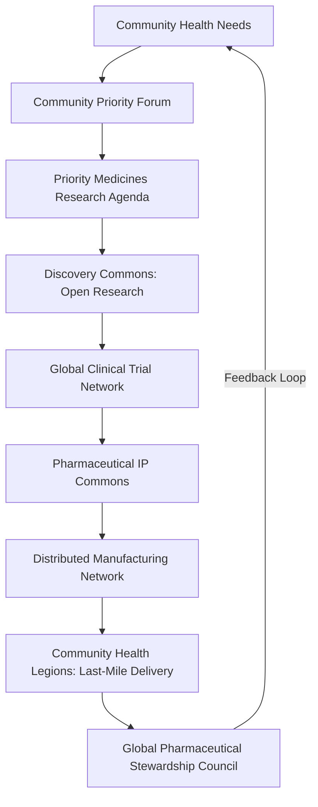
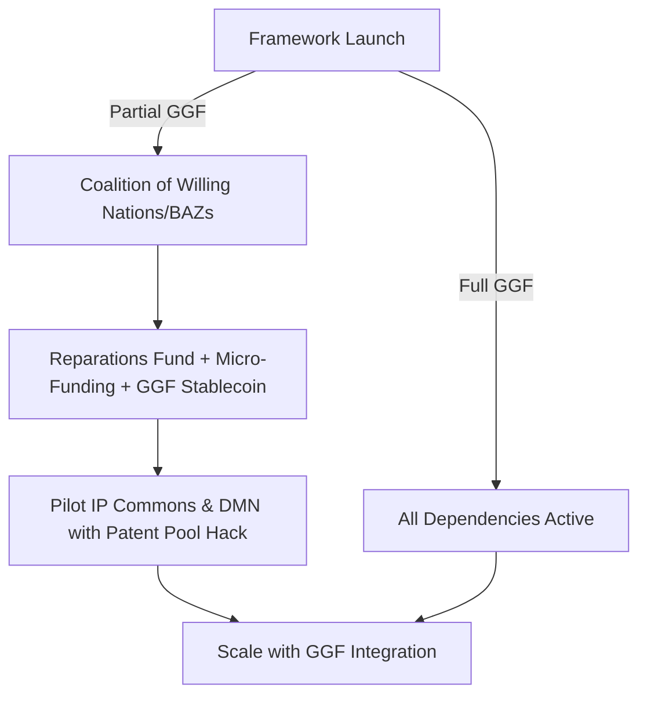

# The Pharmaceutical & Biotechnology Commons Framework v7.0

**Tier:** 2 (Foundational Application Layer)  
**Status:** Seventh Draft  
**Implementation Priority:** High  

---

### **1. Introduction: Healing as a Shared Inheritance**

#### **The Challenge**  
The global pharmaceutical system prioritizes profit over people, perpetuating inequities through patent monopolies, market-driven research, and biopiracy of Indigenous knowledge. The COVID-19 crisis exposed this as "health inequity" and "vaccine apartheid," where wealth dictated access, costing lives and deepening mistrust. This framework dismantles pharmaceutical inequity, ensuring medicines are a universal right.

#### **The Vision**  
In 2025, a mother in rural Malawi receives a heat-stable vaccine for her child, produced by a local community-owned hub, funded by the Global Commons Fund, and guided by Indigenous knowledge under sovereign consent. Her community health worker, rewarded with Hearts via a blockchain Rx coupon, ensures delivery through a drone corridor. By 2035, a researcher in Nairobi contributes to a crowdsourced formulary, an Indigenous council exercises veto power over traditional knowledge, and a cooperative produces pediatric formulations—all part of a global commons where healing is shared.

#### **The Myth of Medicine**  
Healing is humanity’s sacred flame, akin to Prometheus sharing fire for the common good. This framework rekindles that flame, integrating Western medicine with traditional healing practices to transform medicine into a commons where knowledge flows freely, communities thrive, and no one is left behind.

#### **Theory of Change**  
**If** we build a commons-based infrastructure for medicine discovery, production, and distribution, **then** prices drop and access increases globally, **because** community ownership and open knowledge disrupt profit-driven models. **Evidence**: Generic HIV drugs saved millions; the polio vaccine’s open model eradicated a disease; open-source platforms like Linux drive innovation.

#### **Systemic Position**  
This Tier 2 framework operationalizes health equity within the Global Governance Frameworks (GGF).  
- **Core Dependencies:**  
  - **Treaty for Our Only Home (`framework_treaty`):** Legal authority, including **TRIPS Override Clause**.  
  - **Global Commons Fund (`mechanism_gcf`):** Funding.  
- **Key Synergies:**  
  - **Global Health & Pandemic Security (`council_ghsc`):** Crisis response.  
  - **The Aethelred Accord:** Ethical biotechnology oversight.  
  - **The Discovery Commons (`framework_discovery_commons`):** Open-science research.  
  - **The Hearthstone Protocol (`framework_hearthstone`):** IP transition.  
  - **Indigenous & Traditional Knowledge Governance (`framework_indigenous`):** Sovereignty, reparative justice.  
  - **Educational Systems (`framework_education`):** Health worker training.  
  - **Migration Framework (`framework_migration`):** Refugee/migrant access, whistleblower sanctuary.  
  - **Technology Governance (`framework_technology_governance`):** AI in drug discovery.  
  - **Disability Justice (`framework_disability`):** Accessible formulations.  
  - **Mental Health Governance:** Mental health priorities.  
  - **Consciousness & Inner Development (`framework_consciousness_and_inner_development`):** Preventive wellness.  
  - **Public Epistemic Institutions (`framework_synoptic`):** Memetic campaigns.  
  - **Global Supply Chains & Logistics (`framework_gscl`):** Cold chain logistics.  
  - **Financial Systems (`framework_financial_systems`):** GGF Stablecoin.  
- **Failure Modes & Substitutes:**  
  - **Delayed `mechanism_gcf`:** Bootstrap with **Pharmaceutical Colonialism Reparations Fund** and micro-funding (LMIC budgets, crowdfunding via **Planetary Dashboard**).  
  - **Delayed `framework_treaty`:** Coalition of willing nations/BAZs enforces rules via `framework_gaian_trade`.  
  - **Standalone Viability:** **Pharmaceutical IP Commons (`institution_pip_commons`)** and **Distributed Manufacturing Network (`institution_dmn`)** pilot with coalition partners using `framework_hearthstone`.

#### **Medicine Lifecycle Diagram**

---

### **2. Commons Charter**  
We, the stewards of humanity’s health, declare:  
- Healing is a universal right, not a privilege.  
- Knowledge belongs to all, not the few.  
- Indigenous and traditional wisdom is sovereign, its benefits shared justly.  
- Medicines serve need, not profit, priced for access.  
- Communities own their health, empowered by resilient systems.  
We commit to a world where every person thrives, united by the flame of shared healing resonant with diverse spiritual and cultural traditions.  
**Global Pledge Platform:** Sign via **Planetary Dashboard** (`framework_global_health`), logged as non-financial acts on **Love Ledger (`platform_love_ledger`)** to track global solidarity.

---

### **3. Core Principles**

1. **Health as a Universal Right:** Essential medicines accessible to all.  
2. **Knowledge as a Public Good:** Commons-funded research, data, IP open-access.  
3. **Primacy of Indigenous Sovereignty:** Traditional knowledge adheres to **FPIC 2.0** with binding veto power.  
4. **Needs-Driven Innovation:** Democratic priorities based on global health needs (e.g., DALYs).  
5. **Radical Affordability & Access:** Medicines at production cost.  
6. **Distributed & Resilient Manufacturing:** Community-owned, Global South-focused systems.  
7. **Safety, Efficacy & Ethical Rigor:** Transparent regulation ensures standards.  
8. **Reparative Justice:** Addresses pharmaceutical inequity via reparations.  
9. **Intergenerational Equity:** Benefits stewarded for future generations.  
10. **Holistic Wellness:** Evolves toward preventive health via `framework_consciousness_and_inner_development`.

---

### **4. Resistance & Counter-Narratives Strategy**

- **Anticipated Opposition:**  
  - **Pharma Industry Claims:** “Innovation will die,” “Safety will suffer,” “Jobs will be lost.”  
  - **Counter-Narratives:** Success of generic HIV drugs (saved millions), open-source innovation (Linux, Wikipedia), commons-driven job creation in LMICs.  
- **Implementation:**  
  - **Public Epistemic Institutions (`framework_synoptic`)** develop campaigns, commissioned by `council_gpsc`, using **Cultural Resonance Toolkit** for global messaging (e.g., “Patents Kill, Commons Heal”).  
  - Case studies (e.g., polio vaccine) hosted on **Planetary Dashboard**.  
- **Regulatory Capture Prevention:** Annual audits by **Regeneration Audit Council (`council_regeneration_audit`)** (`framework_institutional_regeneration`) to detect industry infiltration in `council_gpsc`, **Healing Justice Tribunal**, or related bodies.  
- **GGF Integration:** Links to `framework_synoptic`, `framework_institutional_regeneration`.

---

### **5. Structural Components**

#### **5.1. Governance: Global Pharmaceutical Stewardship Council (GPSC)**  
- **Mandate:** Oversees research, IP, manufacturing, equitable access.  
- **Structure:**  
  - **Composition:** Global South health ministries (30%), patient advocacy/community health (20%), scientists/clinicians from **Discovery Commons** (20%), Indigenous representatives from **Earth Council** (20% minimum, permanent co-chair), ethicists/legal experts (10%), Youth Health Justice Council representative (rotating co-chair, `framework_global_health`), city/BAZ representatives (`framework_nested_sovereignty`).  
  - **Selection:** Nominated by stakeholder bodies, confirmed by **Planetary Health Council (`council_phc`)**; 3-year staggered terms.  
  - **Evolution:** Decennial review via **Meta-Governance Framework (`framework_meta_gov`)**.  
  - **Accountability:** Co-chairs report annually on **Planetary Dashboard**; recall by two-thirds vote of nominating bodies, mediated by `council_phc`.  
- **Key Tools:**  
  - **Community Priority Forum:** Hybrid platform (`framework_discovery_commons`) uses sortition for representative selection, decentralized digital IDs for verification, and cultural translation by `institution_ggf_catalyst` and `council_earth` to set **Priority Medicines Research Agenda**.  
  - Manages **Pharmaceutical IP Commons**, **Distributed Manufacturing Network** (70% LMIC hubs by Year 5).  
  - Oversees **Indigenous Benefit Veto** (15% revenue to communities via **Love Ledger**).  
  - Declares health emergencies for compulsory licensing (`framework_treaty`, WTO Doha Declaration).  
- **Enforcement:** Deadlocks mediated by `council_phc`; escalated to **Healing Justice Tribunal** (`institution_dj_tribunal`) for binding decisions.  
- **GGF Integration:** Interfaces with `council_ghsc`, `council_earth`, `framework_global_health`, `framework_education`.  
- **Executive Summary:** One-page visual PDF on **Planetary Dashboard**.

#### **5.2. Research & Development: Discovery-to-Delivery Pipeline**  
- **Mandate:** Drives needs-based innovation.  
- **Structure:**  
  - **Priority Medicines Research Agenda:** Annual, set via **Community Priority Forum**, prioritizing neglected diseases/populations (pediatric, elderly, disability, mental health).  
  - **Global Clinical Trial Network:** Tests generic-compatible formulations, certified by **framework_disability**.  
  - **Crowdsourced Formulary:** GitHub-style platform in **Discovery Commons**; process:  
    1. Verified clinician submission.  
    2. AI-assisted literature/safety review (`framework_technology_governance`).  
    3. Peer review by trial network committee.  
    4. `council_gpsc` funds fast-tracked trials (safety gates maintained).  
    5. Leaderboard ranks contributions, rewarding **Hearts** and **Impact Credits** via **Love Ledger**.  
- **Key Tools:**  
  - Open-source platforms (e.g., **Open Source Malaria**); **triple Impact Credits** for open tools.  
  - **Fail Forward Database:** AI analytics identify failure patterns, inform **Priority Medicines Research Agenda**, issue safety alerts via **Global Pathogen Surveillance Network** (`framework_global_health`).  
- **Enforcement:** Funded by **Global Commons Fund**, **Pharmaceutical Colonialism Reparations Fund**.  
- **GGF Integration:** Links to `framework_discovery_commons`, `framework_technology_governance`, `framework_mental_health`.  
- **Executive Summary:** One-page visual PDF on **Planetary Dashboard**.

#### **5.3. Intellectual Property: Pharmaceutical IP Commons**  
- **Mandate:** Stewards patents, data, know-how as a **Stewardship Trust**.  
- **Structure:** Managed by **GPSC**, **institution_pip_commons**.  
- **Key Tools:**  
  - **Transition (via `framework_hearthstone`):**  
    - **Patent Buyouts:** **Transition Bonds** for keystone patents (e.g., insulin analogs).  
    - **Stewardship Inheritance:** **Impact Credits** for IP donations.  
    - **Corporate Conversion:** Firms join **Regenerative Enterprises**; **Opt-In Amnesty** waives levies for 5+ patent contributions.  
    - **Patent Pool Hack:** Partners with Medicines Patent Pool for HIV/TB/malaria patents in **Phase 0**.  
  - **Planetary Commons License:** Includes **Commons Growth Clause** (open-source improvements or face `framework_gaian_trade` sanctions/GCF exclusion).  
  - **Viral Open Access Trigger:** `council_ghsc` releases patents in pandemics if targets fail (`process_crisis_command`).  
  - **Compulsory Licensing Threat:** `council_gpsc` declares health emergencies (e.g., diabetes) to trigger licensing under WTO Doha Declaration (`framework_treaty`).  
- **Enforcement:** **Healing Justice Tribunal** adjudicates violations; **Regulatory Harmonization Committee** aligns trials with FDA/EMA (`framework_institutional_regeneration`).  
- **GGF Integration:** Links to `framework_gaian_trade`, `framework_hearthstone`.  
- **Executive Summary:** One-page visual PDF on **Planetary Dashboard**.

#### **5.4. Manufacturing & Distribution: Distributed Manufacturing Network**  
- **Mandate:** Produces medicines via community-owned facilities.  
- **Structure:**  
  - **Community Work Teams (`institution_cwt`)** or cooperatives (`framework_work_in_liberation`).  
  - Open-source technologies (e.g., mRNA printers) licensed for $1/year, 10% profit cap.  
  - **Global South First:** 70% LMIC hubs by Year 5; Northern hubs train two Southern hubs via `institution_ggf_catalyst` (AR tools, personnel exchanges).  
- **Key Tools:**  
  - **Global Quality Standards Board:** Enforces WHO Prequalification/ICH Good Manufacturing Practice, blockchain-audited (`framework_gscl`).  
  - **Digital Product Passports:** **Love Ledger** ensures ethical sourcing (`framework_gaian_trade`).  
  - **Pandemic Fire Drill:** 5% capacity pivots in 30 days; failures open-source patents.  
  - **Emergency Stockpiling:** For conflict/disaster zones (`council_ghsc`, `council_gpsc`).  
  - **Cold Chain Logistics:** Managed via `framework_gscl` for vaccine stability.  
  - **Last-Mile Delivery:**  
    - **Blockchain Rx Coupons:** NFTs on **Love Ledger** for free medicine redemption (`framework_global_health`).  
    - **Drone Delivery Corridors:** Pre-mapped with Africa CDC/PAHO, funded by **AUBI** (`institution_baz`).  
    - **Community Health Legions** (`framework_global_health`) rewarded with **Hearts**.  
- **Enforcement:** Sanctions via `framework_gaian_trade`.  
- **GGF Integration:** Aligns with `framework_migration`, `framework_education`, `framework_gscl`.  
- **Executive Summary:** One-page visual PDF on **Planetary Dashboard**.

#### **5.5. Indigenous Knowledge & Biopiracy Prevention**  
- **Mandate:** Protects traditional knowledge with reparative benefits.  
- **Structure:** Co-governed by **BAZs** or Indigenous authorities.  
- **Key Tools:**  
  - **Binding Veto Power:** Enforced via **Love Ledger** cryptographic signatures; open-sharing communities receive priority **GCF** grants for health infrastructure via **Stewardship Trusts** (`framework_hearthstone`).  
  - **International Genetic Commons & Sovereignty Registry** (`council_earth`) tracks IP lineage.  
  - **Global Alert System:** `council_earth` monitors unauthorized use, triggers **Healing Justice Tribunal** injunctions.  
  - 15% revenue to **Stewardship Trusts** for intergenerational benefits.  
  - **Phase 0 Pilot:** Tests veto with Kani Tribe (India), Yanomami (Amazon), Aboriginal groups (Australia).  
- **Enforcement:** **Healing Justice Tribunal** adjudicates violations.  
- **GGF Integration:** Links to `framework_indigenous`, `framework_justice`.  
- **Executive Summary:** One-page visual PDF on **Planetary Dashboard**.

#### **5.6. Pharma Transition Pathway**  
- **Mandate:** Integrates whistleblowers and firms into commons.  
- **Structure:** Restorative justice via **Healing Justice Tribunal** (`framework_justice`).  
- **Key Tools:**  
  - **Pharma Whistleblower Sanctuary:** Asylum via `framework_migration`, **Hearts** bonuses for price-gouging leaks, logged on **Love Ledger**.  
  - **Opt-In Amnesty:** Firms contributing 5+ patents convert to **Regenerative Enterprises**, waive levies.  
  - **Regenerative Enterprises** attract talent with purpose-driven work (`framework_work_in_liberation`), economic security (`framework_aubi`), open-science access (`framework_discovery_commons`).  
- **Enforcement:** Sanctions for non-compliance (`framework_gaian_trade`).  
- **GGF Integration:** Aligns with `framework_hearthstone`, `framework_institutional_regeneration`.  
- **Executive Summary:** One-page visual PDF on **Planetary Dashboard**.

---

### **6. Economic Model**

- **Funding:**  
  - **Initial:** **Pharmaceutical Colonialism Reparations Fund** (1.5% levy on 2010–2025 pharma profits, tiered: 1% for **Regenerative Enterprises**, 2% for non-compliant firms, biennial review by `council_gpsc`, enforced via `framework_gaian_trade`). Micro-funding (LMIC budgets, crowdfunding via **Planetary Dashboard**) for **Phase 0**.  
  - **Long-term:** **Automation Tax**, **Carbon Tax**, GCF (`framework_treaty`).  
  - **Crypto-Backed Bypass:** GGF Stablecoin (`framework_financial_systems`) funds hubs if payments blocked.  
- **Revenue Projections:** Estimated $50B from levies (based on $3T global pharma revenue, 2010–2025), sufficient for 70% LMIC hubs by Year 5. R&D failure rates (80% Phase I–III) mitigated by GCF decoupling funding from sales.  
- **Competitive Analysis:** Commons pricing undercuts for-profit models; **Regenerative Enterprises** incentivize cooperation via prestige, reduced levies.  
- **Pricing:** Production cost for affordability.  
- **AUBI & Hearts:** Medicines in **AUBI Layer 1**; health workers earn **Hearts** for delivery/education.  
- **Financial Systems:** **Transition Bonds** for buyouts/conversions (`framework_financial_systems`).

---

### **7. Implementation Pathway**

- **Phase 0 (Year 1):**  
  - Test **Indigenous Benefit Veto** with Kani Tribe, Yanomami, Aboriginal groups.  
  - Establish **Reparations Fund** (2010–2025 profits) and micro-funding portal (`framework_treaty`).  
  - Build coalitions with health ministries, universities, patient organizations.  
  - Launch **Patent Pool Hack** with Medicines Patent Pool.  
  - Begin FDA/EMA regulatory discussions for commons pathways.  
  - Conduct **Scenario-Based Stress Testing** (corporate lawsuits, supply chain disruptions) via `framework_meta_gov`.  
- **Phase 1 (Years 1-3):**  
  - Charter **GPSC** with co-chairs.  
  - Launch **Pharmaceutical IP Commons** with compulsory licensing for insulin/diabetes.  
  - Buyout 5 keystone patents (high DALY impact).  
  - Issue **Priority Medicines Research Agenda** via **Community Priority Forum**.  
- **Phase 2 (Years 4-7):**  
  - Build **Distributed Manufacturing Network** (70% LMIC hubs).  
  - Launch **Global Clinical Trial Network** with accessibility certification.  
  - Integrate **Genetic Commons Registry**.  
- **Phase 3 (Years 8+):**  
  - 90% global access to commons medicines.  
  - Full pandemic surge capacity.  
- **Success Metrics (via Commons Health Dashboard):**  
  - **Equity:** % GCF to neglected diseases; # Indigenous benefit-sharing agreements; # **Community Priority Forum** participants (Phase 1: 1,000, 50% marginalized; Phase 2: 10,000, 60% LMIC/disabled; Phase 3: 100,000, 70% neglected populations).  
  - **Resilience:** Time-to-production for vaccines; # medicines with 3+ hubs.  
  - **Phase Targets:**  
    - Phase 1: 10 LMIC hubs, 5 patents, 1 compulsory license.  
    - Phase 2: 50% essential medicines, 70% LMIC hubs.  
    - Phase 3: 90% access, surge capacity.

---

### **8. Stakeholder Engagement**

- **Healthcare Workers:** Reduced bureaucracy, training via `framework_education`.  
- **Patient Advocates:** **GPSC** seat for priority-setting; grassroots outreach in **Phase 0**.  
- **Academic Institutions:** **Impact Credits**, prestige for IP contributions; university partnerships in **Phase 0**.  
- **Communication:** Frame as “Shared Healing”; **Cultural Resonance Toolkit** on **Planetary Dashboard** adapts messaging (e.g., “health equity” in conservative regions), co-developed by `institution_ggf_catalyst`, `council_earth`.  
- **Memetic Campaigns:** Deploy via `framework_synoptic` (e.g., “Patents Kill, Commons Heal” near pharma HQs).  

---

### **9. Conclusion**

This framework transforms medicine into a shared, equitable resource, dismantling pharmaceutical inequity with justice, resilience, and innovation. It builds a future where health is a universal right, guided by the flame of collective healing across diverse traditions.  

**Post-Scarcity Evolution:** As production costs approach zero via automation (`framework_technology_governance`), the commons shifts to preventive health, integrating with `framework_consciousness_and_inner_development` for holistic wellness.

**Companion Documents:**  
- **Commons Implementation Playbook:** Templates for early adopters, hosted on **Planetary Dashboard** (`institution_ggf_catalyst`).  
- **Legal Briefing on International Law:** Addresses TRIPS/WTO compliance, corporate challenges, includes **TRIPS Override Clause** (`framework_treaty`).  
- **Economic Modeling:** Projects $50B levy revenue, R&D failure resilience, competitive advantages.  

**Day in the Life—2035:**  
- **Rural Health Worker:** Uses blockchain Rx coupons to deliver vaccines via drone corridors, earning **Hearts**.  
- **Research Scientist:** Contributes to crowdsourced formulary, tops leaderboard for **Impact Credits**.  
- **Indigenous Community:** Exercises veto power over traditional knowledge, receives 15% revenue via **Stewardship Trusts**.  
- **Manufacturing Cooperative:** Produces pediatric formulations, audited by **Global Quality Standards Board**.

**Quote for the Launch:**  
*"This framework doesn’t ask for change—it builds a system where justice is the path of least resistance."*

---

### **Appendix A: Systems Map & Risk Assessment**

| **Component** | **Role** | **Dependency Type** | **Risk Scenarios & Mitigations** |
|---------------|----------|---------------------|-----------------------------|
| `framework_treaty` | Legal authority, TRIPS Override | Essential | **Risk:** Delayed ratification. **Mitigation:** Coalition of willing nations/BAZs (e.g., India, Brazil, South Africa) enforces rules via `framework_gaian_trade`. **Black Swan:** Universal nano-assemblers obsolete manufacturing; framework stewards new tech as commons. |
| `mechanism_gcf` | Funding | Essential | **Risk:** Funding shortfall. **Mitigation:** Bootstrap with **Reparations Fund**, micro-funding, GGF Stablecoin. **High-Probability:** Regulatory delays; mitigated by pilot frameworks in coalition nations. |
| `framework_hearthstone` | IP transition | Amplifier | **Risk:** Slow IP acquisition. **Mitigation:** Patent Pool Hack, compulsory licensing. **Low-Probability:** Major pandemic; mitigated by **Viral Open Access Trigger**. |
| `framework_discovery_commons` | R&D engine | Amplifier | **Risk:** Limited open-science adoption. **Mitigation:** Leverage existing platforms (e.g., Open Source Malaria). |
| `framework_indigenous` | Ethical guidance | Amplifier | **Risk:** Incomplete FPIC protocols. **Mitigation:** Interim community agreements via `council_earth`. |

#### **Fallback Pathways Diagram**

---

### **Appendix B: Technical Standards**

- **Technology Transfer Protocols:** Managed by `institution_ggf_catalyst`; includes blueprints, AR support, personnel exchanges for biologics (e.g., monoclonal antibodies).  
- **Quality Assurance:** **Global Quality Standards Board** enforces WHO Prequalification/ICH Good Manufacturing Practice; blockchain-audited inspections (`framework_gscl`).  
- **Cold Chain Logistics:** Resilient systems via `framework_gscl`, ensuring vaccine stability in LMICs.  
- **References:** WHO Prequalification (PQ/VP/2019), ICH Q7, Q9, Q10 guidelines.

---

### **Appendix C: Glossary**

- **FPIC 2.0**: Enhanced Free, Prior, Informed Consent with binding Indigenous veto power (`framework_indigenous`). [Plain language: Ensures Indigenous communities control their knowledge.]  
- **Commons Growth Clause**: Licensing rule for open-sourcing improvements, enforced by `framework_gaian_trade` sanctions (`protocol_planetary_commons_license`). [Plain language: Requires sharing new discoveries for the common good.]  
- **Hearts (`mechanism_hearts`)**: GGF currency rewarding community health contributions, logged on **Love Ledger** (`framework_aubi`). [Plain language: Rewards for helping communities.]  
- **Stewardship Trusts (`institution_stewardship_trust`)**: Legal entities for community benefits, ensuring intergenerational equity (`framework_hearthstone`). [Plain language: Funds for future community health.]  
- **Healing Justice Tribunal**: Public-facing name for **Digital Justice Tribunal** in this framework, adjudicating disputes (`framework_justice`). [Plain language: Court for fair health decisions.]  
- **Community Priority Forum**: Hybrid platform for community input into **Priority Medicines Research Agenda** (`framework_discovery_commons`). [Plain language: Community voice in medicine priorities.]  
- **Planetary Dashboard**: GGF platform for metrics, pledges, resources (`framework_global_health`). [Plain language: Online hub for health data and action.]  
- **TRIPS Override Clause**: Model legislation for WTO Doha Declaration flexibilities (`framework_treaty`). [Plain language: Legal tool to prioritize health over patents.]  
- **GGF Stablecoin**: Crypto-currency for funding resilience (`framework_financial_systems`). [Plain language: Backup currency for health projects.]