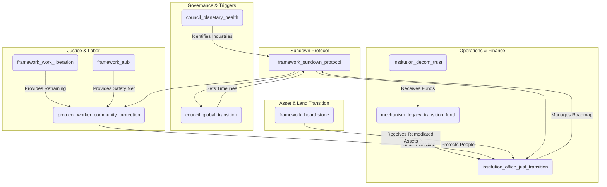

# The Sundown Protocol

### A GGF Framework for the Managed, Just Transition of Legacy Industries

*This is a foundational draft (Version 0.1) intended for iterative development. Its principles and mechanisms are designed to be co-created with affected workers, communities, and Indigenous peoples in alignment with the GGF's core commitment to participatory governance.*

-----

### **1. Introduction: The Necessity of a Managed Sunset**

**The Challenge:** While the **Regenerative Enterprise Framework (REF)** provides a vital "pull" for companies willing to transform, the planetary polycrisis is accelerated by legacy industries (fossil fuels, extractive mining) locked into business models that are fundamentally incompatible with a regenerative future. These industries represent trillions of dollars in infrastructure, employ millions of people, and are deeply embedded in the global economy. A voluntary transition is insufficient to meet the timelines dictated by planetary boundaries. Leaving their decline to market forces would create chaotic economic collapse, devastate communities, and strand millions of workers—a transition that is anything but just.

**The Opportunity:** A managed, orderly, and just transition of these legacy industries is one of the most critical levers for addressing the polycrisis. Modeled on the principles of the **Aegis Protocol**'s transition of the military-industrial complex, the Sundown Protocol provides the GGF's official "push" mechanism. It is not a punishment, but a compassionate and pragmatic pathway to gracefully sunset harmful economic models while protecting the people and communities dependent on them. It is the bridge that carries us from an extractive past to a regenerative future, ensuring no one is left behind.

**The Framework:** The Sundown Protocol is a **Tier 2 Foundational Application Framework** that provides the governance, legal, financial, and social architecture for the phased decommissioning of industries identified as existentially harmful by the **Planetary Health Council**. It works in direct concert with the REF, serving as the mandatory, time-bound pathway for entities that do not or cannot achieve voluntary regenerative certification. It operationalizes the **Treaty for Our Only Home's** commitment to ecological integrity by providing the "how" for a just transition.

-----

### **2. Core Principles**

The Sundown Protocol is guided by a specific subset of GGF principles, tailored for this unique challenge:

  - **Just Transition First**: The well-being, security, and future prosperity of workers and communities are the primary success metrics of the transition. All planning must prioritize their agency and protection.
  - **Restorative & Reparative Justice**: The process must actively address and heal the historical ecological and social harms caused by extractive industries, guided by the **Peace & Conflict Resolution Framework's** Truth & Reconciliation processes.
  - **Polluter Pays & Precautionary Principle**: The financial mechanisms for the transition are primarily capitalized by the legacy industries themselves, ensuring the burden does not fall on the public.
  - **Orderly & Predictable Decommissioning**: The transition must be managed to prevent economic shocks, ensuring energy security and resource stability through a planned, phased process coordinated by the **Conduit Protocol**.
  - **Indigenous Sovereignty**: All transition and remediation activities on or affecting traditional lands are subject to the non-negotiable guidance and veto power of the **Indigenous & Traditional Knowledge Governance Framework** and its **FPIC 2.0** protocols.

-----

### **3. Structural Components & GGF Integration**

The Sundown Protocol activates and coordinates a suite of existing and new GGF entities to achieve its mandate.

**Visual: Sundown Protocol Integration Hub**

#### **Core Entities:**

  - **Framework (`framework_sundown_protocol`):** This parent framework.
  - **Governing Council (`council_global_transition`):** A specialized sub-council of the Meta-Governance framework.
      - **Mandate:** To receive directives from the **Planetary Health Council** on which industries require transition. It then sets the official, non-negotiable timelines and phase-out schedules.
      - **Composition:** Tripartite representation from affected workers (via global unions), affected communities (via BAZ councils and civil society), and GGF institutions.
  - **Operational Institution (`institution_office_just_transition`):** The primary operational body.
      - **Mandate:** Manages the end-to-end transition process for each targeted industry. It develops the specific decommissioning roadmaps, oversees worker retraining programs in partnership with **Work in Liberation**, and coordinates community-led reparations and restoration projects.
  - **Financial Mechanism (`mechanism_legacy_transition_fund`):** The central financial engine.
      - **Mandate:** Governs the **Reparations Levy** (a targeted tax on the ongoing revenue of transitioning industries) and directs capital to the **Fossil Fuel Decommissioning Trust** (from the **Conduit Protocol**) and other remediation efforts.
  - **Legal Protocol (`protocol_worker_community_protection`):** A legally binding charter of rights.
      - **Mandate:** Guarantees protections for workers (pensions, healthcare, retraining stipends via **AUBI**) and communities (investment in new regenerative infrastructure, health monitoring). Enforceable by the **Digital Justice Tribunal**.

-----

### **4. Implementation Pathway: A Phased & Managed Approach**

The protocol is activated not by choice, but by necessity, based on scientific and ethical thresholds.

  - **Phase 1: Identification & Designation (Year 1)**
      - The **Planetary Health Council**, using data from the **Biosphere Health Index (BHI)**, formally identifies an industry (e.g., thermal coal mining) as requiring a managed sunset.
      - The **Global Transition Council** receives this designation and ratifies a binding global timeline for the complete phase-out (e.g., "100% phase-out by 2040").
  - **Phase 2: Transition Roadmap Co-Creation (Years 1-3)**
      - The **Office of Just Transition** convenes all companies in the designated industry, along with worker unions and community representatives.
      - A binding **Transition Roadmap** is co-created, detailing decommissioning schedules, asset transfer plans, worker retraining programs (leveraging **Work in Liberation's** Community Work Teams model), and community investment packages.
      - Companies that can successfully pivot and achieve **Regenerative Enterprise Framework** certification can exit the Sundown Protocol.
  - **Phase 3: Managed Decommissioning & Remediation (Years 3-15+)**
      - The **Office of Just Transition** oversees the execution of the roadmap.
      - The **Legacy Transition Fund** begins collecting the Reparations Levy to fund the process.
      - The **Conduit Protocol's** Decommissioning Trust manages the shutdown of physical infrastructure.
      - Ecological remediation begins, with work carried out by retrained former employees, now part of regenerative **Community Work Teams**.
  - **Phase 4: Asset & Land Stewardship Transfer (Ongoing)**
      - Once fully remediated, all land and assets are legally transferred into **Stewardship Trusts** under the governance of the **Hearthstone Protocol**.
      - Priority is given to rematriation to **Bioregional Autonomous Zones (BAZs)** where applicable, overseen by the **Peace & Conflict Resolution Framework's** restorative justice processes.

-----

### **5. Justice, Reparations, and Healing**

The Sundown Protocol is fundamentally a framework for restorative justice.

  - **Worker Covenants:** The **Worker & Community Protection Protocol** ensures that no worker loses their livelihood. It guarantees income support (via **AUBI**), fully funded retraining for regenerative jobs, and pension protection.
  - **Community Reparations:** The **Legacy Transition Fund** is legally mandated to allocate a significant portion of its capital to long-term investments in the health, infrastructure, and economic diversification of communities historically dependent on the sunsetting industry.
  - **Truth & Reconciliation:** For communities that have suffered significant harm, the **Office of Just Transition** will facilitate formal **Truth & Reconciliation Processes** (as defined in the **Peace & Conflict Resolution Framework**) to acknowledge harm, provide a platform for testimony, and guide reparative actions.

-----

### **6. Conclusion: A Compassionate End and a New Beginning**

The Sundown Protocol is not about destruction; it is about transformation. It recognizes that the industries that powered a previous era are now incompatible with a thriving future. Instead of allowing a chaotic and brutal collapse, this framework provides a structured, compassionate, and orderly process to retire what no longer serves us, heal the wounds of the past, and use the resources and human capital of the old system to build the foundations of the new. It is the GGF's ultimate expression of turning endings into beginnings.

