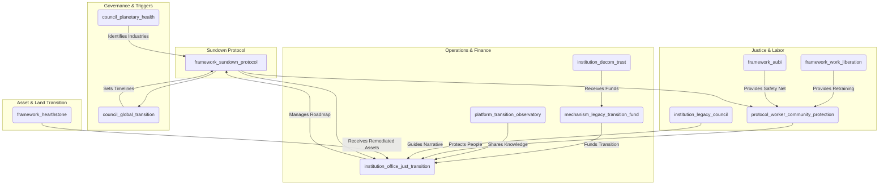

# The Sundown Protocol (Version 0.2)

### A GGF Framework for the Managed, Just Transition of Legacy Industries

*This is an enhanced draft (Version 0.2) incorporating feedback from Claude and clarifications from Gemini. It is designed for iterative co-creation with affected workers, communities, and Indigenous peoples, aligning with the GGF's commitment to participatory governance.*

-----

### **1. Introduction: The Necessity of a Managed Sunset**

**The Challenge:** Legacy industries (e.g., fossil fuels, extractive mining) are locked into business models incompatible with a regenerative future, accelerating the planetary polycrisis. Representing trillions in infrastructure and employing millions, these industries cannot be left to chaotic market-driven decline, which would devastate communities and strand workers. A voluntary transition is insufficient to meet planetary boundary timelines.

**The Opportunity:** The Sundown Protocol provides a compassionate, pragmatic, and orderly pathway to sunset harmful industries while protecting workers, communities, and ecosystems. Modeled on the **Aegis Protocol**'s transition of the military-industrial complex and inspired by real-world successes like Germany’s 60-year coal phase-out, it ensures a just transition that bridges an extractive past to a regenerative future.

**The Framework:** As a **Tier 2 Foundational Application Framework**, the Sundown Protocol delivers the governance, legal, financial, and social architecture for the phased decommissioning of industries identified as existentially harmful by the **Planetary Health Council**. It complements the **Regenerative Enterprise Framework (REF)** as the mandatory, time-bound pathway for entities unable to achieve voluntary regenerative certification, operationalizing the **Treaty for Our Only Home**’s commitment to ecological integrity.

-----

### **2. Core Principles**

The Sundown Protocol is guided by tailored GGF principles:

- **Just Transition First**: The well-being, security, and future prosperity of workers and communities are the primary success metrics. All planning prioritizes their agency and protection.
- **Restorative & Reparative Justice**: The process actively heals historical ecological and social harms, guided by the **Peace & Conflict Resolution Framework**’s Truth & Reconciliation processes.
- **Polluter Pays & Precautionary Principle**: Legacy industries primarily fund the transition, ensuring the burden does not fall on the public.
- **Orderly & Predictable Decommissioning**: Managed to prevent economic shocks, ensuring energy and resource stability via the **Conduit Protocol**.
- **Indigenous Sovereignty**: Transition and remediation activities on traditional lands are subject to the **Indigenous & Traditional Knowledge Governance Framework** and its **FPIC 2.0** protocols.
- **Regenerative Advantage**: First-mover regions and companies gain expertise in decommissioning and restoration, positioning them as global leaders.

-----

### **3. Structural Components & GGF Integration**

The Sundown Protocol coordinates existing and new GGF entities to achieve its mandate.

**Visual: Sundown Protocol Integration Hub**

#### **Core Entities:**

- **Framework (`framework_sundown_protocol`):** The parent framework.
- **Governing Council (`council_global_transition`):** A sub-council of the Meta-Governance framework.
  - **Mandate**: Receives **Planetary Health Council** directives on industries requiring transition, setting binding timelines and phase-out schedules.
  - **Composition**: Tripartite representation from workers (global unions), communities (BAZ councils, civil society), and GGF institutions.
- **Operational Institution (`institution_office_just_transition`):** The primary operational body.
  - **Mandate**: Manages end-to-end transition, developing decommissioning roadmaps, overseeing retraining via **Work in Liberation**, and coordinating reparations/restoration. It also manages the **initiative_transition_champions** (Industry Insider Champions Program) to amplify pro-transition industry voices.
- **Financial Mechanism (`mechanism_legacy_transition_fund`):** The financial engine.
  - **Mandate**: Governs the **Reparations Levy** (a tax on transitioning industries’ revenue) and directs capital to the **Fossil Fuel Decommissioning Trust** and remediation efforts.
- **Legal Protocol (`protocol_worker_community_protection`):** A binding charter of rights.
  - **Mandate**: Guarantees worker protections (pensions, healthcare, retraining stipends via **AUBI**) and community investments (regenerative infrastructure, health monitoring), enforceable by the **Digital Justice Tribunal**.
- **Knowledge Platform (`platform_transition_observatory`):** A global learning network.
  - **Mandate**: Connects to the `platform_regeneration_community` to share real-time data, best practices, and lessons between transitioning regions.
- **Cultural Institution (`institution_legacy_council`):** Industry Legacy Councils.
  - **Mandate**: Worker-community-Indigenous partnerships to guide transition narratives, preserve industrial heritage, and co-design dignified closure rituals.

#### **Crisis & Temporal Coordination:**

- In rapid industry collapse, the `process_crisis_command` (from `framework_meta_gov`) triggers emergency-managed transitions.
- Implementation balances immediate worker needs, medium-term community diversification, and long-term ecological restoration via the `protocol_cross_temporal` (from `framework_meta_gov`).

-----

### **4. Implementation Pathway: A Phased & Managed Approach**

The protocol is activated by scientific and ethical thresholds, with adaptive timelines.

- **Phase 0: Pre-Transition Assessment (Year 0)**
  - Conducts regional resilience mapping and community readiness evaluations, guided by the `framework_nested_sovereignty`.
  - Includes **Worker and Community Consent Protocols** to ensure affected populations shape timing and approach.
  - Performs **Regional Resilience Assessments** to identify alternative economic opportunities.

- **Phase 1: Identification & Designation (Year 1)**
  - The **Planetary Health Council**, using the **Biosphere Health Index (BHI)**, identifies an industry (e.g., thermal coal) for sunset.
  - The **Global Transition Council** ratifies a binding global phase-out timeline (e.g., 2040).

- **Phase 2: Transition Roadmap Co-Creation (Years 1-3)**
  - The **Office of Just Transition** convenes companies, worker unions, community representatives, Indigenous knowledge holders, and **Youth Future Councils**.
  - A binding **Transition Roadmap** details decommissioning schedules, asset transfers, retraining (via **Work in Liberation**’s Community Work Teams), and community investments.
  - Companies achieving **REF** certification exit the protocol.
  - Incorporates **Indigenous Knowledge Integration** for land restoration and sustainable resource management.

- **Phase 3: Managed Decommissioning & Remediation (Years 3-15+)**
  - The **Office of Just Transition** oversees roadmap execution.
  - The **Legacy Transition Fund** collects the Reparations Levy, rewarding ecological restoration work via the `platform_love_ledger` (from `framework_aubi`).
  - The **Conduit Protocol**’s Decommissioning Trust manages infrastructure shutdown.
  - Retrained workers in **Community Work Teams** perform ecological remediation.

- **Phase 4: Asset & Land Stewardship Transfer (Ongoing)**
  - Remediated land/assets transfer to **Stewardship Trusts** under the `framework_hearthstone`.
  - Priority for rematriation to **Bioregional Autonomous Zones (BAZs)**, guided by the **Peace & Conflict Resolution Framework**’s restorative justice processes.

#### **Adaptive Timeline Mechanisms:**

- **Transition Readiness Indicators (TRIs)** (e.g., renewable capacity, retraining completion) trigger phase advancement, overseen by the `council_global_transition`.
- Timelines adjust based on technological breakthroughs or climate urgency, with the `council_planetary_health` holding escalation authority.

#### **Bioregional Adaptation & Transition Typologies:**

- The `institution_office_just_transition` develops distinct **Bioregional Transition Typologies** (e.g., coal regions vs. oil economies), guided by the `framework_nested_sovereignty`.
- Supports regions in crafting regenerative economic identities, inspired by the Ruhr Valley’s transformation into an environmental technology hub.

#### **The Regenerative Advantage: Reframing the Transition**

- Positions first-movers as global leaders in decommissioning, ecological restoration, and circular economy logistics.
- Highlights competitive advantages for regions/companies developing expertise in high-demand services.

-----

### **5. Justice, Reparations, and Healing**

The Sundown Protocol is a framework for restorative justice.

- **Worker Covenants:** The `protocol_worker_community_protection` guarantees income support (via **AUBI**), retraining, and pension protection. **Skills Translation Recognition** formally acknowledges how industrial skills transfer to restoration/renewable energy work.
- **Community Reparations:** The `mechanism_legacy_transition_fund` allocates capital for community health, infrastructure, and economic diversification. **Health Legacy Protocols** provide long-term health monitoring for pollution-affected communities.
- **Truth & Reconciliation:** The `institution_office_just_transition` facilitates **Truth & Reconciliation Processes** to acknowledge harm, provide testimony platforms, and guide reparations.
- **Ceremonial Transition & Healing:** The `institution_legacy_council` collaborates with BAZ authorities to design **Ceremonial Transition Protocols** (via `framework_indigenous`), marking industrial site closures with rituals honoring workers and ecological healing.
- **Cultural Heritage Transformation:** Converts significant facilities into educational/cultural centers (e.g., Zollverein UNESCO site). **Ecosystem Damage Quantification** assesses restoration costs with ongoing monitoring.

-----

### **6. Coordinating the Transition Across Systems**

- **International Coordination & Carbon Leakage**: The `council_global_transition` coordinates with the `framework_gaian_trade` to establish trade agreements preventing extractive operations from relocating to non-compliant jurisdictions.
- **Downstream Supply Chain Transition**: The `institution_office_just_transition` creates transition plans for dependent industries, coordinating with the `framework_gscl`.
- **Financial System Resilience**: The `mechanism_legacy_transition_fund` collaborates with the `framework_financial_systems` to manage stranded assets and pension fund exposures.
- **Rapid Escalation Protocols**: The `council_planetary_health` can trigger an **Ecological Tipping Point Escalation** via the `process_crisis_command`, granting the `council_global_transition` emergency authority to accelerate timelines.

-----

### **7. Conclusion: A Compassionate End and a New Beginning**

The Sundown Protocol transforms endings into beginnings. It retires industries incompatible with a thriving future through a structured, compassionate process, healing past wounds and building regenerative foundations. By integrating global learning, Indigenous wisdom, and bioregional adaptation, it ensures a just transition that honors workers, communities, and the planet.