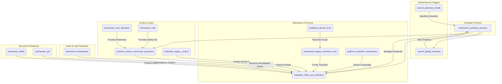

# The Sundown Protocol (Version 0.3)

### A GGF Framework for the Managed, Just Transition of Legacy Industries

*This is an enhanced draft (Version 0.3) incorporating feedback from Claude and Gemini, with new improvements inspired by the Aegis Protocol. It is designed for iterative co-creation with affected workers, communities, and Indigenous peoples, aligning with the GGF's commitment to participatory governance.*

-----

### **1. Introduction: The Necessity of a Managed Sunset**

**The Challenge:** Legacy industries (e.g., fossil fuels, extractive mining) accelerate the planetary polycrisis through business models incompatible with a regenerative future. Representing trillions in infrastructure and employing millions, these industries cannot be left to chaotic market-driven decline, which would devastate communities and strand workers. A voluntary transition is insufficient to meet planetary boundary timelines.

**The Opportunity:** The Sundown Protocol provides a compassionate, pragmatic, and orderly pathway to sunset harmful industries while protecting workers, communities, and ecosystems. Inspired by Germany’s 60-year coal phase-out and the **Aegis Protocol**’s transition of the military-industrial complex, it ensures a just transition that transforms an extractive past into a regenerative future, positioning first-movers as global leaders.

**The Framework:** As a **Tier 2 Foundational Application Framework**, the Sundown Protocol delivers the governance, legal, financial, and social architecture for the phased decommissioning of industries identified as existentially harmful by the **Planetary Health Council**. It complements the **Regenerative Enterprise Framework (REF)** as the mandatory, time-bound pathway for entities unable to achieve voluntary regenerative certification, operationalizing the **Treaty for Our Only Home**’s commitment to ecological integrity.

-----

### **2. Core Principles**

The Sundown Protocol is guided by tailored GGF principles:

- **Just Transition First**: The well-being, security, and future prosperity of workers and communities are the primary success metrics. All planning prioritizes their agency and protection.
- **Restorative & Reparative Justice**: The process heals historical ecological and social harms, guided by the **Peace & Conflict Resolution Framework**’s Truth & Reconciliation processes.
- **Polluter Pays & Precautionary Principle**: Legacy industries primarily fund the transition, ensuring the burden does not fall on the public.
- **Orderly & Predictable Decommissioning**: Managed to prevent economic shocks, ensuring energy and resource stability via the **Conduit Protocol**.
- **Indigenous Sovereignty**: Transition and remediation activities on traditional lands are subject to the **Indigenous & Traditional Knowledge Governance Framework** and its **FPIC 2.0** protocols.
- **Regenerative Advantage**: First-movers gain expertise in decommissioning and restoration, positioning them as global leaders.
- **Strategic Incentivization**: Participation is framed as an opportunity, with economic and geopolitical benefits for early adopters.

-----

### **3. Structural Components & GGF Integration**

The Sundown Protocol coordinates existing and new GGF entities to achieve its mandate.

**Visual: Sundown Protocol Integration Hub**

#### **Core Entities:**

- **Framework (`framework_sundown_protocol`):** The parent framework.
- **Governing Council (`council_global_transition`):** A sub-council of the Meta-Governance framework.
  - **Mandate**: Receives **Planetary Health Council** directives on industries requiring transition, sets binding timelines, and offers advisory roles to transitioned executives via the **Golden Parachute Protocol**.
  - **Composition**: Tripartite representation from workers (global unions), communities (BAZ councils, civil society), and GGF institutions.
- **Operational Institution (`institution_office_just_transition`):** The primary operational body.
  - **Mandate**: Manages end-to-end transition, developing roadmaps, overseeing retraining via **Work in Liberation**, coordinating reparations/restoration, and managing the **initiative_transition_champions** (Industry Insider Champions Program) and **Pathfinder Compact** for voluntary adopters.
- **Financial Mechanism (`mechanism_legacy_transition_fund`):** The financial engine.
  - **Mandate**: Governs the **Reparations Levy**, issues **Transition Bonds**, and distributes **Regenerative Dividends** to early-completing regions.
- **Legal Protocol (`protocol_worker_community_protection`):** A binding charter of rights.
  - **Mandate**: Guarantees worker protections (pensions, healthcare, retraining stipends via **AUBI**) and community investments, enforceable by the **Digital Justice Tribunal**.
- **Knowledge Platform (`platform_transition_observatory`):** A global learning network.
  - **Mandate**: Connects to the `platform_regeneration_community` to share data, best practices, and lessons, with leadership roles for **Pathfinder Compact** signatories.
- **Cultural Institution (`institution_legacy_council`):** Industry Legacy Councils.
  - **Mandate**: Worker-community-Indigenous partnerships to guide transition narratives, preserve heritage, co-design closure rituals, and collaborate with `framework_synoptic` and `institution_gimn` for the **Graduating an Industry** narrative.
- **Security Framework (`framework_shield` & `mechanism_gcf`):** Supports the **Resilience Compact**.
  - **Mandate**: Protects adopting regions from economic coercion via priority energy access (`framework_conduit_protocol`) and emergency support.

#### **Crisis & Temporal Coordination:**

- In rapid industry collapse, the `process_crisis_command` (from `framework_meta_gov`) triggers emergency transitions.
- Implementation balances immediate worker needs, medium-term community diversification, and long-term ecological restoration via the `protocol_cross_temporal`.

-----

### **4. Implementation Pathway: A Phased & Managed Approach**

The protocol is activated by scientific and ethical thresholds, with voluntary and mandatory pathways.

- **Pre-Mandate: Pathfinder Compact (Voluntary)**
  - Companies/regions sign the **Pathfinder Compact** to proactively transition.
  - Benefits include planning support from the `institution_office_just_transition`, preferential **Transition Bond** rates, and leadership roles in the `platform_transition_observatory`.
  - Demonstrates viability, easing mandatory transitions.

- **Phase 0: Pre-Transition Assessment (Year 0)**
  - Conducts regional resilience mapping and community readiness evaluations, guided by the `framework_nested_sovereignty`.
  - Includes **Worker and Community Consent Protocols** and **Regional Resilience Assessments** for alternative opportunities.

- **Phase 1: Identification & Designation (Year 1)**
  - The **Planetary Health Council**, using the **Biosphere Health Index (BHI)**, identifies an industry for sunset.
  - The **Global Transition Council** ratifies a binding phase-out timeline (e.g., 2040).

- **Phase 2: Transition Roadmap Co-Creation (Years 1-3)**
  - The **Office of Just Transition** convenes companies, unions, communities, Indigenous knowledge holders, and **Youth Future Councils**.
  - A binding **Transition Roadmap** details decommissioning, asset transfers, retraining, and investments, incorporating **Indigenous Knowledge Integration**.
  - Companies achieving **REF** certification exit the protocol.

- **Phase 3: Managed Decommissioning & Remediation (Years 3-15+)**
  - The **Office of Just Transition** oversees roadmap execution.
  - The **Legacy Transition Fund** collects the Reparations Levy, issues **Transition Bonds**, and rewards restoration work via the `platform_love_ledger`.
  - The **Conduit Protocol**’s Decommissioning Trust manages infrastructure shutdown.
  - Retrained workers in **Community Work Teams** perform remediation.
  - Early-completing regions receive **Regenerative Dividends** from restored ecosystems (e.g., carbon sequestration).

- **Phase 4: Asset & Land Stewardship Transfer (Ongoing)**
  - Remediated land/assets transfer to **Stewardship Trusts** under the `framework_hearthstone`.
  - Priority for rematriation to **Bioregional Autonomous Zones (BAZs)**, guided by the **Peace & Conflict Resolution Framework**.

#### **Adaptive Timeline Mechanisms:**

- **Transition Readiness Indicators (TRIs)** (e.g., renewable capacity, retraining completion) trigger phase advancement, overseen by the `council_global_transition`.
- Timelines adjust based on technological breakthroughs or climate urgency, with the `council_planetary_health` holding escalation authority.

#### **Bioregional Adaptation & Geopolitical Playbooks:**

- The `institution_office_just_transition` develops **Bioregional Transition Typologies** (e.g., coal vs. oil economies) and **Geopolitical Playbooks** (e.g., framing petro-state transitions as leadership in hydrogen/solar), guided by the `framework_nested_sovereignty`.
- Supports regenerative economic identities, inspired by the Ruhr Valley.

#### **The Regenerative Advantage: Reframing the Transition**

- Positions first-movers as global leaders in decommissioning, restoration, and circular economy logistics.
- The **Graduating an Industry** narrative, led by the `institution_legacy_council`, `framework_synoptic`, and `institution_gimn`, frames transition as an honorable evolution (e.g., “The Last Coal Miner, The First Geothermal Engineer”).

#### **Resilience Compact:**

- Protects adopting regions from economic coercion via priority energy access (`framework_conduit_protocol`) and emergency support (`mechanism_gcf`), with the `framework_shield` countering economic warfare.

-----

### **5. Justice, Reparations, and Healing**

The Sundown Protocol is a framework for restorative justice.

- **Worker Covenants:** The `protocol_worker_community_protection` guarantees income support, retraining, and pension protection. **Skills Translation Recognition** acknowledges industrial skill transfers.
- **Community Reparations:** The `mechanism_legacy_transition_fund` allocates capital for health, infrastructure, and diversification. **Health Legacy Protocols** monitor pollution-affected communities.
- **Truth & Reconciliation:** The `institution_office_just_transition` facilitates processes to acknowledge harm and guide reparations.
- **Ceremonial Transition & Healing:** The `institution_legacy_council` designs **Ceremonial Transition Protocols** (via `framework_indigenous`) for site closures.
- **Cultural Heritage Transformation:** Converts facilities into educational/cultural centers. **Ecosystem Damage Quantification** assesses restoration costs.
- **Golden Parachute Protocol:** Offers transitioned executives advisory roles in the `council_global_transition`.

-----

### **6. Coordinating the Transition Across Systems**

- **International Coordination & Carbon Leakage**: The `council_global_transition` coordinates with the `framework_gaian_trade` to prevent extractive relocation.
- **Downstream Supply Chain Transition**: The `institution_office_just_transition` plans for dependent industries via the `framework_gscl`.
- **Financial System Resilience**: The `mechanism_legacy_transition_fund` manages stranded assets and pension exposures via the `framework_financial_systems`.
- **Rapid Escalation Protocols**: The `council_planetary_health` triggers **Ecological Tipping Point Escalation** via the `process_crisis_command`.

-----

### **7. Conclusion: A Compassionate End and a New Beginning**

The Sundown Protocol transforms endings into beginnings, retiring unsustainable industries through a compassionate, incentivized process. By integrating voluntary pathways, economic instruments, geopolitical strategies, and global learning, it ensures a just transition that honors workers, communities, and the planet, making the shift to a regenerative future both inevitable and desirable.