# The Sundown Protocol (Version 0.4)

### A GGF Framework for the Managed, Just Transition of Legacy Industries

*This is an enhanced draft (Version 0.4) incorporating feedback from Claude, Gemini, and DeepSeek. It is designed for iterative co-creation with affected workers, communities, Indigenous peoples, and youth, aligning with the GGF's commitment to participatory governance and justice.*

-----

### **1. Introduction: The Necessity of a Managed Sunset**

**The Challenge:** Legacy industries (e.g., fossil fuels, extractive mining) accelerate the planetary polycrisis through business models incompatible with a regenerative future. Representing trillions in infrastructure and employing millions, these industries cannot be left to chaotic market-driven decline, which would devastate communities and strand workers. A voluntary transition is insufficient to meet planetary boundary timelines.

**The Opportunity:** The Sundown Protocol provides a compassionate, pragmatic, and enforceable pathway to sunset harmful industries while protecting workers, communities, and ecosystems. Inspired by Germany’s 60-year coal phase-out, Ecuador’s Yasuní-ITT initiative, and the **Aegis Protocol**’s transition of the military-industrial complex, it ensures a just transition that transforms an extractive past into a regenerative future, positioning first-movers as global leaders.

**The Framework:** As a **Tier 2 Foundational Application Framework**, the Sundown Protocol delivers the governance, legal, financial, and social architecture for the phased decommissioning of industries identified as existentially harmful by the **Planetary Health Council**. It complements the **Regenerative Enterprise Framework (REF)** as the mandatory, time-bound pathway for entities unable to achieve voluntary regenerative certification, operationalizing the **Treaty for Our Only Home**’s commitment to ecological integrity.

-----

### **2. Core Principles**

The Sundown Protocol is guided by tailored GGF principles:

- **Just Transition First**: The well-being, security, and future prosperity of workers and communities are the primary success metrics. All planning prioritizes their agency and protection.
- **Restorative & Reparative Justice**: The process heals historical ecological and social harms, guided by the **Peace & Conflict Resolution Framework**’s Truth & Reconciliation processes.
- **Polluter Pays & Precautionary Principle**: Legacy industries primarily fund the transition, ensuring the burden does not fall on the public.
- **Orderly & Predictable Decommissioning**: Managed to prevent economic shocks, ensuring energy and resource stability via the **Conduit Protocol**.
- **Indigenous Sovereignty**: Transition and remediation activities on traditional lands are subject to the **Indigenous & Traditional Knowledge Governance Framework** and its **FPIC 2.0** protocols.
- **Regenerative Advantage**: First-movers gain expertise in decommissioning and restoration, positioning them as global leaders.
- **Strategic Incentivization**: Participation is framed as an opportunity, with economic and geopolitical benefits for early adopters.
- **Enforceable Compliance**: Non-compliance triggers sanctions and asset seizures to ensure adherence to timelines.

-----

### **3. Structural Components & GGF Integration**

The Sundown Protocol coordinates existing and new GGF entities to achieve its mandate.

**Visual: Sundown Protocol Integration Hub**

```mermaid
graph TD
    subgraph Sundown Protocol
        A[framework_sundown_protocol]
    end

    subgraph Governance & Triggers
        B(council_planetary_health) --Identifies Industries--> A
        C(council_global_transition) --Sets Timelines--> A
    end

    subgraph Operations & Finance
        D(institution_office_just_transition) --Manages Roadmap--> A
        E(mechanism_legacy_transition_fund) --Funds Transition--> D
        F(institution_decom_trust) --Receives Funds--> E
        G(platform_transition_observatory) --Shares Knowledge--> D
    end

    subgraph Justice & Labor
        H(protocol_worker_community_protection) --Protects People--> D
        I(framework_work_liberation) --Provides Retraining--> H
        J(framework_aubi) --Provides Safety Net--> H
        K(institution_legacy_council) --Guides Narrative--> D
        L(institution_just_transition_swat) --Crisis Response--> D
    end

    subgraph Asset & Land Transition
        M(framework_hearthstone) --Receives Remediated Assets--> D
        N(institution_indigenous_monitoring_teams) --Oversees Remediation--> D
    end

    subgraph Security & Resilience
        O(framework_shield) --Protects Adopters--> D
        P(mechanism_gcf) --Emergency Support--> D
        Q(framework_migration) --Sanctuary Pathways--> D
    end

    A --> C
    A --> D
    A --> H
```

#### **Core Entities:**

- **Framework (`framework_sundown_protocol`):** The parent framework.
- **Governing Council (`council_global_transition`):** A sub-council of the Meta-Governance framework.
  - **Mandate**: Receives **Planetary Health Council** directives, sets binding timelines, and offers advisory roles to transitioned executives via the **Golden Parachute Protocol**.
  - **Composition**: Tripartite representation from workers (global unions), communities (BAZ councils, civil society), youth (**institution_gya**), and GGF institutions.
- **Operational Institution (`institution_office_just_transition`):** The primary operational body.
  - **Mandate**: Manages end-to-end transition, developing roadmaps, overseeing retraining, coordinating reparations/restoration, and managing the **initiative_transition_champions**, **Pathfinder Compact**, and **Labor-Driven Innovation Fund**.
- **Financial Mechanism (`mechanism_legacy_transition_fund`):** The financial engine.
  - **Mandate**: Governs the **Reparations Levy**, issues **Transition Bonds**, distributes **Regenerative Dividends**, and allocates 5% to worker-cooperative startups in remediation tech via the **Labor-Driven Innovation Fund**.
- **Legal Protocol (`protocol_worker_community_protection`):** A binding charter of rights.
  - **Mandate**: Guarantees worker protections (income, healthcare, retraining, housing) and community investments, enforceable by the **Digital Justice Tribunal** (`institution_dj_tribunal`).
- **Knowledge Platform (`platform_transition_observatory`):** A global learning network.
  - **Mandate**: Shares data and best practices, with leadership roles for **Pathfinder Compact** signatories.
- **Cultural Institution (`institution_legacy_council`):** Industry Legacy Councils.
  - **Mandate**: Worker-community-Indigenous partnerships to guide narratives, preserve heritage, co-design closure rituals, and collaborate with `framework_synoptic` and `institution_gimn` for the **Graduating an Industry** narrative.
- **Crisis Response (`institution_just_transition_swat`):** Just Transition SWAT Team.
  - **Mandate**: Rapid deployment to crisis zones for emergency triage during industry collapse.
- **Indigenous Oversight (`institution_indigenous_monitoring_teams`):** Indigenous-led teams.
  - **Mandate**: Monitor remediation, halt FPIC 2.0 violations, and enforce **Sacred Site Remediation Guidelines**.
- **Security & Migration Frameworks (`framework_shield`, `mechanism_gcf`, `framework_migration`):** Support the **Resilience Compact**.
  - **Mandate**: Protect adopters from coercion, provide emergency support, and offer sanctuary pathways.

#### **Crisis & Temporal Coordination:**

- In rapid industry collapse, the `process_crisis_command` (from `framework_meta_gov`) triggers emergency transitions with **Emergency Triage Measures** (e.g., `framework_aubi` payment surges, temporary nationalization).
- Implementation balances immediate worker needs, medium-term diversification, and long-term restoration via the `protocol_cross_temporal`.

#### **New Initiatives & Mandates:**

- **Labor-Driven Innovation Fund**: 5% of the `mechanism_legacy_transition_fund` supports worker-cooperative startups in remediation and regenerative technologies.
- **Youth Council Veto**: The `institution_gya` (Global Youth Assembly) or **Youth Future Councils** hold veto power over long-term land stewardship plans under the `framework_hearthstone` to ensure intergenerational equity.

-----

### **4. Implementation Pathway: A Phased & Managed Approach**

The protocol is activated by scientific and ethical thresholds, with voluntary and mandatory pathways.

- **Pre-Mandate: Pathfinder Compact (Voluntary)**
  - Companies/regions sign the **Pathfinder Compact** to proactively transition, gaining planning support, preferential **Transition Bond** rates, and leadership in the `platform_transition_observatory`.

- **Phase 0: Pre-Transition Assessment (Year 0)**
  - Conducts regional resilience mapping and community readiness evaluations, guided by the `framework_nested_sovereignty`.
  - Includes **Worker and Community Consent Protocols** and **Regional Resilience Assessments**.

- **Phase 1: Identification & Designation (Year 1)**
  - The **Planetary Health Council**, using the **Biosphere Health Index (BHI)**, issues a **binding trigger** for an industry sunset based on BHI thresholds.
  - The **Global Transition Council** ratifies a binding phase-out timeline (e.g., 2040).

- **Phase 2: Transition Roadmap Co-Creation (Years 1-3)**
  - The **Office of Just Transition** convenes companies, unions, communities, Indigenous knowledge holders, and **Youth Future Councils**.
  - A binding **Transition Roadmap** details decommissioning, asset transfers, retraining, and investments, incorporating **Indigenous Knowledge Integration** and **Cultural Impact Assessments**.
  - Companies achieving **REF** certification exit the protocol.

- **Phase 3: Managed Decommissioning & Remediation (Years 3-15+)**
  - The **Office of Just Transition** oversees execution, with `institution_indigenous_monitoring_teams` ensuring FPIC 2.0 compliance and **Sacred Site Remediation Guidelines**.
  - The **Legacy Transition Fund** collects the Reparations Levy, issues **Transition Bonds**, and rewards restoration via the `platform_love_ledger`.
  - The **Conduit Protocol**’s Decommissioning Trust manages infrastructure shutdown.
  - Retrained workers in **Community Work Teams** perform remediation.
  - Early-completing regions receive **Regenerative Dividends** from restored ecosystems.

- **Phase 4: Asset & Land Stewardship Transfer (Ongoing)**
  - Remediated land/assets transfer to **Stewardship Trusts** under the `framework_hearthstone`, subject to **Youth Council Veto**.
  - Priority for rematriation to **Bioregional Autonomous Zones (BAZs)**, guided by the **Peace & Conflict Resolution Framework**.

#### **Adaptive Timeline Mechanisms:**

- **Transition Readiness Indicators (TRIs)** (e.g., renewable capacity, retraining completion) trigger phase advancement, overseen by the `council_global_transition`.
- Timelines adjust based on technological breakthroughs or climate urgency, with the `council_planetary_health` holding escalation authority.

#### **Bioregional Adaptation & Geopolitical Playbooks:**

- The `institution_office_just_transition` develops **Bioregional Transition Typologies** and **Geopolitical Playbooks** (e.g., petro-state transitions to hydrogen/solar leadership), guided by the `framework_nested_sovereignty`.
- Supports regenerative economic identities, inspired by the Ruhr Valley and Yasuní-ITT.

#### **The Regenerative Advantage: Reframing the Transition**

- Positions first-movers as global leaders in decommissioning, restoration, and circular economy logistics.
- The **Graduating an Industry** narrative, led by the `institution_legacy_council`, `framework_synoptic`, and `institution_gimn`, frames transition as an honorable evolution (e.g., “The Last Coal Miner, The First Geothermal Engineer”).

#### **Resilience Compact:**

- Protects adopters from economic coercion via priority energy access (`framework_conduit_protocol`), emergency support (`mechanism_gcf`), and sanctuary/asylum pathways (`framework_migration`) for persecuted workers/activists.
- Offers debt relief via the `framework_gaian_trade` and `framework_financial_systems` for compliant nations.

-----

### **5. Justice, Reparations, and Healing**

The Sundown Protocol is a framework for restorative justice.

- **Worker & Family Covenant**:
  - **Income Bridge**: 100% wage replacement for 3 years, tapering to 70% via `framework_aubi` until re-employment.
  - **Transition Housing**: Relocation subsidies or **Community Land Trust** access via `framework_hearthstone`.
  - **Toxic Exposure Healthcare**: Lifetime coverage for pollution-linked illnesses, funded by the **Reparations Levy**, modeled on the Black Lung Program.
  - **Skills Translation & Certification**: Industrial credentials fast-track certifications under `framework_work_liberation` (e.g., “Oil Rig to Offshore Wind Farm”).
- **Community Reparations**: The `mechanism_legacy_transition_fund` allocates capital for health, infrastructure, and diversification. **Health Legacy Protocols** monitor pollution-affected communities.
- **Indigenous-Led Oversight & Cultural Integrity**:
  - `institution_indigenous_monitoring_teams` halt FPIC 2.0 violations and enforce **Sacred Site Remediation Guidelines** co-drafted with Indigenous stewards.
  - **Cultural Impact Assessments** are required before asset transfers.
- **Truth & Reconciliation**: The `institution_office_just_transition` facilitates processes to acknowledge harm and guide reparations.
- **Ceremonial Transition & Healing**: The `institution_legacy_council` designs **Ceremonial Transition Protocols** (via `framework_indigenous`) for site closures.
- **Cultural Heritage Transformation**: Converts facilities into educational/cultural centers. **Ecosystem Damage Quantification** assesses restoration costs.
- **Golden Parachute Protocol**: Offers transitioned executives advisory roles in the `council_global_transition`.

-----

### **6. Coordinating the Transition Across Systems**

- **International Coordination & Carbon Leakage**: The `council_global_transition` coordinates with the `framework_gaian_trade` to prevent extractive relocation.
- **Downstream Supply Chain Transition**: The `institution_office_just_transition` plans for dependent industries via the `framework_gscl`.
- **Financial System Resilience**: The `mechanism_legacy_transition_fund` manages stranded assets and pension exposures via the `framework_financial_systems`.
- **Rapid Escalation Protocols**: The `council_planetary_health` triggers **Ecological Tipping Point Escalation** via the `process_crisis_command`.
- **Mandatory Compliance & Enforcement**:
  - Non-compliance within 12 months of Phase 2 triggers sanctions (e.g., fossil fuel export bans via `framework_shield`) and asset seizures by the `institution_dj_tribunal`.

-----

### **7. Conclusion: A Compassionate End and a New Beginning**

The Sundown Protocol transforms endings into beginnings, retiring unsustainable industries through a compassionate, incentivized, and enforceable process. By integrating voluntary pathways, robust enforcement, Indigenous oversight, and global learning, it ensures a just transition that honors workers, communities, youth, and the planet, making the shift to a regenerative future both inevitable and desirable.

-----

### **Appendix**

#### **Appendix A: Implementation Timeline**
- [Placeholder for Gantt chart visualizing phased milestones: Pre-Mandate (Year 0), Phase 0 (Year 0), Phase 1 (Year 1), Phase 2 (Years 1-3), Phase 3 (Years 3-15+), Phase 4 (Ongoing).]

#### **Appendix B: Glossary**
- **Biosphere Health Index (BHI)**: A GGF metric assessing ecological harm to trigger industry sunsets.
- **FPIC 2.0**: Enhanced Free, Prior, and Informed Consent protocols ensuring Indigenous veto power.
- **AUBI**: Adaptive Universal Basic Income, providing income support for transitioning workers.
- **BAZ**: Bioregional Autonomous Zones, prioritizing local governance and rematriation.

#### **Appendix C: Illustrative Case Studies**
- [Placeholder for Germany’s coal phase-out (1958-2018): Worker protections, regional transformation.]
- [Placeholder for Ecuador’s Yasuní-ITT initiative: Indigenous-led conservation, global precedent.]