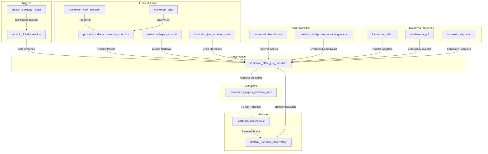

# The Sundown Protocol (Version 0.5)

### A Just Transition Framework for Retiring Harmful Industries and Rebirthing Regenerative Futures

*This is an enhanced draft (Version 0.5) incorporating feedback from Claude, Gemini, DeepSeek, and ChatGPT. It is designed for iterative co-creation with workers, communities, Indigenous peoples, and youth, aligning with the GGF's commitment to participatory governance and justice.*

---

### **Framework at a Glance (Placeholder)**

*[Placeholder for a 1-page visual summary or flowchart mapping the phases (Pre-Mandate, Phase 0–4) and key actors (Planetary Health Council, Office of Just Transition, Legacy Councils, etc.).]*

---

### **1. Introduction: A Pro-Future Transition**

#### **The Challenge**

Legacy industries (e.g., fossil fuels, extractive mining) accelerate the planetary polycrisis through business models incompatible with a regenerative future. Representing trillions in infrastructure and employing millions, these industries cannot be left to chaotic market-driven decline, which would devastate communities and strand workers. A voluntary transition is insufficient to meet planetary boundary timelines.

#### **The Opportunity**

The Sundown Protocol is not anti-industry; it is a pro-future roadmap designed to help vital sectors and their workforces 'graduate' into a new, regenerative economy. Inspired by Germany’s coal phase-out, Ecuador’s Yasuní-ITT initiative, and the **Aegis Protocol**’s transition of the military-industrial complex, it ensures a just, compassionate, and enforceable transition that protects workers, communities, and ecosystems while positioning first-movers as global leaders.

#### **The Framework**

As a **Tier 2 Foundational Application Framework**, the Sundown Protocol delivers the governance, legal, financial, and social architecture for the phased decommissioning of industries identified as existentially harmful by the **Planetary Health Council**. It complements the **Regenerative Enterprise Framework (REF)** as the mandatory, time-bound pathway for entities unable to achieve voluntary regenerative certification, operationalizing the **Treaty for Our Only Home**’s commitment to ecological integrity.

> **Why Now? The Urgency of a Managed Transition**  
> Planetary boundaries are nearing critical thresholds, as monitored by the `council_planetary_health`. Closing policy windows demand orderly action to prevent chaotic economic collapse and irreversible climate tipping points, making a managed transition an urgent necessity.

---

### **2. Core Principles**

The Sundown Protocol is guided by tailored GGF principles:

- **Just Transition First**: The well-being, security, and future prosperity of workers and communities are the primary success metrics. All planning prioritizes their agency and protection.
- **Restorative & Reparative Justice**: The process heals historical ecological and social harms, guided by the **Peace & Conflict Resolution Framework**’s Truth & Reconciliation processes.
- **Polluter Pays & Precautionary Principle**: Legacy industries primarily fund the transition, ensuring the burden does not fall on the public.
- **Orderly & Predictable Decommissioning**: Managed to prevent economic shocks, ensuring energy and resource stability via the **Conduit Protocol**.
- **Indigenous Sovereignty**: Transition and remediation activities on traditional lands are subject to the **Indigenous & Traditional Knowledge Governance Framework** and its **FPIC 2.0** protocols.
- **Regenerative Advantage**: First-movers gain expertise in decommissioning and restoration, positioning them as global leaders.
- **Strategic Incentivization**: Participation is framed as an opportunity, with economic and geopolitical benefits for early adopters.
- **Enforceable Compliance**: Non-compliance triggers sanctions and asset seizures to ensure adherence to timelines.

---

### **3. Structural Components & GGF Integration**

> **Framework Snapshot**  
> - **Main Entities**: `council_global_transition`, `institution_office_just_transition`, `mechanism_legacy_transition_fund`  
> - **Key GGF Links**: `framework_hearthstone`, `framework_aubi`, `framework_shield`  
> - **Enforcement Lever**: `institution_dj_tribunal` sanctions and asset seizures  
> - **Success Metric**: % of workers retrained and ecosystems restored  

The Sundown Protocol coordinates existing and new GGF entities to achieve its mandate.

**Visual: Sundown Protocol Integration Hub**

#### **Core Entities**

##### **Framework (`framework_sundown_protocol`)**  
The parent framework coordinating the transition process.

##### **Governing Council (`council_global_transition`)**  
- **Mandate**: Receives `council_planetary_health` directives, sets binding timelines, and offers advisory roles via the **Golden Parachute Protocol**.  
- **Composition**: Workers (global unions), communities (BAZ councils, civil society), youth (`institution_gya`), and GGF institutions.

##### **Operational Institution (`institution_office_just_transition`)**  
- **Mandate**: Manages end-to-end transition, developing roadmaps, overseeing retraining, coordinating reparations/restoration, and managing the **initiative_transition_champions**, **Pathfinder Compact**, and **Labor-Driven Innovation Fund**.

##### **Financial Mechanism (`mechanism_legacy_transition_fund`)**  
- **Mandate**: Governs the **Reparations Levy**, issues **Transition Bonds**, distributes **Regenerative Dividends**, and allocates 5% to worker-cooperative startups via the **Labor-Driven Innovation Fund**.

##### **Legal Protocol (`protocol_worker_community_protection`)**  
- **Mandate**: Guarantees worker protections and community investments, enforceable by the `institution_dj_tribunal`.

##### **Knowledge Platform (`platform_transition_observatory`)**  
- **Mandate**: Shares data and best practices, with leadership roles for **Pathfinder Compact** signatories. Includes a **dynamic feedback mechanism** to propose protocol amendments based on implementation data.

##### **Cultural Institution (`institution_legacy_council`)**  
- **Mandate**: Worker-community-Indigenous partnerships to guide narratives, preserve heritage, co-design closure rituals, and collaborate with `framework_synoptic` and `institution_gimn` for the **Graduating an Industry** narrative.

##### **Crisis Response (`institution_just_transition_swat`)**  
- **Mandate**: Rapid deployment to crisis zones for emergency triage during industry collapse.

##### **Indigenous Oversight (`institution_indigenous_monitoring_teams`)**  
- **Mandate**: Monitor remediation, halt FPIC 2.0 violations, and enforce **Sacred Site Remediation Guidelines**.

##### **Security & Migration Frameworks (`framework_shield`, `mechanism_gcf`, `framework_migration`)**  
- **Mandate**: Protect adopters, provide emergency support, and offer sanctuary pathways.

#### **Crisis & Temporal Coordination**

- In rapid industry collapse, the `process_crisis_command` triggers **Emergency Triage Measures** (e.g., `framework_aubi` payment surges, temporary nationalization).
- Balances immediate worker needs, medium-term diversification, and long-term restoration via `protocol_cross_temporal`.

---

### **4. Implementation Pathway: A Phased & Managed Approach**

> **Framework Snapshot**  
> - **Main Entities**: `institution_office_just_transition`, `council_global_transition`  
> - **Key GGF Links**: `framework_nested_sovereignty`, `framework_work_liberation`  
> - **Enforcement Lever**: Binding phase triggers via BHI thresholds  
> - **Success Metric**: % of communities with completed roadmaps  

The protocol follows a **Ladder of Participation** (Inform → Consult → Co-Decide → Empower), with the `platform_transition_observatory` serving as a **Public Observatory** for transparency and citizen input.

- **Pre-Mandate: Pathfinder Compact (Voluntary)**  
  - Companies/regions sign to proactively transition, gaining planning support, preferential **Transition Bond** rates, and leadership in the `platform_transition_observatory`.  
  - **Key Success Indicators**: % of signatories completing initial transition plans.

- **Phase 0: Pre-Transition Assessment (Year 0)**  
  - Conducts regional resilience mapping and readiness evaluations, guided by `framework_nested_sovereignty`.  
  - Includes **Worker and Community Consent Protocols** and **Regional Resilience Assessments**.  
  - **Key Success Indicators**: % of communities with completed resilience maps.

- **Phase 1: Identification & Designation (Year 1)**  
  - The `council_planetary_health` issues a **binding trigger** for an industry sunset based on **Biosphere Health Index (BHI)** thresholds.  
  - The `council_global_transition` ratifies a phase-out timeline (e.g., 2040).  
  - **Key Success Indicators**: % of designated industries with ratified timelines.

- **Phase 2: Transition Roadmap Co-Creation (Years 1-3)**  
  - The `institution_office_just_transition` convenes companies, unions, communities, Indigenous knowledge holders, and **Youth Future Councils**.  
  - A binding **Transition Roadmap** details decommissioning, asset transfers, retraining, investments, and **Cultural Impact Assessments**.  
  - Companies achieving **REF** certification exit the protocol.  
  - **Key Success Indicators**: % of regions with co-created roadmaps.

- **Phase 3: Managed Decommissioning & Remediation (Years 3-15+)**  
  - The `institution_office_just_transition` oversees execution, with `institution_indigenous_monitoring_teams` ensuring FPIC 2.0 and **Sacred Site Remediation Guidelines**.  
  - The `mechanism_legacy_transition_fund` collects the **Reparations Levy**, issues **Transition Bonds**, and rewards restoration via `platform_love_ledger`.  
  - Retrained workers in **Community Work Teams** perform remediation.  
  - Early-completing regions receive **Regenerative Dividends**.  
  - **Key Success Indicators**: % of workforce retrained and re-employed in regenerative sectors; verified restoration data in `platform_love_ledger`.

- **Phase 4: Asset & Land Stewardship Transfer (Ongoing)**  
  - Remediated land/assets transfer to **Stewardship Trusts** under `framework_hearthstone`, subject to **Youth Council Veto**.  
  - Priority for rematriation to **Bioregional Autonomous Zones (BAZs)**.  
  - **Key Success Indicators**: % of assets transferred to BAZs or Stewardship Trusts.

#### **Adaptive Timeline Mechanisms**

- **Transition Readiness Indicators (TRIs)** (e.g., % of regional energy grid from renewables, % of workforce in retraining programs) trigger phase advancement, overseen by `council_global_transition`.  
- Timelines adjust based on technological breakthroughs or climate urgency, with `council_planetary_health` escalation authority.

#### **Bioregional Adaptation & Geopolitical Playbooks**

- The `institution_office_just_transition` develops **Bioregional Transition Typologies** and **Geopolitical Playbooks** (e.g., petro-state transitions to hydrogen/solar leadership), guided by `framework_nested_sovereignty`.  
- **Differentiated Pathways for the Global South**: Enhanced technical support and compliance linked to `mechanism_gcf` access and debt relief via `framework_financial_systems`.  
- Supports regenerative economic identities, inspired by the Ruhr Valley and Yasuní-ITT.

#### **The Regenerative Advantage: Reframing the Transition**

- Positions first-movers as global leaders in decommissioning, restoration, and circular economy logistics.  
- The **Graduating an Industry** narrative, led by `institution_legacy_council`, `framework_synoptic`, and `institution_gimn`, frames transition as an honorable evolution (e.g., “The Last Coal Miner, The First Geothermal Engineer”).

#### **Resilience Compact**

- Protects adopters from coercion via priority energy access (`framework_conduit_protocol`), emergency support (`mechanism_gcf`), and sanctuary/asylum pathways (`framework_migration`).  
- Offers debt relief via `framework_gaian_trade` and `framework_financial_systems` for compliant nations.

---

### **5. Justice, Reparations, and Healing**

> **Framework Snapshot**  
> - **Main Entities**: `institution_legacy_council`, `protocol_worker_community_protection`  
> - **Key GGF Links**: `framework_indigenous`, `framework_mental_health`  
> - **Enforcement Lever**: `institution_dj_tribunal` enforces worker rights  
> - **Success Metric**: Increase in `metric_lmci` (Love, Meaning, Connection Index)  

#### **Worker & Family Covenant**

- **Income Bridge**: 100% wage replacement for 3 years, tapering to 70% via `framework_aubi` until re-employment.  
- **Transition Housing**: Relocation subsidies or **Community Land Trust** access via `framework_hearthstone`.  
- **Toxic Exposure Healthcare**: Lifetime coverage for pollution-linked illnesses, funded by **Reparations Levy**, modeled on the Black Lung Program.  
- **Skills Translation & Certification**: Industrial credentials fast-track certifications under `framework_work_liberation` (e.g., “Oil Rig to Offshore Wind Farm”).  
- **Psychological & Identity Support**: The `institution_legacy_council`, with `framework_mental_health`, facilitates grief, identity transition, and mental well-being programs, measured via `metric_lmci`.

#### **Community Reparations**

- The `mechanism_legacy_transition_fund` allocates capital for health, infrastructure, and diversification. **Health Legacy Protocols** monitor pollution-affected communities.

#### **Indigenous-Led Oversight & Cultural Integrity**

- `institution_indigenous_monitoring_teams` halt FPIC 2.0 violations and enforce **Sacred Site Remediation Guidelines** co-drafted with Indigenous stewards.  
- **Cultural Impact Assessments** required before asset transfers.

#### **Truth & Reconciliation**

- The `institution_office_just_transition` facilitates processes to acknowledge harm and guide reparations.

#### **Ceremonial Transition & Healing**

- The `institution_legacy_council` develops **Ceremonial Closure Templates** (e.g., “Retiring the Last Oil Rig,” “Healing the Mine”), integrating youth art, community storytelling, and Indigenous rites.  
- *This process treats the industrial sunset not as a death, but as a sacred composting—where the energy of the past is gratefully acknowledged and returned to the soil to nourish a new future.*

#### **Cultural Heritage Transformation**

- Converts facilities into educational/cultural centers. **Ecosystem Damage Quantification** assesses restoration costs.

#### **Golden Parachute Protocol**

- Offers transitioned executives advisory roles in `council_global_transition`.

#### **New Initiatives & Mandates**

- **Labor-Driven Innovation Fund**: 5% of `mechanism_legacy_transition_fund` supports worker-cooperative startups in remediation tech.  
- **Youth Council Veto**: `institution_gya` or **Youth Future Councils** hold veto power over long-term land stewardship plans under `framework_hearthstone`.

---

### **6. Coordinating the Transition Across Systems**

> **Framework Snapshot**  
> - **Main Entities**: `council_global_transition`, `institution_dj_tribunal`  
> - **Key GGF Links**: `framework_gaian_trade`, `framework_financial_systems`  
> - **Enforcement Lever**: Sanctions and asset seizures  
> - **Success Metric**: % of compliant jurisdictions  

- **International Coordination & Carbon Leakage**: The `council_global_transition` coordinates with `framework_gaian_trade` to prevent extractive relocation.  
- **Downstream Supply Chain Transition**: The `institution_office_just_transition` plans for dependent industries via `framework_gscl`.  
- **Financial System Resilience**: The `mechanism_legacy_transition_fund` manages stranded assets and pension exposures via `framework_financial_systems`.  
- **Rapid Escalation Protocols**: The `council_planetary_health` triggers **Ecological Tipping Point Escalation** via `process_crisis_command`.  
- **Mandatory Compliance & Enforcement**: Non-compliance within 12 months of Phase 2 triggers sanctions (e.g., fossil fuel export bans via `framework_shield`) and asset seizures by `institution_dj_tribunal`.

---

### **7. Conclusion: A Compassionate End and a New Beginning**

The Sundown Protocol transforms endings into beginnings, retiring unsustainable industries through a compassionate, incentivized, and enforceable process. By integrating voluntary pathways, robust enforcement, Indigenous oversight, youth empowerment, and cultural resonance, it ensures a just transition that honors workers, communities, and the planet, making the shift to a regenerative future both inevitable and desirable.

---

### **Appendix**

#### **Appendix A: Implementation Timeline**

- *[Placeholder for Gantt chart visualizing phased milestones: Pre-Mandate (Year 0), Phase 0 (Year 0), Phase 1 (Year 1), Phase 2 (Years 1-3), Phase 3 (Years 3-15+), Phase 4 (Ongoing).]*

#### **Appendix B: Glossary**

- **Biosphere Health Index (BHI)**: A GGF metric assessing ecological harm to trigger industry sunsets.  
- **FPIC 2.0**: Enhanced Free, Prior, and Informed Consent protocols ensuring Indigenous veto power.  
- **AUBI**: Adaptive Universal Basic Income, providing income support for transitioning workers.  
- **BAZ**: Bioregional Autonomous Zones, prioritizing local governance and rematriation.  
- **LMCI**: Love, Meaning, and Connection Index, measuring psychosocial well-being.

#### **Appendix C: Illustrative Case Studies**

- *[Placeholder for Germany’s coal phase-out (1958-2018): Worker protections, regional transformation.]*  
- *[Placeholder for Ecuador’s Yasuní-ITT initiative: Indigenous-led conservation, global precedent.]*

#### **Appendix D: The Sundown Playbook for CEOs (Placeholder)**

- *[Placeholder for a practical onboarding tool for private sector leaders, detailing incentives, timelines, and case studies.]*