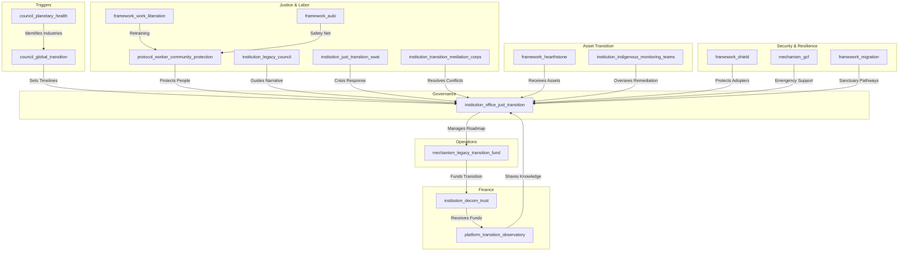

# The Sundown Protocol (Version 0.8)

### A Just Transition Framework for Retiring Harmful Industries and Rebirthing Regenerative Futures

*This is the pilot-ready draft (Version 0.8), incorporating feedback from Claude, Gemini, DeepSeek, ChatGPT, and Grok. It is designed for iterative co-creation with workers, communities, Indigenous peoples, and youth, aligning with the GGF's commitment to participatory governance, justice, and resilience.*

---

### **Framework at a Glance (Placeholder)**

*[Placeholder for a 1-page visual summary or flowchart mapping the phases (Pre-Mandate, Phase 0–4) and key actors (Planetary Health Council, Office of Just Transition, Legacy Councils, etc.).]*

---

### **1. Introduction: A Pro-Future Transition**

#### **The Challenge**

Legacy industries (e.g., fossil fuels, extractive mining, industrial agriculture) accelerate the planetary polycrisis through business models incompatible with a regenerative future. Representing trillions in infrastructure and employing millions, these industries cannot be left to chaotic market-driven decline, which would devastate communities and strand workers. A voluntary transition is insufficient to meet planetary boundary timelines.

#### **The Opportunity**

The Sundown Protocol is not anti-industry; it is a pro-future roadmap designed to help vital sectors and their workforces 'graduate' into a new, regenerative economy. Inspired by Germany’s coal phase-out, Ecuador’s Yasuní-ITT initiative, and the **Aegis Protocol**’s transition of the military-industrial complex, it ensures a just, compassionate, and enforceable transition that protects workers, communities, and ecosystems while positioning first-movers as global leaders.

#### **The Framework**

As a **Tier 2 Foundational Application Framework**, the Sundown Protocol delivers the governance, legal, financial, and social architecture for the phased decommissioning of industries identified as existentially harmful by the **Planetary Health Council**. It complements the **Regenerative Enterprise Framework (REF)** as the mandatory, time-bound pathway for entities unable to achieve voluntary regenerative certification, operationalizing the **Treaty for Our Only Home**’s commitment to ecological integrity.

> **Why Now? The Urgency of a Managed Transition**  
> Planetary boundaries, as monitored by the `council_planetary_health`, are nearing critical thresholds. Closing policy windows and the risk of climate tipping points demand orderly action to prevent chaotic economic collapse and ensure a just transition.

---

### **2. Core Principles**

The Sundown Protocol is guided by tailored GGF principles:

- **Just Transition First**: The well-being, security, and future prosperity of workers and communities are the primary success metrics. All planning prioritizes their agency and protection.
- **Restorative & Reparative Justice**: The process heals historical ecological and social harms, guided by the **Peace & Conflict Resolution Framework**’s Truth & Reconciliation processes.
- **Polluter Pays & Precautionary Principle**: Legacy industries primarily fund the transition, ensuring the burden does not fall on the public.
- **Orderly & Predictable Decommissioning**: Managed to prevent economic shocks, ensuring energy and resource stability via the **Conduit Protocol**.
- **Indigenous Sovereignty**: Transition and remediation activities on traditional lands are subject to the **Indigenous & Traditional Knowledge Governance Framework** and its **FPIC 2.0** protocols.
- **Regenerative Advantage**: First-movers gain expertise in decommissioning and restoration, positioning them as global leaders.
- **Strategic Incentivization**: Participation is framed as an opportunity, with economic and geopolitical benefits for early adopters.
- **Enforceable Compliance**: Non-compliance triggers sanctions and asset seizures to ensure adherence to timelines.
- **Adaptive Scalability**: Industry-specific modules ensure tailored approaches for diverse sectors.
- **Generational Justice**: Long-term ecological and social outcomes prioritize future generations.

---

### **3. Structural Components & GGF Integration**

> **Framework Snapshot**  
> - **Main Entities**: `council_global_transition`, `institution_office_just_transition`, `mechanism_legacy_transition_fund`  
> - **Key GGF Links**: `framework_hearthstone`, `framework_aubi`, `framework_shield`  
> - **Enforcement Lever**: `institution_dj_tribunal` sanctions and asset seizures  
> - **Success Metrics**: % of workers retrained, ecosystems restored, `metric_lmci` increase, Regional Resilience Index  

The Sundown Protocol coordinates existing and new GGF entities to achieve its mandate.

**Visual: Sundown Protocol Integration Hub**



#### **Core Entities**

##### **Framework (`framework_sundown_protocol`)**
The parent framework coordinating the transition process.

##### **Governing Council (`council_global_transition`)**
- **Mandate**: Receives `council_planetary_health` directives, sets binding timelines, offers advisory roles via the **Golden Parachute Protocol**, and liaises with international bodies (e.g., UNFCCC, ILO).  
- **Composition**: Workers (global unions), communities (BAZ councils, civil society), youth (`institution_gya`), GGF institutions, and rotating community delegate seats elected from BAZ councils and worker unions.

##### **Operational Institution (`institution_office_just_transition`)**
- **Mandate**: Manages end-to-end transition, developing roadmaps, overseeing retraining, coordinating reparations/restoration, and managing **initiative_transition_champions**, **Pathfinder Compact**, **Labor-Driven Innovation Fund**, **institution_community_transition_board**, and **initiative_transition_solidarity_compacts**.

##### **Financial Mechanism (`mechanism_legacy_transition_fund`)**
- **Mandate**: Governs the **Reparations Levy**, issues **Transition Bonds** (underwritten by alliances like GFANZ, with **protocol_sovereign_guarantee** for Global South nations), distributes **Regenerative Dividends**, allocates 5% to **Labor-Driven Innovation Fund**, 5% to **mechanism_childrens_future_fund**, and 5% to **mechanism_regional_emergency_reserve**.  
- **Transparency & Accountability Protocol (`protocol_fund_transparency`)**: Publishes real-time dashboards on `platform_transition_observatory`, overseen by `institution_citizen_oversight_panel` with majority Global South representation.

##### **Legal Protocol (`protocol_worker_community_protection`)**
- **Mandate**: Guarantees worker protections and community investments, enforceable by `institution_dj_tribunal`.

##### **Knowledge Platform (`platform_transition_observatory`)**
- **Mandate**: Shares data, best practices, and lessons, with leadership roles for **Pathfinder Compact** signatories. Includes **Technology Integration Hub** publishing **Transition Technology Reports** and **protocol_tech_transfer** for open-source standards. Hosts **dynamic feedback mechanism**, **Community Resilience Dashboard**, and **Red Lines Registry**.

##### **Cultural Institution (`institution_legacy_council`)**
- **Mandate**: Worker-community-Indigenous partnerships to guide narratives, preserve heritage via **initiative_industrial_knowledge_preservation**, co-design closure rituals, and manage **Global Transition Story Archive** with `institution_gimn`.

##### **Crisis Response (`institution_just_transition_swat`)**
- **Mandate**: Rapid deployment to crisis zones for emergency triage, funded by **mechanism_regional_emergency_reserve**.

##### **Conflict Resolution (`institution_transition_mediation_corps`)**
- **Mandate**: Facilitates restorative dialogue circles, certified by `framework_peace_conflict_resolution`, with escalation to `institution_dj_tribunal`.

##### **Indigenous Oversight (`institution_indigenous_monitoring_teams`)**
- **Mandate**: Monitor remediation, halt FPIC 2.0 violations, and enforce **Sacred Site Remediation Guidelines**.

##### **Security & Migration Frameworks (`framework_shield`, `mechanism_gcf`, `framework_migration`)**
- **Mandate**: Protect adopters, provide emergency support, and offer sanctuary pathways.

##### **Innovation Labs (`institution_transition_innovation_labs`)**
- **Mandate**: R&D facilities in transitioned regions, funded by **Labor-Driven Innovation Fund**, developing restoration and circular economy technologies.

#### **Crisis & Temporal Coordination**

- **Crisis Response Tiering**:  
  - **Tier 1 (Localized Collapse)**: Deploy `institution_just_transition_swat` with funds from **mechanism_regional_emergency_reserve** (5% of `mechanism_legacy_transition_fund`).  
  - **Tier 2 (Systemic Shock)**: Activate `process_crisis_command` to suspend corporate dividends, temporarily nationalize critical infrastructure, and offer **BAZ Sanctuary Pathways** for displaced families.  
  - **Tier 3 (Geopolitical Instability)**: Trigger `framework_shield` trade sanctions and `framework_migration` asylum protocols.  
- Balances immediate worker needs, medium-term diversification, and long-term restoration via `protocol_cross_temporal`.

---

### **4. Implementation Pathway: A Phased & Managed Approach**

> **Framework Snapshot**  
> - **Main Entities**: `institution_office_just_transition`, `council_global_transition`  
> - **Key GGF Links**: `framework_nested_sovereignty`, `framework_work_liberation`  
> - **Enforcement Lever**: Binding phase triggers via BHI thresholds  
> - **Success Metrics**: % of communities with completed roadmaps, Regional Resilience Index  

The protocol follows a **Ladder of Participation** (Inform → Consult → Co-Decide → Empower), with `platform_transition_observatory` as a **Public Observatory** for transparency and citizen input.

- **Pre-Mandate: Pathfinder Compact (Voluntary)**  
  - Companies/regions sign to proactively transition, gaining planning support, preferential **Transition Bond** rates, and leadership in `platform_transition_observatory`.  
  - **Key Success Indicators**: % of signatories completing initial transition plans (Regional Resilience Index baseline).

- **Phase 0: Pre-Transition Assessment (Year 0)**  
  - Conducts regional resilience mapping and readiness evaluations, guided by `framework_nested_sovereignty`.  
  - Includes **Worker and Community Consent Protocols** and **Regional Resilience Assessments**.  
  - **Key Success Indicators**: % of communities with completed resilience maps.

- **Phase 1: Identification & Designation (Year 1)**  
  - The `council_planetary_health` issues a **binding trigger** for an industry sunset based on **Biosphere Health Index (BHI)** thresholds, prioritized by ecological impact scores.  
  - The `council_global_transition` ratifies a phase-out timeline (e.g., 2040).  
  - **Key Success Indicators**: % of designated industries with ratified timelines.

- **Phase 2: Transition Roadmap Co-Creation (Years 1-3)**  
  - The `institution_office_just_transition` convenes companies, unions, communities, Indigenous knowledge holders, **Youth Future Councils**, and **institution_community_transition_board** with delegated decision-making power over local investment priorities.  
  - A binding **Transition Roadmap** details decommissioning, asset transfers, retraining, investments, **Cultural Impact Assessments**, and **Seven-Generation Impact Assessments**, facilitated by restorative dialogue circles via `institution_transition_mediation_corps`.  
  - Companies achieving **REF** certification exit the protocol.  
  - **Key Success Indicators**: % of regions with co-created roadmaps.

- **Phase 3: Managed Decommissioning & Remediation (Years 3-15+)**  
  - The `institution_office_just_transition` oversees execution, with `institution_indigenous_monitoring_teams` ensuring FPIC 2.0 and **Sacred Site Remediation Guidelines**.  
  - The `mechanism_legacy_transition_fund` collects **Reparations Levy**, issues **Transition Bonds**, and rewards restoration via `platform_love_ledger` with **Biodiversity Bonus Mechanisms** for exceeding targets.  
  - Retrained workers in **Community Work Teams** perform remediation.  
  - Early-completing regions receive **Regenerative Dividends**.  
  - **Key Success Indicators**: % of workforce retrained and re-employed (Worker Satisfaction Trajectory ≥80%); verified restoration data in `platform_love_ledger`; Ecosystem Services Restoration Rate.

- **Phase 4: Asset & Land Stewardship Transfer (Ongoing)**  
  - Remediated land/assets transfer to **Stewardship Trusts** under `framework_hearthstone`, subject to **Youth Council Veto**.  
  - Priority for rematriation to **Bioregional Autonomous Zones (BAZs)**.  
  - **Key Success Indicators**: % of assets transferred to BAZs or Stewardship Trusts.

#### **Industry-Specific Transition Modules**

- The `institution_office_just_transition` develops tailored modules for industries (e.g., fossil fuels, industrial agriculture, petrochemicals), each with customized TRIs, stakeholder maps, and remediation guidelines.  
- Example: The **Industrial Agriculture Module** prioritizes soil restoration and agroecology training, linking to `framework_regenerative_food_systems`. The **Petrochemicals Module** focuses on circular economy and chemical cleanup.

#### **Deep Ecological Restoration**

- **Ecosystem Succession Planning**: Remediation plans include 50-100 year ecological succession plans, co-designed with BAZ councils and guided by Traditional Ecological Knowledge from `framework_indigenous`.  
- **Climate Adaptation Integration**: Restoration projects are stress-tested against climate scenarios from `council_planetary_health`.  
- **Biodiversity Bonus Mechanisms**: `platform_love_ledger` issues bonus `mechanism_leaves` for projects exceeding bioregional biodiversity targets.

#### **Adaptive Timeline Mechanisms**

- **Transition Readiness Indicators (TRIs)** (e.g., % of regional energy grid from renewables, % of workforce in retraining programs) trigger phase advancement, informed by **Transition Technology Reports**.  
- Timelines adjust based on technological breakthroughs or climate urgency, with `council_planetary_health` escalation authority.

#### **Bioregional Adaptation & Geopolitical Playbooks**

- The `institution_office_just_transition` develops **Bioregional Transition Typologies** and **Geopolitical Playbooks** (e.g., petro-state transitions to hydrogen/solar leadership), guided by `framework_nested_sovereignty`.  
- **Differentiated Pathways for the Global South**: Enhanced technical support and compliance linked to `mechanism_gcf` access and debt relief via `framework_financial_systems`.  
- Supports regenerative economic identities, inspired by the Ruhr Valley and Yasuní-ITT.

#### **The Regenerative Advantage: Reframing the Transition**

- Positions first-movers as global leaders in decommissioning, restoration, and circular economy logistics.  
- The **Graduating an Industry** narrative, led by `institution_legacy_council`, `framework_synoptic`, and `institution_gimn`, frames transition as an honorable evolution (e.g., “The Last Coal Miner, The First Geothermal Engineer”).

#### **Resilience Compact**

- Protects adopters from coercion via priority energy access (`framework_conduit_protocol`), emergency support (`mechanism_gcf`), and **BAZ Sanctuary Pathways** (`framework_migration`).  
- Offers debt relief via `framework_gaian_trade` and `framework_financial_systems` for compliant nations.

---

### **5. Justice, Reparations, and Healing**

> **Framework Snapshot**  
> - **Main Entities**: `institution_legacy_council`, `protocol_worker_community_protection`  
> - **Key GGF Links**: `framework_indigenous`, `framework_mental_health`  
> - **Enforcement Lever**: `institution_dj_tribunal` enforces worker rights  
> - **Success Metrics**: Increase in `metric_lmci`, Worker Satisfaction Trajectory  

#### **Worker & Family Covenant**

- **Income Bridge**: 100% wage replacement for 3 years, tapering to 70% via `framework_aubi` until re-employment.  
- **Transition Housing**: Relocation subsidies or **Community Land Trust** access via `framework_hearthstone`.  
- **Toxic Exposure Healthcare**: Lifetime coverage for pollution-linked illnesses, funded by **Reparations Levy**, modeled on the Black Lung Program.  
- **Skills Translation & Certification**: Industrial credentials fast-track certifications under `framework_work_liberation` (e.g., “Oil Rig to Offshore Wind Farm”).  
- **Psychological & Identity Support**: The `institution_legacy_council`, with `framework_mental_health`, facilitates grief, identity transition, and mental well-being programs, measured via `metric_lmci` and tracked on the **Community Resilience Dashboard** with disaggregated data (by gender, Indigenous status, disability).

#### **Community Reparations**

- The `mechanism_legacy_transition_fund` allocates capital for health, infrastructure, and diversification. **Health Legacy Protocols** monitor pollution-affected communities.

#### **Indigenous-Led Oversight & Cultural Integrity**

- `institution_indigenous_monitoring_teams` halt FPIC 2.0 violations and enforce **Sacred Site Remediation Guidelines** co-drafted with Indigenous stewards.  
- **Cultural Impact Assessments** required before asset transfers.  
- **Blacklisting Mechanism**: Corporate entities interfering with FPIC 2.0 are barred from GGF-aligned markets via `framework_gaian_trade`.

#### **Truth & Reconciliation**

- The `institution_office_just_transition` facilitates processes to acknowledge harm and guide reparations.

#### **Ceremonial Transition & Healing**

- The `institution_legacy_council` develops **Ceremonial Closure Templates** (e.g., “Retiring the Last Oil Rig,” “Healing the Mine”), integrating youth art, community storytelling, and Indigenous rites.  
- *This process treats the industrial sunset not as a death, but as a sacred composting—where the energy of the past is gratefully acknowledged and returned to the soil to nourish a new future.*  
- The **Global Transition Story Archive**, managed by `institution_legacy_council` and `institution_gimn`, collects and amplifies narratives, art, and rituals.

#### **Cultural Heritage Transformation**

- Converts facilities into educational/cultural centers via **initiative_industrial_knowledge_preservation** to document technical and operational knowledge.  
- **Ecosystem Damage Quantification** assesses restoration costs.  
- **Industrial Archaeology Programs** preserve and interpret industrial site history.  
- **Worker Heritage Documentation** captures oral histories of industrial communities.  
- **Intergenerational Storytelling Circles** connect elder workers with youth.

#### **New Initiatives & Mandates**

- **Labor-Driven Innovation Fund**: 5% of `mechanism_legacy_transition_fund` supports worker-cooperative startups in remediation tech.  
- **Youth Council Veto & Generational Justice**: `institution_gya` or **Youth Future Councils** hold veto power over long-term land stewardship plans under `framework_hearthstone`. **Seven-Generation Impact Assessments** required for major phase-gate decisions. **initiative_youth_transition_apprenticeships** pairs youth with experienced workers for knowledge transfer.  
- **Children's Future Fund (`mechanism_childrens_future_fund`)**: 5% of `mechanism_legacy_transition_fund` allocated to education and ecological opportunities for children in affected communities.  
- **Community Resilience Dashboard**: Hosted on `platform_transition_observatory`, tracks `metric_lmci`, worker re-employment rates, Worker Satisfaction Trajectory (≥80% threshold for Phase 3), and community satisfaction scores with disaggregated data.

---

### **6. Coordinating the Transition Across Systems**

> **Framework Snapshot**  
> - **Main Entities**: `council_global_transition`, `institution_dj_tribunal`  
> - **Key GGF Links**: `framework_gaian_trade`, `framework_financial_systems`  
> - **Enforcement Lever**: Sanctions, asset seizures, blacklisting  
> - **Success Metrics**: % of compliant jurisdictions, Regional Resilience Index  

- **International Coordination & Carbon Leakage**: The `council_global_transition` coordinates with `framework_gaian_trade` to prevent extractive relocation.  
- **Downstream Supply Chain Transition**: The `institution_office_just_transition` plans for dependent industries via `framework_gscl`.  
- **Financial System Resilience**: The `mechanism_legacy_transition_fund` manages stranded assets and pension exposures via `framework_financial_systems`.  
- **Rapid Escalation Protocols**: The `council_planetary_health` triggers **Ecological Tipping Point Escalation** via `process_crisis_command`.  
- **Mandatory Compliance & Enforcement**: Non-compliance within 12 months of Phase 2 triggers sanctions (e.g., fossil fuel export bans via `framework_shield`) and asset seizures by `institution_dj_tribunal`. For entities in non-GGF 'transition havens,' `institution_dj_tribunal` freezes assets touching GGF-integrated financial systems.  
- **Conflict Resolution & Mediation**: The `institution_transition_mediation_corps`, certified by `framework_peace_conflict_resolution`, facilitates restorative dialogue circles in Phase 2, with escalation to `institution_dj_tribunal`.  
- **International Solidarity & Capacity Sharing**:  
  - **Transition Solidarity Compacts (`initiative_transition_solidarity_compacts`)**: Bilateral agreements for sharing expertise and worker exchange programs.  
  - **Global Transition Finance Facility (`mechanism_global_transition_finance`)**: Grants and low-cost financing for developing countries via `mechanism_gcf`.  
  - **Technology Transfer Protocols (`protocol_tech_transfer`)**: Open-source standards for decommissioning and restoration technologies via `platform_transition_observatory`.

---

### **7. Advanced Protocols & Jurisdictional Integration**

> **Framework Snapshot**  
> - **Main Entities**: `council_global_transition`, `institution_dj_tribunal`  
> - **Key GGF Links**: `framework_treaty`, `framework_gaian_trade`  
> - **Enforcement Lever**: Global jurisdiction over multinationals  
> - **Success Metric**: Alignment with international frameworks  

- **Coordination with Existing International Frameworks**: The `council_global_transition` liaises with UNFCCC (Paris Agreement) and ILO to ensure alignment and enhancement of existing commitments.  
- **Jurisdiction over Multinational Corporations**: Under `framework_treaty`, `institution_dj_tribunal` has jurisdiction over corporate entities in signatory nations, assessing compliance holistically across global operations to prevent relocation of harmful activities.  
- **Protocol for Critical Transition Industries**: Industries deemed harmful but temporarily essential (e.g., rare earth mining) receive extended timelines and mandatory investment in circular economy alternatives, overseen by the **Technology Integration Hub**.  
- **Protocol for Re-evaluation**: If a certified technological breakthrough alters an industry’s BHI score, `council_planetary_health` initiates a review, requiring consent from `institution_gya` and BAZ councils to ensure high reversal thresholds.

---

### **8. Conclusion: A Compassionate End and a New Beginning**

The Sundown Protocol transforms endings into beginnings, retiring unsustainable industries through a compassionate, incentivized, and enforceable process. By integrating scalable modules, robust conflict resolution, technological adaptation, deep community empowerment, generational justice, and global solidarity, it ensures a just transition that honors workers, communities, Indigenous peoples, youth, and the planet, making the shift to a regenerative future both inevitable and desirable.

---

### **Appendix**

#### **Appendix A: Implementation Timeline**

```chartjs
{
  "type": "bar",
  "data": {
    "labels": ["Pre-Mandate", "Phase 0", "Phase 1", "Phase 2", "Phase 3", "Phase 4"],
    "datasets": [
      {
        "label": "Sundown Protocol Phases",
        "data": [
          { "x": "Pre-Mandate", "y": [0, 0.5] },
          { "x": "Phase 0", "y": [0, 1] },
          { "x": "Phase 1", "y": [1, 2] },
          { "x": "Phase 2", "y": [2, 5] },
          { "x": "Phase 3", "y": [5, 20] },
          { "x": "Phase 4", "y": [20, 30] }
        ],
        "backgroundColor": ["#2ecc71", "#3498db", "#e74c3c", "#f1c40f", "#9b59b6", "#1abc9c"],
        "borderColor": ["#27ae60", "#2980b9", "#c0392b", "#f39c12", "#8e44ad", "#16a085"],
        "borderWidth": 1
      }
    ]
  },
  "options": {
    "indexAxis": "y",
    "scales": {
      "x": {
        "title": { "display": true, "text": "Years" },
        "min": 0,
        "max": 30
      },
      "y": {
        "title": { "display": true, "text": "Phases" }
      }
    },
    "plugins": {
      "title": { "display": true, "text": "Sundown Protocol Implementation Timeline" },
      "legend": { "display": false }
    }
  }
}
```

#### **Appendix B: Glossary**

- **Biosphere Health Index (BHI)**: A GGF metric assessing ecological harm to trigger industry sunsets.  
- **FPIC 2.0**: Enhanced Free, Prior, and Informed Consent protocols ensuring Indigenous veto power.  
- **AUBI**: Adaptive Universal Basic Income, providing income support for transitioning workers.  
- **BAZ**: Bioregional Autonomous Zones, prioritizing local governance and rematriation.  
- **LMCI**: Love, Meaning, and Connection Index, measuring psychosocial well-being.  
- **Regional Resilience Index**: Composite measure of economic, social, and ecological health.  
- **Ecosystem Services Restoration Rate**: Quantified environmental benefits from restoration.

#### **Appendix C: Illustrative Case Studies**

- *[Placeholder for Germany’s coal phase-out (1958-2018): Worker protections, regional transformation.]*  
- *[Placeholder for Ecuador’s Yasuní-ITT initiative: Indigenous-led conservation, global precedent.]*

#### **Appendix D: The Sundown Playbook for CEOs (Placeholder)**

- *[Placeholder for a practical onboarding tool for private sector leaders, detailing incentives, timelines, and case studies. Includes Transition ROI Calculator.]*

#### **Appendix E: The Transition Workforce Bill of Rights (Placeholder)**

- *[Placeholder for a one-page charter of all worker guarantees, translated into 50+ languages.]*

#### **Appendix F: The Red Lines Registry (Placeholder)**

- *[Placeholder for a public ledger of Indigenous-vetoed projects, managed by `platform_transition_observatory`.]*

#### **Appendix G: The Transition ROI Calculator (Placeholder)**

- *[Placeholder for an interactive tool showing economic benefits of early adoption.]*